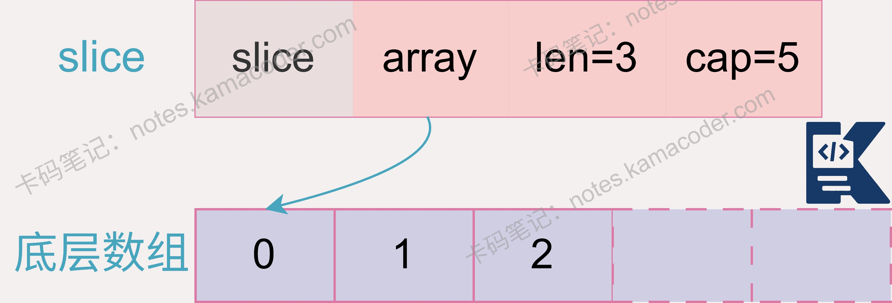
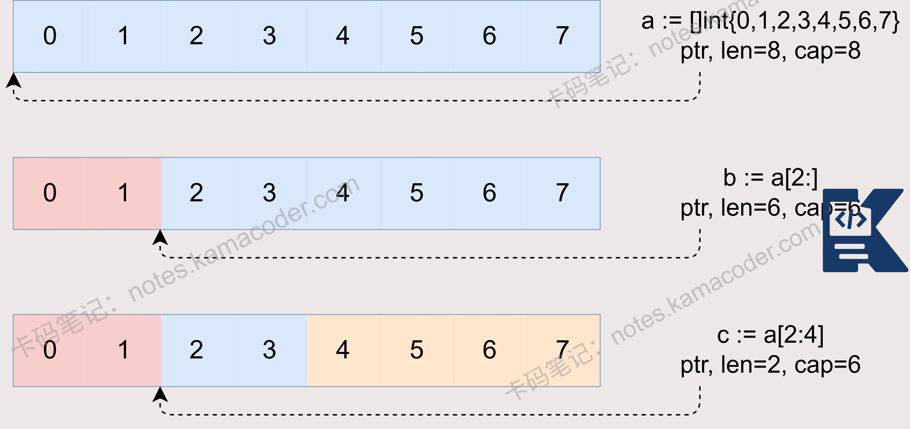

# Go语言中slice和array有什么区别？slice和map有什么区别？

> 来源: https://notes.kamacoder.com/go/go_sliceVSarray.html

# `# Go语言中slice和array有什么区别？slice和map有什么区别？ 

注意切片共享底层数组，append 未扩容时会直接覆盖原内存，扩容后才会分配新空间。 

以下为知识星球  (opens new window)录友分享的哔哩哔哩golang后端实习面试问题：“**Go语言中slice和array有什么区别?**”（下文知识框架部分提供了图例） 

## `# 简要回答 

**数组（Array）是长度固定的值类型**。其长度是类型定义的一部分，大小一旦指定就不可更改，且在参数传递时是值传递。
**切片（Slice）则是对底层数组的动态封装**。本质上，切片是一个轻量级的结构体，包含指向底层数组的**指针**、**长度**和**容量**三个字段。它支持动态扩容，在传递时是引用传递，比数组更加灵活高效。 

## `# 详细回答 

在Go语言中，数组和切片的核心区别在于其**数据结构的本质**。 

数组是具有**固定长度**的数据结构，长度是类型的一部分，其长度在声明时确定且不可改变。且数组是**值类型**，当它被赋值给一个新变量或作为参数传递给函数时，会创建整个数组数据的完整副本，修改副本不会影响原始数组。 

而切片是**动态**的，其长度可以改变，它本身并不直接存储数据，而是作为一个包含三个字段的结构体：指向底层数组的指针、当前长度以及容量。切片是**引用类型**，传递切片时只复制切片的描述符，不复制底层数组的数据。 

切片的动态特性通过append函数实现，当添加新元素导致超出当前容量时，Go运行时会自动分配一个更大的新底层数组并复制数据，此时新切片就不再与旧底层数组关联了。 

在实际使用中，数组适用于元素数量在编译期就已知且固定不变的场景。而切片比较灵活，可以处理动态集合、作为函数参数传递大数据结构，开发时更常用。 

## `# 知识图解 

slice的底层结构：

 

slice的使用：

 

## `# 知识扩展 

面试官可能会追问： 

Q1：Go 语言中 slice 与 map 有什么区别？ 

A1：**Slice**是一个**有序**的线性序列，用于存储相同类型的元素集合，底层基于数组。 

只能使用连续的整数下标（0, 1, 2...）进行访问，且元素顺序固定，遍历时按索引顺序输出。 

零值为 nil ，但**可以直接对 nil slice 进行 append 操作**，不会报错。 

**Map**是一个**无序**的键值对集合，用于通过 Key 快速查找 Value，底层基于哈希表。 

可以使用任何**可比较**的类型作为 Key 进行访问，但遍历元素的顺序是**无序**的。 

零值为 nil，读取安全，但**向 nil map 写入数据会导致 Panic**，必须先用 make 初始化。 

Q2：讲讲 slice 的扩容机制。 

A2：Go语言中slice的扩容机制是在使用**append函数添加元素**，且元素数量**超过slice的容量**时触发。 

在Go 1.18之前，如果新元素数量大于原容量的2倍，新容量等于新元素数量； 

原容量小于1024时，新容量直接翻倍；原容量大于等于1024时，新容量每次增加原容量的1/4。 

在Go 1.18及之后，新元素数量大于原容量2倍时，新容量等于新元素数量； 

原容量小于256时，新容量直接翻倍；原容量大于等于256时，会尝试用 newcap = oldcap + (oldcap + 3*256) / 4 计算新容量。 

扩容时会分配新的底层数组，并将原数组元素复制过去，原数组会被垃圾回收。由于扩容涉及内存分配和数据复制，有一定性能开销，所以在创建slice时，若能预估容量，最好指定合适的容量以减少扩容次数。  

如果你在学习、求职的路上，需要有个高手全程带你，欢迎报名： 
  - 卡码C++训练营  (opens new window)   - 卡码Java、Go训练营  (opens new window)   - 卡码大模型应用开发训练营  (opens new window)
