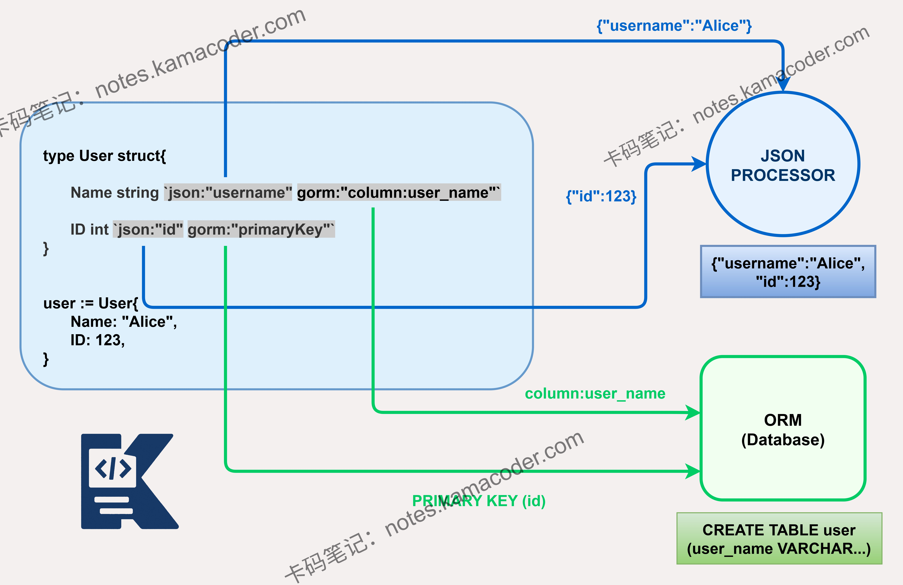

# Go语言中struct tag有什么作用？

> 来源: https://notes.kamacoder.com/go/go_tag.html

# `# Go语言中struct tag有什么作用？ 

Go语言中的 tag 有什么作用？ 

## `# 简要回答 

Go 语言中的 tag 是**结构体字段的元数据**，以反引号包裹，用于提供额外信息。 

它在**序列化 / 反序列化、ORM 映射、JSON 处理**等场景中发挥重要作用。 

例如，在 JSON 处理中，tag 可以指定字段的 JSON 名称，如json:"name"，这样在序列化时字段会使用指定的名称而非结构体字段名。 

## `# 详细回答 

Go 语言的 tag 是**结构体字段的元数据**，以key:"value"形式存在，通过**反射**获取。 

它的主要作用是为结构体字段提供额外信息，影响字段的处理行为。 
  - 

在 JSON 处理中，tag 可指定字段的 JSON 名称、是否忽略空值、是否为 omitempty 等；   - 

在 XML 处理中，可指定 XML 元素名、属性等。   - 

在 ORM 框架中，tag 用于映射结构体字段到数据库表的列名，如gorm:"column:user_name;index"，指定字段对应的数据库列名和索引属性。   - 

tag 还可用于表单验证，如validate:"required,email"，为字段添加验证规则。 

tag 的使用使得结构体字段具有更强的表达能力，通过反射机制实现了元数据驱动的编程模式，是 Go 语言中处理复杂数据结构的重要工具。 

## `# 知识图解 


 

## `# 知识扩展 

Go 语言的 tag 不仅用于 JSON 和 ORM，还在其他场景中发挥作用。 

例如，在 gRPC 中，**由 protoc 自动生成的 Go 结构体会携带 protobuf tag，用于在序列化时映射底层二进制数据的字段编号和规则**；在 Swagger 文档生成中，tag 可用于描述 API 参数；在配置文件解析中，tag 可指定配置项的名称。 

tag 的格式通常为 key:"value"，多个不同的 key 用空格分隔，如 json:"name" xml:"Name"。通过 reflect.StructTag 的 Get 方法可以获取指定 key 的 value。 

**⚠️ 常见语法陷阱：** tag 的解析是大小写敏感的，且 value 部分的引号需要正确闭合。需要特别注意的是，**tag 的键值对之间（key、冒号、引号之间）绝对不能有任何空格**（例如 json: "name" 是错误的），否则会导致解析失败，且编译器不会报错，这是一个非常隐蔽的 BUG 来源。 

### `# 面试官可能会追问 

Q1：如何获取结构体字段的 tag？ 

A1：可以通过**反射机制**获取结构体字段的 tag。 

首先使用 reflect.TypeOf 获取结构体类型，然后通过 Field 方法获取字段信息，最后通过 Tag.Get 或 Tag.Lookup 方法获取指定 key 的 tag 值。 

```
type User struct {
    Name string `json:"name"`
    Age  int    `json:""` // tag 存在，但值为空
}

t := reflect.TypeOf(User{})

// 使用 Get 获取
field, _ := t.FieldByName("Name")
tag := field.Tag.Get("json") // tag 的值为 "name"

// 使用 Lookup 区分空值与不存在
ageField, _ := t.FieldByName("Age")
ageTag, ok := ageField.Tag.Lookup("json") 
// ageTag 为 ""，但 ok 为 true，证明 tag 存在

_, ok2 := ageField.Tag.Lookup("xml")
// ok2 为 false，证明根本没有打 xml 这个 tagtype User struct {
    Name string `json:"name"`
}
t := reflect.TypeOf(User{})
field, _ := t.FieldByName("Name")
tag := field.Tag.Get("json") // tag的值为"name"

```

 

Q2：tag 和注释有什么区别？ 

A2：tag 和注释的区别在于： 
  - tag 是结构体字段的元数据，通过反射可以在运行时获取；   - 注释是代码的说明，仅在源代码中存在，编译后会被忽略；   - tag 用于影响程序的运行时行为，如 JSON 序列化、ORM 映射；   - 注释用于解释代码，帮助开发者理解代码功能。
