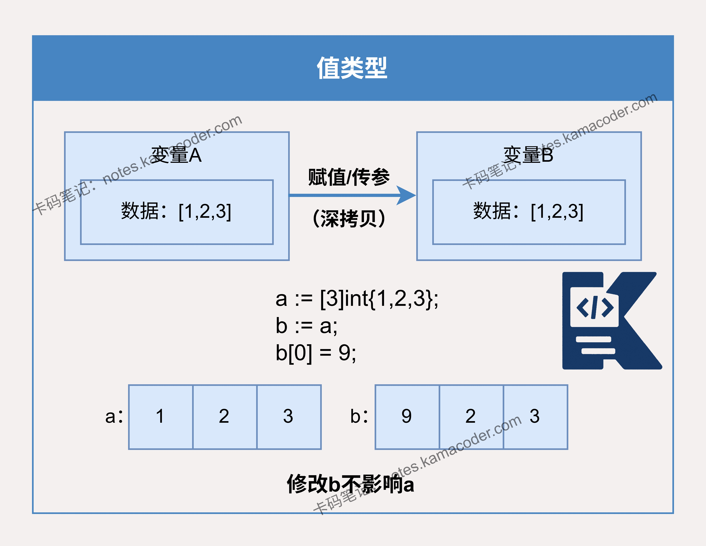
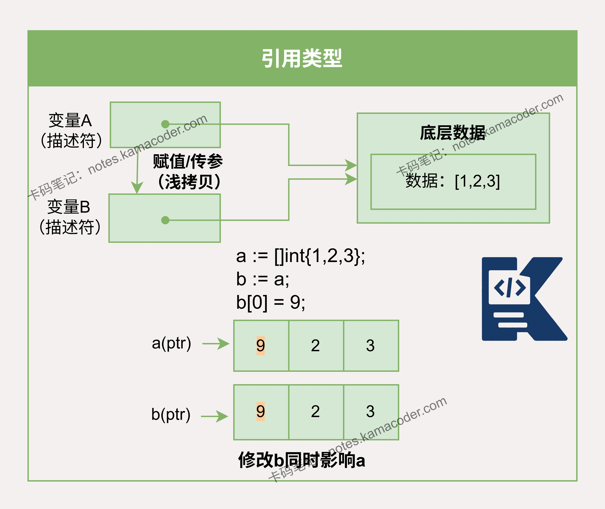

# Go语言中值类型和引用类型有什么区别？

> 来源: https://notes.kamacoder.com/go/go_vtypeVSrtype.html

# `# Go语言中值类型和引用类型有什么区别？ 

Go只有值传递，引用类型拷的是指针，改扩容要小心~ 

以下为知识星球  (opens new window)录友分享的得物后端面试问题：“**请说明Go语言中值类型和引用类型的区别**”（下文知识图解部分提供了图例） 

## `# 简要回答 

Go语言中值类型和引用类型的核心区别是它们的内存存储与拷贝方式不同。 
  - **值类型**：包括基础类型（int, float, bool）、数组（Array）和结构体（Struct）。

    - 特点：变量直接存储值。赋值或传参时会进行**深拷贝**，新旧变量互不影响，是完全独立的个体。   - **引用类型：包括**切片（Slice）**、**映射（Map）、通道（Channel）和接口（Interface）。

    - 特点：变量存储的是一个指向底层数据的“描述符”（指针）。赋值或传参时进行**浅拷贝**，新旧变量指向同一块内存，修改其中一个**会影响**另一个。 

## `# 详细回答 

Go语言中**所有的函数参数传递都是值传递**。这意味着传递给函数的永远是变量的一个副本。区别在于，这个副本的内容是什么。 
  - **值类型**：如基本类型（int、string 等）、数组和结构体，传递的是整个数据结构的完整副本。函数内部对参数的任何修改都发生在副本上，不会影响调用方的原始变量。   - **引用类型**：如切片、映射和通道，变量本身存储的是一个“描述符”（或头结构），其中包含指向底层数据（如数组、哈希表）的指针。在值传递时，复制的是这个“描述符”的副本，而非整个底层数据。因此，函数内外的变量副本其指针仍然指向同一块底层数据，通过指针修改底层数据，自然会影响到原始变量。 

另外值传递、引用传递和值类型、引用类型是两个不同的概念。引用类型作为变量传递可以影响到函数外部是因为发生值拷贝后新旧变量指向了相同的内存地址。 

## `# 知识图解 

值类型： 

 

引用类型： 

 

## `# 知识扩展 

面试官可能会追问： 

Q1：切片既然是引用类型，那把它传进函数里 append 数据，外面的切片会变吗？ 

A1：**不一定，但通常不会变。** 虽然切片底层共用数组，但切片本身是一个包含 ptr，len，cap 的**结构体。 
  - **传参时**：发生了值拷贝，函数内的切片拥有独立的 len 字段。   - **Append 时**：如果函数内 append 导致扩容，会分配新底层数组，彻底与原切片断开联系。即使没扩容，函数改了 len，外面的切片 len 没变，依然看不到新增的数据。 

所以如果想修改切片长度或扩容的话，必须**传切片指针 (*[]int)** 或者**返回新的切片**。 

Q2：值类型在栈上分配，引用类型在堆上分配，这句话完全正确吗？ 

A2：**不完全正确。Go 语言的内存分配由“逃逸分析”决定，而不是由类型决定。** 
  - **值类型也可能在堆上**：如果一个 int 变量的地址被返回给外部函数引用（发生了逃逸），它就会被分配到堆上。   - **引用类型也可能在栈上**：如果一个 make([]int, 10) 在函数内创建且从未逃逸到外部，编译器优化后可能会直接在栈上分配空间，以减少 GC 压力。 

Q3：既然 Map 是引用类型，那如果在多个 Goroutine 里并发读写同一个 Map 会怎样？ 

A3：**会直接 Panic，导致整个进程崩溃。** Go 的原生 Map **不是线程安全**的，也没有内置锁。 

原因是因为Map 的扩容和哈希桶迁移是复杂的多步操作，并发读写会破坏内部状态。 

可以通过以下方式解决：使用 sync.Mutex 互斥锁低频读写；使用 sync.Map 读多写少；或自己实现分段锁减少锁粒度。
