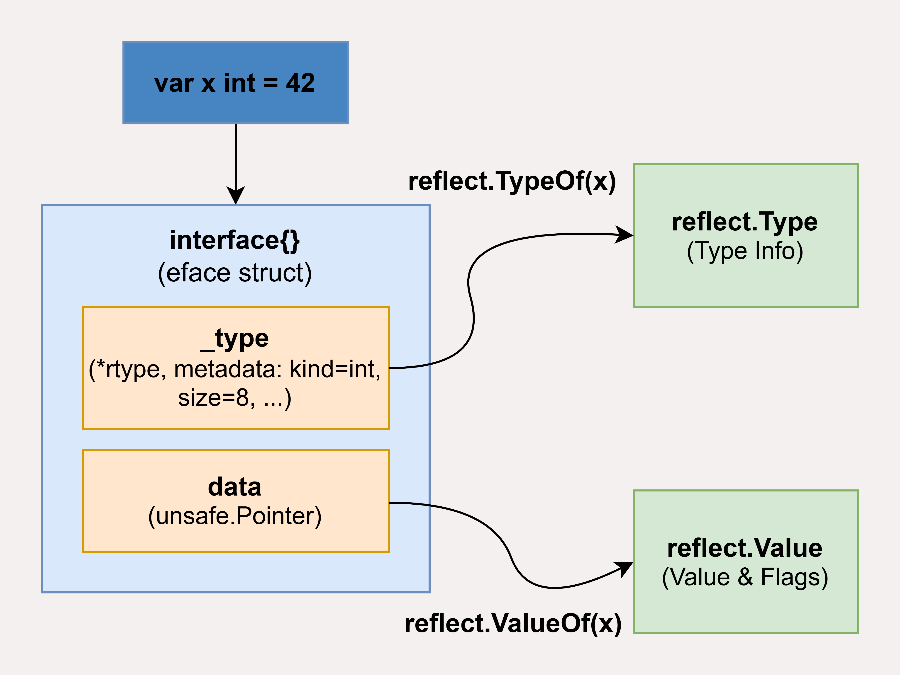
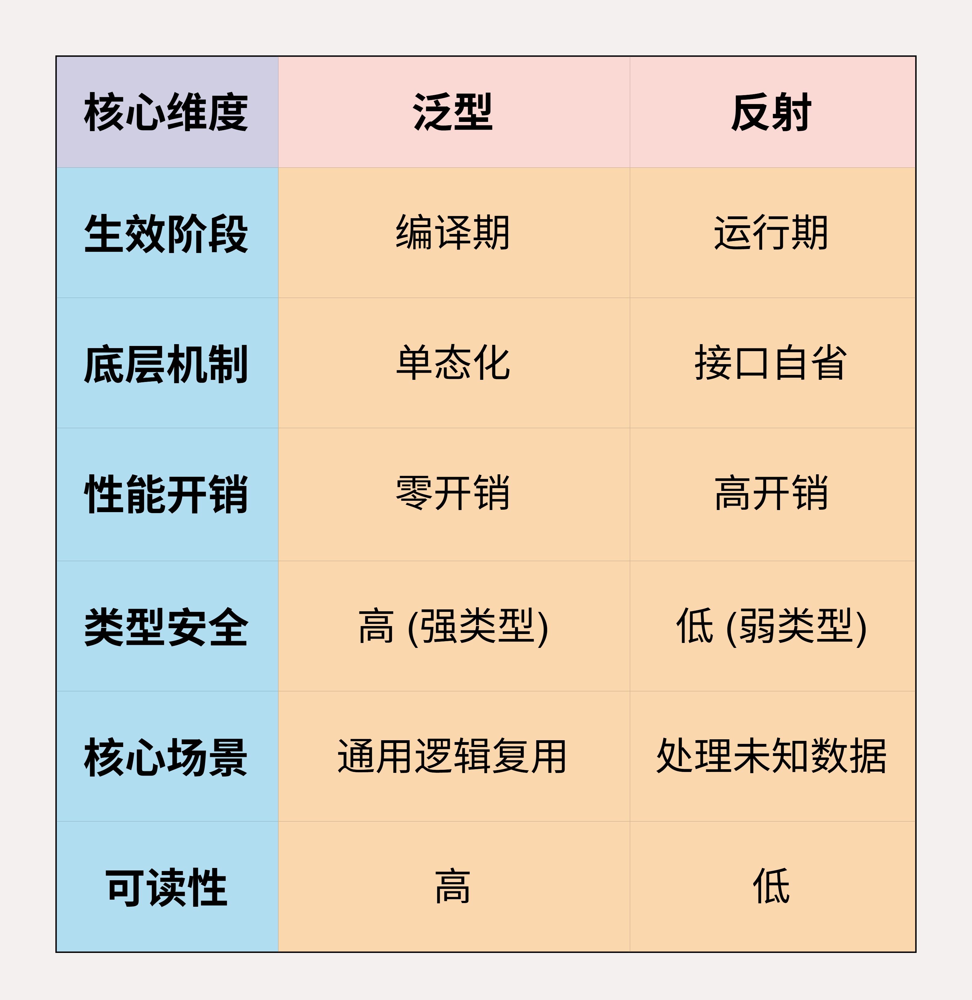

# Go语言中的反射原理是什么？什么场景应谨慎使用？

> 来源: https://notes.kamacoder.com/go/go_reflection.html

# `# Go语言中的反射原理是什么？什么场景应谨慎使用？ 

以下为知识星球  (opens new window)录友分享的腾讯go后端一面问题：”**Go语言中的反射原理是什么？**“（下文知识图解部分提供了底层原理图示） 

## `# 简要回答 

Go 语言的反射（Reflection）是指在程序运行时**检查、访问和修改其自身类型和值**的能力。核心原理是基于 Go 的 **interface（接口）隐式转换**。 

当一个变量被转为 interface{} 时，Go 底层会将其封装为一个包含**类型指针**和**数据指针**的内部结构。 

反射包 reflect 通过 TypeOf() 和 ValueOf() 函数解析该内部结构，将其转换为反射对象 reflect.Type 和 reflect.Value。 

## `# 详细回答 

Go 语言反射的本质是**对接口底层元数据的运行时解析与内存映射**。 

在 Go 的类型系统中，任何变量在赋值给空接口 interface{} 时，都会在运行时被封装成一个**双指针结构体 eface**，其中一个指针指向类型元数据 _type，另一个指针则指向真实的物理数据。 

反射原理的核心就在于，reflect 包通过 **unsafe.Pointer** 强行“拆解”这个接口结构，将原本对程序员透明的 _type 映射为 **reflect.Type** 接口，将数据指针映射为 **reflect.Value** 结构。 

这种映射不仅是只读的，它还通过 Value 内部的 flag 位记录了数据的寻址属性。 

当我们进行反射修改操作时，底层实际上是在根据 _type 提供的字段偏移量，**直接计算出目标内存地址并进行裸指针赋值**，从而绕过了编译期的静态类型检查。 

简而言之，反射就是利用接口作为媒介，在程序运行时刻，通过直接操作内存布局来模拟编译器的类型推导行为。 

## `# 知识图解 

反射原理的底层原理图示： 

 

## `# 知识扩展 

### `# 反射 vs 泛型 

泛型与反射的核心区别在于**类型解析的时机与底层机制的差异**。 

泛型本质是**编译期的多态**：编译器在构建阶段根据类型约束，为不同类型直接生成专用的机器码，这既保证了严格的类型安全，又消除了运行时的类型转换开销。 

因此，在实现通用算法（如 Sort、Max）和数据容器（如 Set、List）时，泛型提供了接近原生代码的执行效率。 

相比之下，反射则是**运行期的多态**：它允许程序在运行时通过接口去探测和操作任意变量的元数据与值。 

这种动态性在处理完全未知的外部数据时是不可替代的，例如 JSON 序列化、ORM 数据库映射或依赖注入。 

虽然反射赋予了程序极大的灵活性，但其代价是昂贵的运行时开销（如内存分配、逃逸分析）以及缺乏编译期检查带来的 Panic 风险。 

区别图示： 

 

### `# 面试官可能会追问： 

Q1：反射原理的应用有哪些？ 

A1：**JSON 序列化**是最常见的应用，比如 encoding/json 包通过反射动态获取结构体字段信息，实现任意类型的序列化和反序列化。 

**ORM 框架**是另一个重点应用，比如 GORM 通过反射分析结构体字段，自动生成SQL语句和字段映射。它能动态读取 structtag 来确定数据库字段名、约束等信息，大大简化了数据库操作。 

**Web框架的参数绑定**也大量使用反射，像Gin框架的 ShouldBind 方法，能够根据请求类型自动将 HTTP 参数绑定到结构体字段上，这背后就是通过反射实现的类型转换和赋值。 

还有**配置文件解析、RPC 调用、测试框架**等场景。比如Viper配置库用反射将配置映射到结构体，gRPC 通过反射实现服务注册和方法调用。 

Q2：v.Elem() 是干什么用的？如果不加 Elem() 直接修改会怎样？ 

A2：v.Elem() 的作用相当于对指针进行**解引用**。因为我们传给 ValueOf 的是变量的指针，所以得到的 Value 对象代表的是一个指针。指针本身是不能被 Set 的，只有调用 Elem() 拿到指针指向的那个实际变量，CanSet() 才会变为 true，才能进行修改。如果不加，**直接 Set 会导致 panic**。
