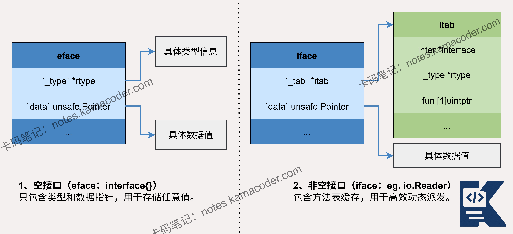
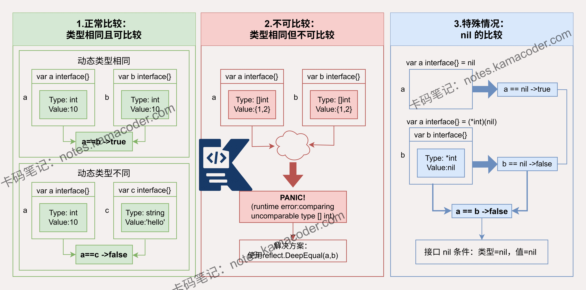

# Go语言中的接口是什么？有什么特点？如何实现接口？

> 来源: https://notes.kamacoder.com/go/go_interface.html

# `# Go语言中的接口是什么？有什么特点？如何实现接口？ 

注意go中的动态类型如切片不可比时会Panic哦！ 

以下为知识星球  (opens new window)录友分享的理想一面问题：”Go语言中的两个接口之间可以相互比较吗？“（下文知识图解部分提供了底层原理图示） 

## `# 简要回答 

Go语言中，两个接口（interface）可以进行比较，但结果取决于它们底层的**动态类型**和**动态值**，并且需要底层类型本身是**可比较**的。 

只有当**动态类型**和**动态值**都完全相同时，两个接口才相等。 

## `# 详细回答 

Go语言中接口比较的核心在于其内部结构。每个接口值都由两部分组成： 
  - **动态类型**：接口所持有的具体值的类型。   - **动态值**：接口所持有的具体值。 

只有当这两个部分都完全相同时，两个接口才相等。 

两个interface**相等**有以下2种情况： 
  - 动态类型T相同，且对应的动态值V相等。   - 两个interface 均等于nil (此时V和T都处于unset状态)。 

但如果接口底层封装的是**不可比较的类型**，如切片、映射和函数，那么直接比较这两个接口会导致**运行时panic**。这是因为Go语言本身不允许直接比较这些类型。 

## `# 知识图解 

go中interface的底层原理： 


 

interface 的比较情况： 


 

## `# 知识扩展 

### `# 如何安全地比较接口 

为了避免程序崩溃，在不确定接口底层类型时，可以采用以下安全方法： 
  - 

**使用类型断言**：先将接口转换为具体的已知类型，再比较该类型的值。这是我们最常用的方式。 

```
var a, b interface{}
a = 10
b = 10

// 安全地类型断言后比较
if intA, okA := a.(int); okA {
    if intB, okB := b.(int); okB {
        fmt.Println(intA == intB) // true
    }
}

```

    - 

**使用类型切换**：当接口可能包含多种类型时，可以使用 switch 语句进行更全面的判断。   - 

**使用反射包**：对于更复杂的场景，可以通过 reflect.DeepEqual 函数进行深度比较，它能处理结构体、数组等复杂类型，但性能有开销，需谨慎使用。 

#### `# 面试官可能会追问： 

Q1：谈谈interface的底层原理。 

A1：Go语言中接口的底层通过两种结构实现：**eface** 和 **iface**，分别对应空接口 interface{} 和带方法的接口。 
  - 

**eface** 结构包含两个字段： 
    - 

**_type 指针**，指向接口所持有值的具体类型元信息；     - 

**data 指针**，指向实际的数据值。 

这使得空接口可以承载任何类型的值。   - 

**iface** 则用于带有方法的接口，它除了包含 data 指针外，还有一个关键的 **tab 字段**，指向一个 itab 结构。 

itab 是接口动态调度的核心，它存储了接口类型本身的信息 (inter)、具体值的类型信息 (_type)，以及一个名为 fun 的函数指针数组。 

fun 数组里保存了具体类型所实现的接口方法的地址，从而在通过接口调用方法时，能够找到正确的函数执行。 

所以当将一个具体类型的值赋值给接口变量时，Go 运行时会在必要时构建相应的 itab 或设置 _type。进行类型断言时，则会通过比较 itab 中的类型信息或 _type 指针来完成。 

Q2：Go语言中interface有哪些应用场景？ 

A2：在Go语言中，接口的应用场景十分广泛，主要用来实现多态、降低耦合并提升代码的灵活性与可测试性。 
  - **实现多态与行为抽象**，允许不同类型对象对同一消息作出响应，编写通用代码；   - **解耦与依赖注入**，可以降低模块耦合度，提高代码的可测试性和可维护性；   - **错误处理**，通过 error 接口提供统一、可扩展的错误处理机制。   - Go标准库也大量使用接口（如 io.Reader 和 io.Writer）来提供**通用的IO**能力，而空接口 interface{} 则常作为容器处理未知类型数据，在JSON解析等场景中使用。
