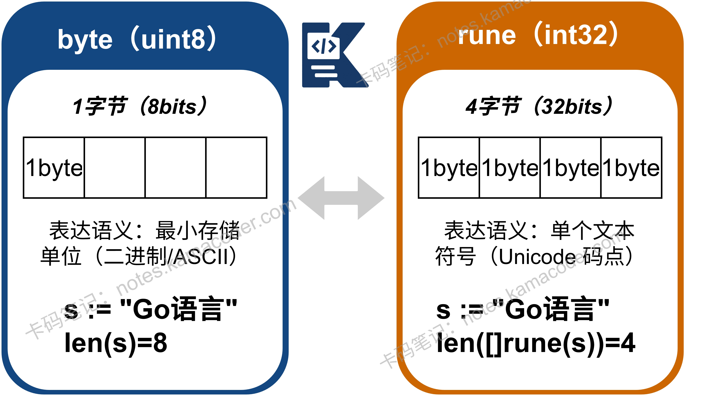

# Go语言有哪些基础数据类型？

> 来源: https://notes.kamacoder.com/go/go_datatype.html

# `# Go语言有哪些基础数据类型？ 

以下为知识星球  (opens new window)录友分享的理想一面问题：”**Go语言中有哪些数据类型**？“（下文知识框架部分提供了类型表格） 

### `# 简要回答 

Go语言的数据类型可以分为两大类：基本类型和复合类型。 
  - **基本类型**主要包括表示真假的布尔型bool、各种整数和浮点数等数值类型，以及不可变的字符串类型string。   - **复合类型**是通过组合基本类型构成的更复杂结构。常用的有：**数组、切片**、**映射**、**结构体**、**指针**、**接口**、**通道**、**函数**等。 

### `# 详细回答 

Go语言的数据类型可分为基本类型和复合类型两大类。 
  - 

**基本类型**是构成程序的基础单元，主要包括： 

**布尔型**：bool，值为 true 或 false。 

**数值类型**：包括各种整数（如 int8, int16, int32, int64, uint8 等，其中 int 和 uint 的长度与平台相关）、浮点数（float32，float64）和复数（complex64，complex128）。 

**字符串类型**：string。字符串在Go中是不可变的字节序列，有利于保证线程安全。字符有 rune（表示Unicode码点）和 byte（表示ASCII字符）两种类型。 

所有基本类型在声明后都有默认的零值，例如数值为0，字符串为空串""。   - 

**复合类型**通过组合基本类型构成更复杂的数据结构，主要包括： 

**数组与切片**：数组长度固定，是值类型，赋值或传参会拷贝整个数组。而切片长度动态可变，是引用类型，底层依赖数组。在使用 append 函数添加元素时，若超出容量会触发扩容。
**映射**：即 map，是键值对集合，基于哈希表实现。遍历是无序的，并且map非线程安全，并发读写需加锁或使用 sync.Map。
**结构体**：struct，用于将多个不同类型的字段组合成一个逻辑整体。 

**指针**：可以直接存储变量内存地址，允许程序通过地址间接访问和操作数据。 

**接口**：interface，定义了一组方法签名。Go语言的接口是隐式实现的，只要类型实现了接口的所有方法，就视为实现了该接口。空接口 interface{} 可以表示任何类型。
**通道**：channel，是Go语言CSP并发模型的核心，用于在多个Goroutine之间进行通信。通道可以是无缓冲或有缓冲的。
**函数**：在Go中，函数也是一种类型，可以赋值给变量或作为参数传递。 

### `# 知识扩展 
  - byte vs rune 

**byte**：是 uint8 的别名。占用 **1 字节**（8 bits）。它用于表示原始的二进制数据或 ASCII 字符。无法完整表示一个汉字，因为一个汉字通常占 3 字节。 

**rune**：是 int32 的别名。占用 **4 字节**（32 bits）。它用于表示一个 Unicode 码点，可以涵盖世界上几乎所有的文字符号（如汉字、Emoji）。可以完整表示一个汉字，一个汉字就是一个 rune。 


 

面试官可能追问： 
  - 

从一个切片截取出另一个切片，修改新切片的值会影响原切片内容吗？ 

**会影响原切片的内容**，这是因为切片在 Go 内部是一个包含指向底层数组指针的结构体，截取操作只是复制了这个结构体，两者在内存中依然共享同一个底层数组。 

只有当新切片执行 append 操作并因为容量不足触发扩容，进而分配全新的底层数组时，两者才会产生内存隔离，此后的修改便互不影响了。   - 

对一个nil的map进行读和写操作分别会发生什么？ 

**读取操作是安全的**，因为读取操作不会修改 map 的底层数据结构。当检测到 map 为 nil 时，这些操作会返回一个安全的结果（如零值）或直接跳过； 

但**写入操作会触发 panic**，因为写入操作需要访问底层的哈希表结构来分配存储空间。一个 nil 的 map 没有指向任何有效的哈希表，因此运行时无法完成此操作，只能通过 panic 来终止程序，防止数据写入到未知的内存区域，从而避免更严重的问题。   - 

如何实现一个“支持中英文混合的字符串截取”函数？ 

如果直接对字符串进行索引截取是按字节操作的，由于一个中文字符在 UTF-8 编码下占用 3 个字节，若截取位置恰好落在汉字的中间，就会产生乱码。但通过**将字符串转换为 []rune**，就可以按字符进行精准截取。 

示例代码如下： 

```
package main

import (
	"fmt"
)

// SubString 按字符长度截取字符串
func SubString(s string, length int) string {
	// 1. 将字符串转换为 rune 切片
	runes := []rune(s)
	// 2. 判断目标长度是否超过实际字符长度
	if len(runes) > length {
		// 3. 按字符索引截取，再转回 string
		return string(runes[:length])
	}
	return s
}

func main() {
	text := "Go语言非常强大"
	// 错误示范：直接按字节截取（Go语言... 共 2+6=8 字节）
	// 如果截取前 3 个字节，会把“语”字切断
	fmt.Printf("直接截取(字节): %s\n", text[:3]) 
	// 正确示范：使用 rune 截取前 4 个字符
	fmt.Printf("正确截取(字符): %s\n", SubString(text, 4))
}

```

   

如果你在学习、求职的路上，需要有个高手全程带你，欢迎报名： 
  - 卡码C++训练营  (opens new window)   - 卡码Java、Go训练营  (opens new window)   - 卡码大模型应用开发训练营  (opens new window)
