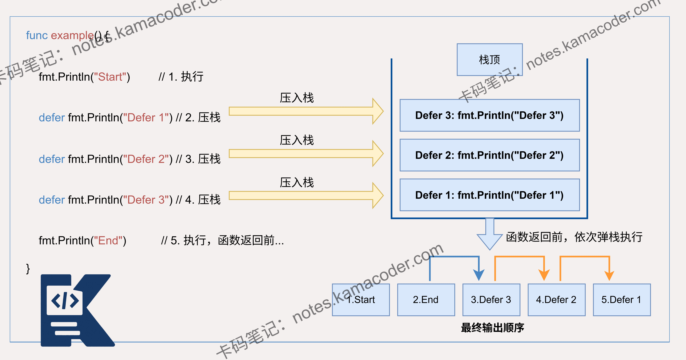
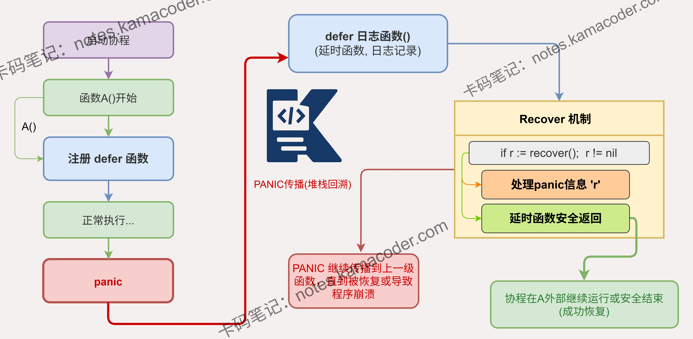

# 多层defer中发生panic时，defer还会执行吗？

> 来源: https://notes.kamacoder.com/go/go_defer_panic.html

# `# 多层defer中发生panic时，defer还会执行吗？ 

多层`defer`中发生panic时，是否会继续执行？ 

## `# 简要回答 

当多层 defer 中发生 panic 时，Go 会暂停当前执行流程，转而执行已经注册的 defer 函数。此时，系统会按照**后进先出（LIFO）**的顺序调用所有已注册的 `defer` 函数。即使在执行某个 `defer` 期间再次触发 `panic`，Go 仍会继续链式调用剩余的 `defer` 函数，确保资源释放等清理逻辑的执行。 

## `# 详细回答 

在 Go 语言中，当多层 defer 中发生 panic 时，程序会停止当前正常执行流程，但会按照 defer 的逆序执行所有已注册的 defer 函数。这是 Go 语言的异常处理机制，确保资源能够被正确释放。 

具体来说，当 panic 发生时，Go 会立即停止当前函数的执行，开始执行当前 goroutine 中所有已注册的 defer 函数。这些 defer 函数会按照后进先出的顺序执行，即使 panic 发生在某个 defer 函数内部，其他 defer 函数仍然会被执行。 

例如，如果有三个 defer 函数 A、B、C 按顺序注册，当 panic 发生时，会先执行 C，然后是 B，最后是 A。这个过程完成后，程序才会真正终止。 

## `# 知识图解 

defer 语句的正常执行顺序： 

 

多层 defer 语句发生PANIC时的执行顺序： 

 

## `# 知识扩展 

Go 语言的 `panic` 与 `recover` 构成了其独特的异常恢复机制。`recover()` 必须在 `defer` 函数内部直接调用才能奏效；若在嵌套函数或常规执行路径中调用，将返回 `nil` 且无任何恢复效果。 

此外，**Go 的 `panic` 具有全局毁灭性**。虽然 `panic` 始于特定的 goroutine，但如果该 goroutine 未能在其 `defer` 链中成功 `recover()`，则会导致整个进程（Process）崩溃退出，而不仅仅是停止当前的 goroutine。 

该设计体现了 Go 的健壮性：错误应该被显式处理，而不是被忽略。通过 panic 和 recover，Go 提供了一种处理严重错误的机制，同时确保资源能够被正确释放。 

### `# 面试官可能会追问 

Q1：在 Go 语言中，如何在 defer 函数中捕获 panic？ 

A1：需在 `defer` 函数体内调用内置的 `recover()` 函数。 

它能拦截当前的 `panic` 序列，停止栈展开并返回触发 `panic` 时传递的值。 

恢复后，程序将从该 `defer` 所属函数之后的逻辑继续执行，而非回到 `panic` 触发点。 

Q2：defer 函数的执行顺序是怎样的？ 

A2：defer 函数的执行顺序遵循 "后进先出" 原则。 

这种设计确保了资源释放顺序与获取顺序相反，有效避免了因依赖关系导致的资源关闭失败。 

Q3：在 Go 语言中，panic 会跨 goroutine 传播吗？ 

A3：**不会传播，但会影响全局。** 

`panic` 的捕获逻辑是 goroutine 局部的，子 goroutine 发生的 `panic` 无法在父 goroutine 中被捕获。 

任何一个 goroutine 发生的 `panic` 如果最终没有被 `recover`，都会导致**整个程序（所有 goroutine）强制退出**。
