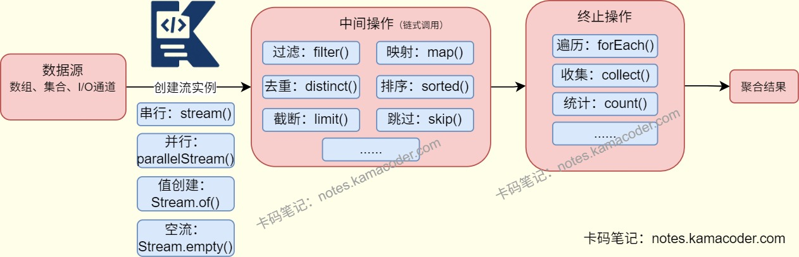

# JDK8新特性

> 来源: https://notes.kamacoder.com/java/jdk8-features.html

# `# JDK8新特性 

## `# 简要回答 
  - Java8引入的核心新特性包括Lambda表达式，Stream API、函数式接口、默认方法、Optional类和新的日期与时间API。   - **Lambda表达式**把函数作为一个方法的参数，提供简洁的语法编写匿名函数。   - 引入的**函数式接口**注解@ FunctionalInterface，作为Lambda表达式的接口，比如Consumer、Supplier、Function和Predicate。   - **Stream API**是数据流处理工具，提供了一种声明式的方式来对集合进行操作，如过滤、映射、排序和去重等。   - Java8也引入了**java.time包**，提供了全新的日期和时间API，线程安全且易用，加强了对日期与时间的处理。 

## `# 详细回答 
  - 

**Lambda表达式**：是Java8的核心特性，本质是匿名函数，即允许**函数作为方法参数传递**，简化代码编写。 
    - 语法结构是 **(参数列表) -> {方法体}** ，其中参数类型可以省略，由编译器类型判断，单参数可省略括号，单行逻辑可以省略大括号与return。     - lambda表达式替代匿名内部类，简化集合遍历、线程创建等场景的代码。依赖函数式接口实现，编译后会生成私有静态方法，通过invokedynamic指令调用，避免匿名内部类产生过多的class文件。   - 

**函数式接口**： 函数式接口是只有一个抽象方法的接口，JDK8开始，接口可以定义默认方法、静态方法，使用@FunctionalInterface注解声明为函数式接口。其中的核心内置接口有Consumer< T >、Function<T,R>、Predicate< T >、Supplier< T >等。 
    - **Consumer< T >** 是消费型接口，接收参数但无返回值(void accept(T t))，比如遍历集合场景。     - **Suppplier< T >** 是供给型接口，无参数有返回值(T get())，生成随机数场景。     - **Function<T,R>** 是函数型接口，接收参数并返回值(R apply(T t))，比如映射场景。     - **Predicate< T >** 是断言型接口，接收参数返回boolean值(boolean test(T t))，比如集合过滤场景。   - 

默认方法与静态方法：**JDK8开始，接口可以定义默认方法和静态方法**，默认方法使用default关键字，静态方法使用static关键字。 
    - 如果实现类同时实现了多个接口，接口中有同名的默认方法时，需要显示重写，通过接口名.super.方法名()指定调用哪个接口的默认方法。   - 

**Stream API**：JDK8开始提供，Stream是对集合数据的声明式处理流，不存储数据也不修改源数据，代码简洁，支持串行/并行处理。 
    - 使用Stream可以通过集合.stream()/集合.parallelStream()或者Stream.of()**创建Stream对象**；     - Stream支持中间操作与终止操作。**中间操作是链式调用返回新的Stream对象**，可以进行filter()过滤、map()映射、sorted()排序、distinct()去重等操作；**终止操作则是返回结果**，如forEach()遍历、collect()收集、count()计数和reduce()归约等。   - 

**Optional类**：可以**解决空指针异常问题**，封装可能为null的对象，提供安全的空值处理方式。 
    - 通过**Optional.of(T t)** 创建Optional对象，of()方法会检查参数是否为null，不为null则返回Optional对象，为null则抛出NullPointerException异常。     - 通过**Optional.ofNullable(T t)** 创建Optional对象，ofNullable()方法会检查参数是否为null，不为null则返回Optional对象，为null则返回Optional.empty()对象。     - 通过**Optional.orElse(T other)** 实现值为null时返回默认值。     - 通过**Optional.ifOfPresent(Consumer< ? super T > consumer)** 可以实现在值不为null时执行消费代码逻辑。   - 

新的日期与时间API 
    - Java8引入了新的日期与时间API，包括**LocalDate、LocalTime、LocalDateTime、Instant、DateTimeFormatter**等。替代了传统的Date、SimpleDateFormat，解决了之前线程不安全、设计混乱的问题。     - **LocalDate**：表示日期（年-月-日），如LocalDate.now()；     - **LocalTime**：表示时间（时:分:秒），如LocalTime.of(12, 30, 0)；     - **LocalDateTime**：表示日期和时间（年-月-日 时:分:秒），如LocalDateTime.now()；     - **Instant**：表示时间戳（从1970-01-01 00:00:00 UTC开始），如Instant.now()；     - **DateTimeFormatter**：用于格式化日期和时间，如DateTimeFormatter.ofPattern("yyyy-MM-dd HH:mm:ss")； 

## `# 知识图解 


 

## `# 代码示例 
  - Lambda表达式与函数式接口使用 

```
import java.util.function.Consumer;
import java.util.function.Function;
import java.util.function.Predicate;
import java.util.function.Supplier;

public class LambdaDemo {
    public static void main(String[] args) {
        // 1. Consumer（消费型）：遍历输出
        Consumer<String> printConsumer = s -> System.out.println("消费：" + s);
        printConsumer.accept("Java8 Lambda");

        // 2. Supplier（供给型）：生成随机数
        Supplier<Integer> randomSupplier = () -> (int) (Math.random() * 100);
        System.out.println("生成随机数：" + randomSupplier.get());

        // 3. Function（函数型）：字符串转长度
        Function<String, Integer> lengthFunction = s -> s.length();
        System.out.println("字符串长度：" + lengthFunction.apply("Hello Java8"));

        // 4. Predicate（断言型）：判断数字是否大于10
        Predicate<Integer> gt10Predicate = num -> num > 10;
        System.out.println("15是否大于10：" + gt10Predicate.test(15));
    }
}

/*
运行结果
消费：Java8 Lambda
生成随机数：67
字符串长度：10
15是否大于10：true
*/

```

 
  - StreamAPI使用示例 

```
import java.util.Arrays;
import java.util.List;
import java.util.Map;
import java.util.stream.Collectors;

public class StreamDemo {
    public static void main(String[] args) {
        List<Integer> numList = Arrays.asList(1, 2, 3, 4, 5, 6, 6, 7);

        // 1. 过滤+去重+排序
        List<Integer> filterList = numList.stream()
                .filter(num -> num % 2 == 0) // 过滤偶数
                .distinct() // 去重
                .sorted((a, b) -> b - a) // 降序排序
                .collect(Collectors.toList());
        System.out.println("过滤去重排序：" + filterList); // [6,4,2]

        // 2. 映射+求和
        int sum = numList.stream()
                .map(num -> num * 2) // 每个数乘2
                .reduce(0, Integer::sum); // 求和
        System.out.println("映射求和：" + sum); // (2+4+6+8+10+12+12+14)=68

        // 3. 分组
        Map<Boolean, List<Integer>> groupMap = numList.stream()
                .collect(Collectors.groupingBy(num -> num > 3)); // 按是否大于3分组
        System.out.println("分组结果：" + groupMap); // {false=[1,2,3], true=[4,5,6,6,7]}
    }
}

```

 
  - 新的日期与时间API 

```
import java.time.LocalDateTime;
import java.time.format.DateTimeFormatter;

public class DateTimeDemo {
    public static void main(String[] args) {
        // 1. 获取当前时间
        LocalDateTime now = LocalDateTime.now();
        System.out.println("当前时间：" + now); // 2025-12-21T15:30:20.123

        // 2. 格式化
        DateTimeFormatter formatter = DateTimeFormatter.ofPattern("yyyy-MM-dd HH:mm:ss");
        String formatStr = now.format(formatter);
        System.out.println("格式化后：" + formatStr); // 2025-12-21 15:30:20
    }
}

```

 

## `# 知识扩展 
  - 面试官可能追问 
  - Q1：**Lambda表达式**和**匿名内部类**有什么区别？

    - 匿名内部类会生成独立的class文件，而Lambda表达式会生成私有静态方法和invokedynamic指令，节省资源。     - 匿名内部类需要显式声明final，Lambda表达式可以直接访问外部final变量。   - Q2：**Stream并行流**有什么特点？

    - Java8的Stream并行流**基于Fork/Join框架**实现**多核并行处理**，默认使用公共ForkJoinPool，会将数据源拆分给多个线程并行计算再合并结果，核心特点是能提升CPU密集型、大数据量场景的处理效率。     - Stream默认无序以保证性能，也支持通过ordered()强制有序，但会牺牲部分效率；同时有**延迟执行**特性，仅在终止操作时触发计算。     - 并行流**存在线程安全风险**，不能直接操作非线程安全的外部集合或变量，优先用collect/reduce等归约操作；     - 适合**CPU密集型**任务，IO密集型任务使用反而会因线程阻塞降低效率，还可以通过自定义ForkJoinPool避免公共线程池的资源竞争问题。   - Q3：函数式接口为什么只能有一个抽象方法？

    - 函数式接口要求抽象方法只能有一个，用于和Lambda表达式绑定，因为**Lambda表达式本质是匿名函数，只能实现一个方法逻辑**，如果有多个抽象方法，编译器无法确定要调用哪个方法，会**编译报错**。     - 但是函数式接口可以包含多个默认方法和静态方法，不会影响接口的函数式特性。   - Q4：延迟执行和并行流冲突吗？

    - 延迟执行是指Stream的中间操作仅记录操作逻辑而不实际执行，只有触发终止操作后才会一次性执行所有中间操作。     - 并行流是将数据源拆分为多个片段，由多线程并行处理后合并结果。     - **延迟执行决定了执行时机，而并行流是执行方式**，无论是串行还是并行，都是在终止操作触发时选择单线程执行或者Fork/Join框架多线程执行，中间操作的延迟特性对两种流类型都生效。
