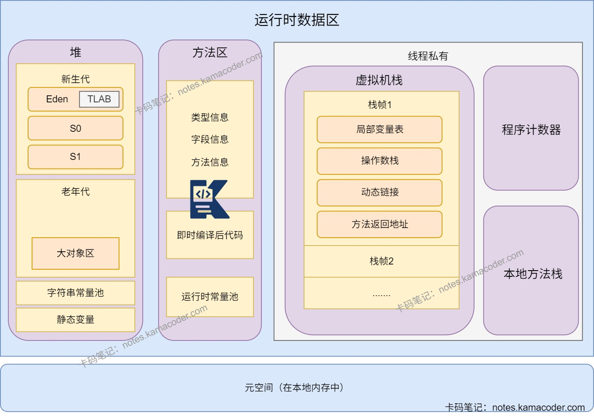

# JVM常见参数

> 来源: https://notes.kamacoder.com/java/jvm-parameters.html

# `# JVM常见参数 

## `# 简要回答 
  - **JVM参数**为JVM运行提供配置依据，可以对内存分配、垃圾回收、日志等方面进行配置，为不同的业务场景选择合适的参数。   - 进行内存配置时可以使用 **-Xms**和 **-Xmx**设置堆内存的初始值和最大值； **-Xmn**设置新生代大小， **-XX:NewRatio**设置老年代与新年代比例；   - 进行垃圾回收时可以使用 **-XX:+UseParallelGC、-XX:+UseConcMarkSweepGC、-XX:+UseG1GC**等参数进行垃圾回收器的选择。   - 关于日志可以使用 **-XX:PrintGCDetails**打印GC详细信息，使用 **-XX:PrintGCDateStamps**打印GC日期和时间，还可以使用 **-Xloggc:/path/to/gc-%t.log**打印GC日志到指定文件。%t表示当前时间。   - JVM参数也可以处理OOM异常，使用 **-XX:+HeapDumpOnOutOfMemoryError**可以在OOM时自动生成堆快照，使用 **-XX:HeapDumpPath=/path/to/heapdump.hprof**可以指定堆快照文件路径。 

## `# 详细回答 
  - **内存配置** 
    - **-Xms**：设置JVM初始堆内存大小，例如-Xms1024m，需要设置数值和单位。     - **-Xmx**：设置JVM最大堆内存大小，一般与-Xms参数设置相同，避免动态调整。     - **-Xmn**：固定新生代内存大小，一般是堆内存的三分之一。     - **-XX:NewSize**：设置新生代初始空间大小。默认情况下新生代大小为1310MB。     - **-XX:MaxNewSize**：设置新生代最大空间大小。     - **-XX:NewRatio**：设置老年代和新生代的内存大小比例。默认值为2，即老年代和新生代占比为2:1。     - **-XX:PermSize**：设置永久代初始空间大小。     - **-XX:MaxPermSize**：设置永久代的最大大小，超出则会抛出OOM异常。     - **-XX:MetaspaceSize**：元空间阈值，当元空间使用量达到该阈值时，会触发Full GC，之后JVM会动态调整该阈值     - **-XX:MaxMetaspaceSize**：设置元空间增长上限，默认值4096MB。   - **垃圾回收配置** 
    - **-XX:+UseSerialGC**：使用串行垃圾收集器，单线程执行GC，适用于客户端模式或者单核CPU环境。     - **-XX:+UseParallelGC**：使用新生代并行收集器，不影响老年代垃圾回收，多线程执行新生代GC。     - **-XX:+UseParallelOldGC**：使用老年代并行收集器，多线程执行老年代GC。     - **-XX:+UseConcMarkSweepGC**：使用CMS垃圾收集器,以获取最短回收停顿时间为目标，大部分GC阶段可与用户线程并发执行。     - **-XX:+UseG1GC**：使用G1收集器进行垃圾回收。     - **-XX:ParallelGCThreads**：设置GC线程数，默认值为CPU核心数。     - **-XX:+UseZGC**：使用ZGC进行垃圾回收，目标是将GC停顿时间控制在几号秒甚至更短时间内，适用于超大堆场景。   - **类加载配置** 
    - **-verbose:class**打印类加载信息   - **日志相关参数** 
    - **-XX:+PrintGCDetails**：打印GC详细信息。     - **-XX:+PrintGCTimeStamps**：打印GC时间戳。     - **-XX:PrintGCDateStamps**：打印GC日期和时间。     - **-Xloggc:/path/to/gc-%t.log**：指定GC日志文件路径。%t表示当前时间。   - 处理OOM

    - **-XX:+HeapDumpOnOutOfMemoryError**：出现OOM时自动生成堆快照。     - **-XX:HeapDumpPath=/path/to/heapdump.hprof**：指定OOM时生成的堆快照文件路径。 

## `# 知识图解 
  - **运行时数据区示意图** 
 

## `# 知识扩展 
  - 扩展：

    - **GC调优策略**：

      - 因为新生代垃圾回收的成本低，所以需要尽可能让新创建的对象在新生代分配内存并被回收，避免频繁Full GC。可以通过分析GC日志判断新生代空间分配是否合理。     - **内存泄漏**：

      - 程序在运行过程中不再使用的对象仍然被引用，无法被垃圾回收，导致可用内存减少。       - 常见原因：

        - **静态集合**：使用静态数据结构存储对象，没有进行清理。         - **事件监听**：未取消对事件源的监听，导致对象持续被引用。         - **线程**：未停止的线程可能持有对象引用，无法被回收。     - **内存溢出**(OOM)：

      - JVM申请内存时无法找到足够的内存，引发OutOfMemoryError。       - 出现原因：

        - **堆内存溢出**：代码中出现**大对象分配**或者是**内存泄漏**时，多次GC也没有足够的内存空间。         - **栈溢出**：代码中出现**递归调用**，压栈过深或者无法扩展栈空间时出现。         - **元空间溢出**：系统的**代码过多**或加载的类文件过多，导致元空间内存占用大。   - 面试官可能追问： 
  - Q1：秒杀高并发场景下你怎么进行参数配置？

    - 秒杀高并发场景下需要**避免GC停顿和内存浪费**，采取固定堆大小，放大新生代和压缩老年代的方式。     - 将 **-Xms和-Xmx设置为相同值**，可以避免JVM在-Xms<-Xmx时进行动态扩容而触发Full GC，导致额外停顿，确保内存分配高效。     - 将 **-Xmn设置为-Xms的1/2到2/3之间**，秒杀会创建大量的临时对象，这些对象生命周期短，应该优先在新生代回收，防止对象过早的进入老年代，进而触发Full GC。还应该对新生代采用复制算法，可以容纳峰值时的短期对象。     - 可以**压缩老年代的空间**，因为秒杀场景下长期存活的对象少，尽量让对象在新生代回收可以减少停顿。
