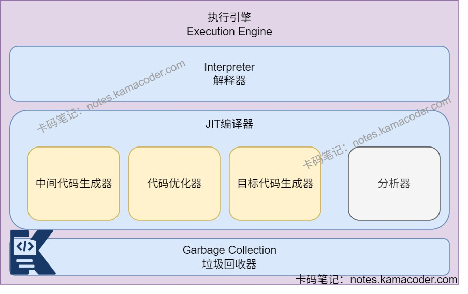

# JVM组成部分

> 来源: https://notes.kamacoder.com/java/jvm-components.html

# `# JVM组成部分 

## `# 简要回答 
  - JVM可以分为**类加载器**、**运行时数据区**、**执行引擎**、**本地方法接口**和**本地方法库**五个部分组成。   - JVM通过**类加载器将字节码（.class文件）加载到内存并生成class对象**，**运行时数据区作为JVM内存管理的区域**中，使用特定的**执行引擎将字节码翻译成底层系统指令**，再交给CPU执行，这个过程需要**调用其他语言的本地接口**实现整个程序的功能。 

## `# 详细回答 
  - **类加载器ClassLoader**：

    - 启动类加载器(Bootstrap ClassLoader)：是最顶层的加载类，JVM启动时加载**核心类库**（rt.jar,resources.jar,charset.jar等jar包和类,被参数-Xbootclasspath指定路径下的类）。     - 扩展类加载器(Extension ClassLoader)：是启动类加载器的子类，加载**扩展目录(lib/ext)中的类库**。     - 应用程序类加载器(Application ClassLoader)：是扩展类加载器的子类，加载**当前应用类路径下的所有jar包和类**。   - **运行时数据区Runtime Data Area**：是Java虚拟机在执行Java程序过程中管理内存的一种方式，将内存划分为不同的区域，分为程序计数器，Java虚拟机栈，本地方法栈，Java堆和方法区。每个区域都有特定的用途和生命周期。

    - **程序计数器**：记录当前线程所执行的字节码指令的地址。生命周期与线程相同。     - **Java虚拟机栈**：方法执行时会创建一个栈帧，存储局部变量、操作数栈、动态链接等。每个线程有独立的Java虚拟机栈，生命周期与线程相同。     - **本地方法栈**：用于存储java中使用native标记的本地方法。是线程私有的，可以固定或动态扩展。     - **堆**：所有线程共享的内存区域，存放对象实例和数组。也是垃圾回收器执行垃圾回收的主要区域。     - **方法区（元空间）**：所有线程共享的内存区域，存储已被虚拟机加载的类信息、常量、静态变量即时编译后的代码等数据。在启动JVM时创建，关闭JVM后释放。   - **执行引擎Execution Engine**：

    - 解释器：将字节码指令翻译为对应平台的本地机器指令，由CPU执行，当一条指令执行完后，根据PC寄存器中记录的下一条指令执行解释操作。     - JIT编译器：将源代码直接编译成与本地平台有关的机器码，并且进行各种层次的优化。由中间代码生成器、代码优化器、目标代码生成器、分析器组成。     - 垃圾回收器：主要用于Java堆的管理，系统运行期间会产生的大量对象实例，GC回收无用的对象。   - **本地方法接口Native Method Interface**：根据本地方法栈中有标记native的方法，生成一个对应的本地接口，启动执行引擎时，会根据本地方法接口去本地方法库中加载对应实现方法。   - **本地方法库Native Method Library**：存储本地方法的实现方法。 

## `# 知识图解 
  - JVM内部结构示意图

   - 执行引擎内部结构示意图

 

## `# 知识扩展 
  - 扩展： 
  - 类加载过程：可以分为三个主要阶段：**加载，链接，初始化**。

    - **加载阶段**：根据类的全限定名，获取字节码文件的二进制流。将字节流解析为方法区中的运行时数据结构，在堆内存生成Class对象，作为方法区数据的访问入口。     - **链接阶段**：

      - 验证：确保字节码符合JVM规范，保证安全性。       - 准备：为类的静态变量分配内存并设置默认值。       - 解析：将常量池中的符号引用转换为直接引用。     - **初始化阶段**：执行类的构造器方法，完成静态变量赋值和静态代码块的执行，如果类有父类，则先初始化父类。   - **JVM（虚拟机）**：能够屏蔽操作系统平台相关信息，使Java程序只需要生成在Java虚拟机上运行的目标代码，即解释自己的字节码并映射到本地的CPU指令集和OS的系统调用，实现“**一次编译，到处运行**”。主要工作有：

    - 加载、验证、执行代码。     - 为各种应用程序提供运行时环境，还提供了内存区域、寄存器集。     - 提供垃圾收集堆，会报告致命错误，提供类文件格式。   - **rt.jar**：代表RunTime，是Java基础类库，包含Java doc里所有的类的文件，如java.util.*，java.io.*，java.nio.*，java.lang.*，java.sql.*，java.math.*等常用内置库。 
  - 面试官可能追问： 
  - Q1：**解释器**和**JIT编译器**的区别是什么？

    - 解释器会逐条执行字节码，没有编译开销，内存占用小，但是执行效率低。     - JIT编译器会将热点代码编译成本地机器码，执行效率高，但是需要一定的编译时间，同时占用CodeCache。   - Q2：为什么Java解释和编译都有？

    - Java同时采用解释和编译执行，这样可以平衡启动速度和执行效率。     - 编译性：使用JIT（即时编译器）可以将频繁执行的代码（热点代码）提前编译为机器码并缓存，后续直接执行机器码。     - 解释性：使用JVM中的解释器，将字节码逐行翻译为机器码并立即执行，不用提前编译，启动速度快且有跨平台性。JVM中一个方法调用计数器，当累计计数大于一定值后，就使用JIT进行编译生成机器码文件。
