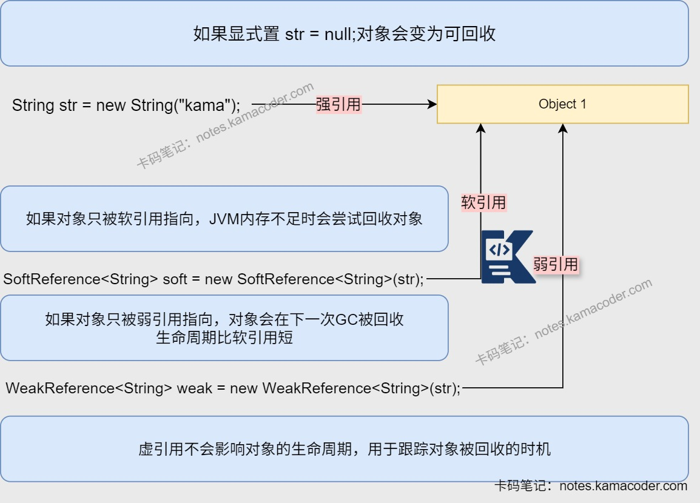

# Java引用类型

> 来源: https://notes.kamacoder.com/java/java-references.html

# `# Java引用类型 

## `# 简要回答 
  - 强引用、软引用、弱引用和虚引用四种引用的主要区别在**垃圾回收过程中的行为不同**，分别是：

    - **强引用**：不会被垃圾回收器回收，新创建的对象会被强引用指向。     - **软引用**：在系统内存不足时会被垃圾回收器回收，描述有用但是非必需的对象。     - **弱引用**：在下一次进行垃圾回收时会被垃圾回收器回收，用于实现对象缓存。     - **虚引用/幻影引用**：在对象被回收之前会被放入引用队列中，用于跟踪对象被垃圾回收的时机。 

## `# 详细回答 
  - 在垃圾回收过程中可以根据**对象被哪些引用类型指向**来**判断对象是否可以被回收**，对对象的生命周期进行更精细地控制与监控。 
  - **强引用(Strong Reference)** ：

    - 如果一个对象有强引用指向它，那么垃圾回收器不会回收该对象。     - 进行引用赋值时（Object obj = new Object();），对象会被强引用指向。   - **软引用(Soft Reference)** ：

    - 如果一个对象只有软引用指向它，**系统内存不足时**垃圾回收器会尝试回收只有软引用指向的对象。     - 描述有用但是非必需的对象，用于实现内存敏感的缓存，可以在内存不足时释放缓存中的对象。   - **弱引用(Weak Reference)** ：

    - 如果一个对象只有弱引用指向它，则在下一次进行垃圾回收时，该对象会被回收。     - 用于实现对象缓存，不希望缓存的对象影响垃圾回收情况。     - 弱引用和软引用的区别是软引用只会在内存不足时进行回收，**弱引用则不管内存是否充足都会进行回收**。   - **虚引用/幻影引用(Phantom Reference)** ：

    - 如果一个对象只有虚引用指向它，那么它什么时候都可能被回收。对象在被回收之前会被放入引用队列中，程序员进行处理。     - **必须和引用队列一起使用**，用于跟踪对象被垃圾回收的时机，进行必要的清理或记录。 

## `# 代码示例 

```
// 强引用
Object obj = new Object();

// 软引用
SoftReference<Object> softRef = new SoftReference<>(new Object());

// 弱引用
WeakReference<Object> weakRef = new WeakReference<>(new Object());

// 虚引用
ReferenceQueue<Object> queue = new ReferenceQueue<>();
PhantomReference<Object> phantomRef = new PhantomReference<>(new Object(), queue);

```

 

## `# 知识图解 
  - **四种引用比较示意图** 
   - **根据引用链判断对象是否可达示意图** 
 

## `# 知识扩展 
  - 扩展： 
  - 判断对象是否可以被回收有引用计数法和可达性分析算法两种方法。其中**可达性分析算法比较常用**，能够避免出现循环引用导致无法回收的问题。

    - **引用计数法**：

      - 给对象中添加**引用计数器**，有地方引用该对象计数器加一，引用失效时计数器减一。如果**计数器为0则说明对象不再可用**。       - 如果两个对象互相引用，会导致计数器无法为0，无法进行垃圾回收。     - **可达性分析**算法：

      - 设置**GC Roots对象**，如果一个对象到GC Roots没有任何引用链相连，则该对象不可用，需要被回收。可以避免使用引用计数器产生的循环引用对象不可回收的问题。       - **GC Roots对象是垃圾回收器可直接访问的起点，且对象本身不能被回收。** 可以作为GC Roots的对象包括**虚拟机栈中引用的对象，方法区中类静态属性引用的对象，方法区中常量引用的对象和被同步锁(synchronized)持有的对象以及JNI中引用的对象**等。   - **内存泄漏**：

    - 程序在运行过程中不再使用的对象仍然被引用，无法被垃圾回收，导致可用内存减少。     - 常见原因：

      - **静态集合**：使用静态数据结构存储对象，没有进行清理。       - **事件监听**：未取消对事件源的监听，导致对象持续被引用。       - **线程**：未停止的线程可能持有对象引用，无法被回收。   - **内存溢出**(OOM)：

    - JVM申请内存时无法找到足够的内存，引发OutOfMemoryError。     - 出现原因：

      - **堆内存溢出**：代码中出现**大对象分配**或者是**内存泄漏**时，多次GC也没有足够的内存空间。       - **栈溢出**：代码中出现**递归调用**，压栈过深或者无法扩展栈空间时出现。       - **元空间溢出**：系统的**代码过多**或加载的类文件过多，导致元空间内存占用大。 
  - 面试官可能追问： 
  - Q1：强引用绝对不会被垃圾回收吗？

    - 如果对象有强引用指向它，及时出现OOM也不会被回收。但是**如果强引用被显式置为null，对象可能变为可回收**。   - Q2：在缓存场景中应该用什么引用？为什么？

    - 缓存场景中应该用**弱引用或软引用**，因为缓存的对象是有用但是非必需的，当内存不足时可以被回收。     - **软引用可以尽可能保留缓存对象**，减少重新加载的开销。还可以在内存不足时释放内存，自动避免OOM。     - **弱引用可以存临时关联数据**，如WeakHashMap中键为弱引用，值为强引用，键对象被回收后，对应的键值对会被自动移除。但是**GC的触发时机不确定**，缓存命中率低。   - Q3：为什么虚引用必须和引用队列一起使用？

    - **虚引用不会影响对象的生命周期**，虚引用的作用就是在对象被回收之前将引用放入引用队列中，程序可以通过检查引用队列来确定对象是否被回收。   - Q4：如果不处理引用队列中的对象，会不会导致内存泄漏？

    - 不会，引用队列本身不持有强引用，而内存泄漏的核心是不必要的强引用。     - 引用队列存储的是已经失去目标对象的引用对象（SoftReference，WeakReference，PhantomReference的实例），他们的目标对象被GC回收后，其会实例被加入引用队列。
