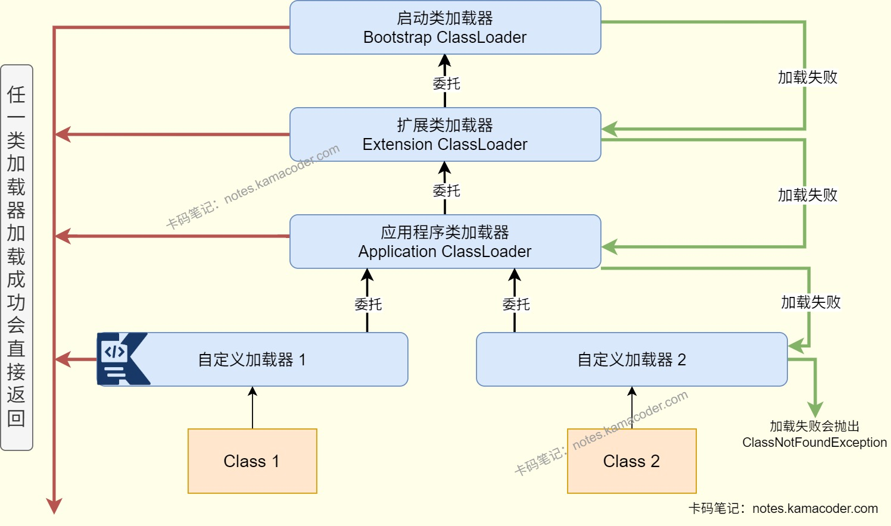

# 双亲委派机制

> 来源: https://notes.kamacoder.com/java/parent-delegation-model.html

# `# 双亲委派机制 

## `# 简要回答 
  - **双亲委派机制**是Java类加载器的一种类加载策略，该机制的核心思想是如果一个类加载器收到了类加载请求，默认先将该请求委托给父类加载器进行加载，如果父类加载器无法完成该加载任务，才会尝试自行加载。 

## `# 详细回答 
  - JVM中有三类类加载器，分别是启动类加载器Bootstrap ClassLoader,扩展类加载器Extension ClassLoader和系统类加载器System ClassLoader。**启动类加载器**加载的是%JAVA_HOME%/jre/lib目录下的Java核心类库；**扩展类加载器**加载的是%JAVA_HOME%/jre/lib/ext目录下的Java扩展类库；**系统类加载器**加载的是应用程序类路径（classpath）下的类库。除此之外，用户也可以**自定义类加载器**，可以加载用户指定目录下的Class文件。   - 类加载器之间是父子关系，启动类加载器是最顶层的类加载器，扩展类加载器是启动类加载器的子加载器，系统类加载器又是扩展类加载器的子加载器。   - 当类加载器收到类加载的请求时，会先**检查该类是否已经被加载过**，如果已经加载则直接返回该类的引用；否则会**委托给父类加载器**加载该类，直到顶层的启动类加载器；父类加载器如果无法加载，当前类加载器才会**尝试自行加载**，也就是调用自己的findClass()方法。如果当前的类加载器也无法加载这个类，那么它会抛出一个ClassNotFoundException异常。   - 优点：

    - 所有的加载请求都会传递到启动类加载器，可以避免不同类重复加载相同类的情况，可以**保证类的唯一性**。     - 核心类被顶层加载器加载一次所有的子加载器就能共享这个类，可以实现**类的复用**。     - 启动类加载器加载Java的核心类库，可以防止不可信的类假冒核心类，能够**增强程序安全性**。     - 实现了不同层次的类加载器服务于不同的类加载需求，例如启动类加载器加载核心类库，扩展类加载器加载扩展类库，应用程序类加载器加载用户代码，各个层级类加载器的职责清晰。   - 缺点：

    - 类加载过程需要不断的委托给父类加载器，可能会导致实际应用中类加载的**灵活性降低**。     - 在类数量多或者层次比较深的情况下，类加载所需的时间可能会增加。 

## `# 知识图解 
  - 双亲委派机制示意图

 

## `# 知识扩展 
  - 扩展： 
  - 打破双亲委派机制

    - 在自定义加载器时，需要继承ClassLoader类，并重写findClass方法，无法被父类加载的类会通过这个方法加载。但是如果希望打破双亲委派机制，则需要**重写loadClass()方法**，实现自己指定项目需求。     - 例如Tomcat服务器就自定义了类加载器WebAppClassLoader用以打破双亲委派机制，每个Web应用的WebAppClassLoader会优先加载Web应用目录下的类实现类，不会委托父类，避免不同Web应用的同名类冲突，实现类隔离。   - 启动类加载器

    - 由C/C++语言实现的，属于JVM内核组件，没有对应的Java类对象，因此如果在代码中获取由启动类加载器加载的类时会返回null，无法返回启动类加载器实例。 
  - 面试官可能追问： 
  - Q1：如果两个不同的类加载器加载了同一个全限定名的类，这两个类在JVM中是一个类吗？

    - 不是。**JVM判断两个类是否相同，需要全限定名和加载它们的类加载器都相同**，如果类加载器不同，JVM会视为两个独立的类，此时使用instanceof判断或强制转换会抛出ClassCastException异常。   - Q2：如果父类加载器加载的类依赖了由子类加载器加载的类，会发生什么？

    - 会导致**类加载失败**，因为父类加载器无法委托子类加载器加载类，所以父类加载时会找不到类而抛出ClassNotFoundException异常。     - 可以使用**线程上下文类加载器**来解决，可以在父类加载器加载的类中获取子类的加载器并进行加载，从而绕过双亲委派从下而上的委托机制。     - 例如JDBC加载数据库驱动，DriverManager由启动类加载器加载，需要通过上述方法加载应用类路径下的驱动类。
