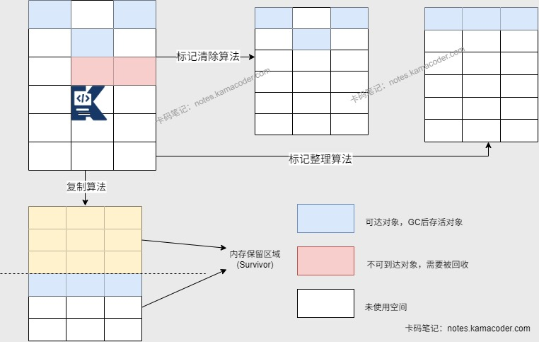

# 垃圾回收

> 来源: https://notes.kamacoder.com/java/garbage-collection.html

# `# 垃圾回收 

## `# 简要回答 
  - 垃圾回收算法包括标记-清除算法、复制算法、标记-压缩算法、分代收集算法等。

    - **标记清除算法**：标记所有存活对象后清除未标记的垃圾对象。     - **复制算法**：将内存分为两块等大区域（如 From 和 To），每次仅使用一块；GC 时将该区域的存活对象复制到另一块空区域，之后清空原区域并互换两块区域的角色，实现循环复用。     - **标记压缩算法**：标记清除算法的改进，标记存活对象后将其压缩到内存一端，清除边界外的垃圾，避免内存碎片问题。   - 垃圾回收机制可以解决内存管理问题，**自动检测和回收不再使用的对象**，释放它们所占用的内存空间，避免内存泄漏和预防内存溢出。 

## `# 详细回答 
  - 垃圾回收算法：

    - 标记清除算法

      - 将垃圾回收分为标记阶段和清除阶段。在标记阶段通过根节点(GC Roots)**标记所有从根节点开始的对象**，没有被标记的对象就是未被引用的垃圾对象。在清除阶段**清除所有未被标记对象**。       - 优点：无需移动对象，仅清除垃圾，适合**存活对象较多**的情况，如老年代（对象存活久，移动开销大）。       - 缺点：容易产生内存碎片，有大对象时可能会提前触发垃圾回收；扫描了两次空间（第一次标记，第二次清理）。     - 复制算法

      - 从根集合节点进行扫描，**标记出所有的存活对象并将其复制到一块新的内存上**，之后将原来的一块内存回收。新生代的Survivor区就是复制算法的体现。       - 优点：适合**存活对象少**的情况，如新生代。只需扫描空间一次，标记并进行复制。       - 缺点：需要一块空的内存空间，如果存活的对象较多，会导致复制操作的效率较低。     - 标记整理算法（标记压缩算法）

      - 在标记清除算法基础上进行优化，对可达对象做标记后，将其**移动到内存的一端实现空间压缩**，清理其他空间。       - 优点：能够避免碎片产生，不需要两块相同内存空间。     - 分代收集算法

      - 将内存空间分为不同的年代，不同年代使用不同的算法。       - 新生代存活率低，可以使用复制算法；老年代存活率高，没有额外空间对它进行分配，使用标记清除/压缩算法。   - 内存分配与垃圾回收时机：

    - JVM将堆内存分为新生代和老年代，**新生代**用于保存新创建的对象，大对象以及GC后仍存活的对象会被保存在**老年代**中。新生代有Eden区和Survivor区（Survivor分为From Survivor和To Survivor）。 
    - 新产生的对象会被优先分配在堆内存新生代的Eden区（如果对象是大对象会直接进入老年代）     - 当Eden区满或者放不下时会触发一次Minor GC（新生代垃圾回收），每次GC后新生代里存活的对象会被移动到Survivor区（S0或S1），如果Survivor区满或放不下时会将新生代存活对象移入老年代。     - 默认情况下，有对象被复制了15次时会进入老年代。     - 当老年代满或放不下时会发生Major GC（老年代垃圾回收），老年代中对象存活率较高，所以每次回收可能需要更长时间。 

## `# 知识图解 
  - **标记阶段根据引用链判断对象是否可达示意图** 
   - **三种回收算法** 
 

## `# 知识扩展 
  - 扩展： 
  - Minor GC/Major GC/Full GC：

    - **Minor GC**针对新生代进行回收，因为新生代的对象生命周期较短，存活对象较少，回收效率高，Minor GC发生的比较频繁。     - **Major GC**针对老年代进行回收，老年代中对象存活率较高，所以每次回收可能需要更长时间，Major GC发生的比较少。     - **Full GC**是对整个堆内存进行回收，通常发生在内存不足的时候（老年代满、永久代满、显示调用System.gc()）。需要停止所有的工作线程并遍历整个堆内存来查找和回收不再使用的对象，耗时严重。   - **内存泄漏**：

    - 程序在运行过程中不再使用的对象仍然被引用，无法被垃圾回收，导致可用内存减少。     - 常见原因：

      - **静态集合**：使用静态数据结构存储对象，没有进行清理。       - **事件监听**：未取消对事件源的监听，导致对象持续被引用。       - **线程**：未停止的线程可能持有对象引用，无法被回收。   - **内存溢出**(OOM)：

    - JVM申请内存时无法找到足够的内存，引发OutOfMemoryError。     - 出现原因：

      - **堆内存溢出**：代码中出现**大对象分配**或者是**内存泄漏**时，多次GC也没有足够的内存空间。       - **栈溢出**：代码中出现**递归调用**，压栈过深或者无法扩展栈空间时出现。       - **元空间溢出**：系统的**代码过多**或加载的类文件过多，导致元空间内存占用大。 
  - 面试官可能追问： 
  - Q1：分代收集算法中对象从新生代晋升到老年代默认的“年龄”是15次，可以通过什么进行调整吗？会对GC有什么影响？

    - 可以通过参数(-XX:MaxTenuringThreshold)进行调整。     - 阈值过小会使对象更早进入老年代，老年代对象增多，增加Major GC频率。     - 阈值过大会使对象在新生代停留更久，Minor GC时存活对象累积，增加复制算法开销。空间不足时对象提前晋升，加大老年代压力。
