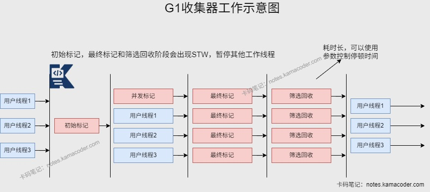

# 垃圾回收器

> 来源: https://notes.kamacoder.com/java/garbage-collectors.html

# `# 垃圾回收器 

## `# 简要回答 
  - 新生代收集器：Serial、ParNew、Parallel Scavenge   - 老年代收集器：Serial Old、Parallel Old、CMS   - 整堆收集器（新生代和老年代）：G1   - 我们需要根据不同的场景选择适合的垃圾回收器，在JDK8中默认的垃圾回收器是Parallel Scavenge和Parallel Old，在JDK9之后是G1。 

## `# 详细回答 
  - 

新生代垃圾收集器： 
    - **Serial** 串行收集器-复制算法：新生代的单线程收集器，简单高效，没有线程交互的开销，在垃圾收集时必须暂停其他所有的工作线程直到收集完成。Serial收集器是虚拟机运行在Client模式下默认新生代收集器。     - **ParNew** 并行收集器-复制算法：是新生代的并行收集器，Serial的多线程版本，包括Serial收集器的所有控制参数、算法、对象分配规则、回收策略等。唯一支持与CMS并行的新生代收集器。     - **Parallel Scavenge** 并行收集器-复制算法：是新生代的并行收集器，追求高吞吐量和高效利用CPU，该收集器的目标是达到一个可控制的吞吐量。可以自适应调节新生代大小等参数，无需手动调优。   - 

老年代垃圾收集器： 
    - **Serial Old** 串行收集器-标记整理算法：是Serial收集器的老年代版本，用于Client模式下的虚拟机。如果在Server模式下可以用在JDK1.5及之前和Parallel Scavenge收集器搭配使用，也可以作为CMS收集器的后备预案，在并发收集发生Concurrent Mode Failure时使用。     - **Parallel Old** 并行收集器-标记整理算法：是Parallel Scavenge收集器的老年代版本，在JDK1.6及之后开始提供。     - **CMS(Concurrent Mark Sweep)** 收集器-标记清除算法：追求最短的回收停顿时间，适合重视服务器响应速度的应用，高并发且低停顿，用户体验好。收集过程可以分为初始标记、并发标记、重新标记和并发清除。初始标记和重新标记需要暂停其他工作线程。

      - **初始标记**会短暂停顿，标记直接与root相连的对象。       - **并发标记**会同时开始GC和用户线程，记录可达对象，不需要停顿。       - **重新标记**能够修正并发标记期间因为用户程序继续运行而导致标记变动的对象，需要停顿。       - **并发清除**会开启用户线程同时GC线程对未标记的区域清扫，不需要停顿。清除阶段新产生的垃圾会等到下一次GC处理。       - CMS对CPU资源敏感，并发阶段需要多个线程和用户线程并行工作，会占用部分CPU资源，在CPU核心较少情况下可能会导致用户线程执行效率下降；基于标记清除算法，回收后会产生内存碎片；清除阶段老年代空间不足会导致Concurrent Mode Failure，JVM会启用Serial Old进行回收；为了避免上述情况，会限制对内存的使用，内存利用率降低。   - 

新生代和老年代垃圾收集器：**G1 收集器** 
    - G1收集器在JDK1.7被引入，后面取代CMS为默认收集器。     - 将**堆内存分为多个区域(Region)** ，维护一个优先列表，根据允许的收集时间选择回收价值最大的Region，尽可能提高收集效率；可以充分利用CPU资源缩短停顿时间；筛选回收阶段的复制算法可以避免内存碎片，尽可能满足GC停顿时间要求的同时具备高吞吐量性能特征。     - G1收集器回收过程：分为初始标记，并发标记，最终标记和筛选回收四个步骤。

      - **初始标记**会短暂停顿，标记所有直接可达的对象，**并发标记**会标记所有可达对象，**最终标记**会短暂停顿，处理并发标记阶段中未处理的引用变更，**筛选回收**会停顿，根据标记结果，优先选择回收价值高的区域，复制存活对象到新区域，回收旧区域内存。 

## `# 知识图解 
  - CMS回收示意图

   - G1回收示意图

 

## `# 使用场景 

| 垃圾收集器  适用场景  回收类型  使用算法  作用域  特点 
| Serial  单核CPU下的Client模式  串行回收  复制算法  新生代  响应速度优先 
| Serial Old  单核CPU下的Client模式  串行回收  标记整理算法  老年代  响应速度优先 
| ParNew  多核CPU环境中Server模式下与CMS配合使用  并行回收  复制算法  新生代  响应速度优先 
| Parallel Scavenge  适用于后台运算，交互少的场景  并行回收  复制算法  新生代  吞吐量优先 
| Parallel Old  适用于后台运算，交互少的场景  并行回收  标记整理算法  老年代  吞吐量优先 
| CMS  适用于B/S业务，交互多场景  并发回收  标记清除算法  老年代  响应速度优先 
| G1  面向服务端应用  并发，并行回收  标记整理算法+复制算法  堆内存  响应速度优先 

## `# 知识扩展 
  - 扩展 
  - **吞吐量**：CPU用于运行用户代码的时间与CPU总消耗时间的比值，吞吐量=用户代码运行时间/（用户代码运行时间+垃圾收集时间）。停顿时间越短就越适合需要与用户交互的程序，良好的响应速度能提升用户体验，**高吞吐量可高效利用CPU时间**，加快完成程序运算任务。   - 并发：用户线程和垃圾收集线程同时执行。   - 并行：多条垃圾收集线程并行工作，用户线程处于等待状态。 
  - 面试官可能追问： 
  - Q1：G1的筛选回收阶段怎么实现“可控停顿”？参数设置过小会怎么样？

    - G1可以**根据预期停顿时间动态调整回收范围**，G1为每个Region维护垃圾比例与耗时，根据参数 **-XX:MaxGCPauseMillis** 选择高收益的Region进行回收，保证单次STW时间不超过预期值。     - 如果参数设置过小，G1只能选择少数Region进行回收，释放内存小于新对象的分配速度，可能会更频繁触发GC，降低用户代码执行效率。
