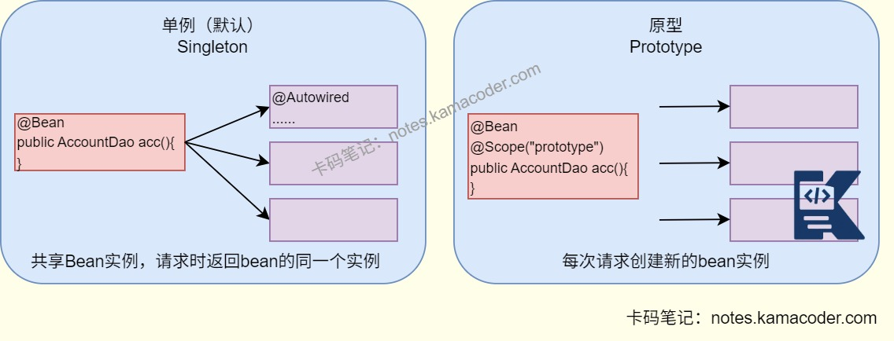

# Bean作用域

> 来源: https://notes.kamacoder.com/java/bean-scope.html

# `# Bean作用域 

## `# 简要回答 
  - Spring Bean有6种作用域，核心常用前2种：**Singleton（默认单例，容器内唯一实例）、Prototype（多例，每次请求新建实例）**；Web 场景专属 4 种：**Request**（单次 HTTP 请求内有效）、**Session**（会话内有效）、**Application**（ServletContext之内有效）、**Websocket**（WebSocket 会话内有效），作用域决定 Bean 的生命周期和可见范围。 

## `# 详细回答 
  - 在Spring中，**Bean**是组成应用程序的主体，由Spring IOC容器所管理的对象。**Bean的作用域**则定义了在应用程序中创建的Bean实例的生命周期和可见范围。Spring容器根据作用域管理Bean的实例，包括它们的创建、销毁，以及是否可以被共享。 
  - **Singleton**（单例）：是默认的作用域，当一个Bean的作用域是Singleton时，Spring IOC**容器只存在一个共享的Bean实例**，并且对所有的Bean请求，只要id与该bean定义匹配，都会返回bean的同一实例。   - **Prototype**（原型）：每次请求都会创建一个新的Bean实例。当Bean的作用域为prototype时，每次对该Bean请求都会得到一个新的Bean实例，适用于瞬时的对象。   - **Request**（请求）：**每次HTTP请求都会产生一个新的Bean实例**，该Bean只在当前HTTP请求中有效。Request只适用于Web程序，请求结束后该对象的生命周期即结束。   - **Session**（会话）：**每一次HTTP请求都会产生一个新的Bean实例**，该bean仅在当前HTTP Session内有效，Session同样只适用于Web程序。可以根据需求更改实例的内部状态，其他session无法看到特定session的状态变化。在该HTTP Session作用域内的bean随着session的结束而销毁。   - **Application**：当前的**ServletContext中只存在一个Bean实例**，仅在Spring Web应用程序中有效，该Bean实例在整个ServletContext中共享。Application作用域只在支持Web的Spring ApplicationContext中有效。   - **Websocket**：每次WebSocket会话会产生一个新的bean，该实例在WebSocket会话范围内共享。   - **Global Session**（全局会话）：类似Session作用域，仅在基于集群的Web应用程序中有意义，指定了在整个集群中共享的Bean实例。Portlet规范了全局Session的概念，它**被所有构成某个portlet的web应用的不同portlet所共享**，在global session作用域中定义的bean被限定于全局portlet Session的生命周期范围内。   - **Custom scopes**（自定义作用域）：Spring允许开发者自定义作用域，可以通过实现Scope接口来创建新的Bean作用域。 

## `# 知识图解 
  - 单例作用域和原型作用域的区别示意图

 

## `# 代码示例 

```
//1. 在Spring配置文件中通过<bean>标签的scope属性指定Bean的作用域
<bean id="myBean" class="com.example.MyBean" scope="singleton"/>

//2. 使用@Scope注解指定Bean的作用域
@Bean
@Scope("prototype")
public class MyBean {
    return new MyBean();
}

```

 

## `# 知识扩展 
  - 面试官可能追问 
  - Q1：Singleton单例Bean是线程安全的吗？为什么？如何解决？

    - **默认不安全**，因为**单例Bean是全局共享的**，若存在可修改的成员变量，多线程并发修改会导致数据错乱；应该避免Bean存储可变状态，可以用局部变量替代成员变量、使用ThreadLocal隔离线程数据、加锁（synchronized/ReentrantLock）或采用无状态设计。   - Q2：Singleton和Prototype的Bean生命周期有什么区别？容器会管理Prototype Bean的销毁吗？

    - **Singleton Bean生命周期与容器一致**（容器启动创建，容器关闭销毁），容器**全程管理**；**Prototype Bean**每次请求创建新实例后，容器仅负责实例化和依赖注入，**创建后不再管理**，销毁由 JVM 垃圾回收，也可以手动释放资源，如在@PreDestroy中处理，但容器不会主动调用）。   - Q3：如何在Singleton Bean中注入Prototype Bean？直接用@Autowired会有什么问题？

    - 直接注入会导致Prototype Bean变成 “**伪多例**”。当Singleton Bean初始化时只注入一次Prototype实例，后续每次使用都是同一个实例。可以用@Lookup注解，即Spring 动态生成代理，每次调用返回新实例、还可以通过ApplicationContext手动获取（context.getBean(PrototypeBean.class)）或者使用 Scoped Proxy（作用域代理）。   - Q4：如何自定义 Bean 的作用域？

    - 先实现Scope接口：重写get（获取 Bean）、remove（移除 Bean）和registerDestructionCallback（注册销毁回调）等方法；再通过CustomScopeConfigurer将自定义 Scope 注册到 Spring 容器；在 Bean 上用@Scope("自定义作用域名称")标注使用。
