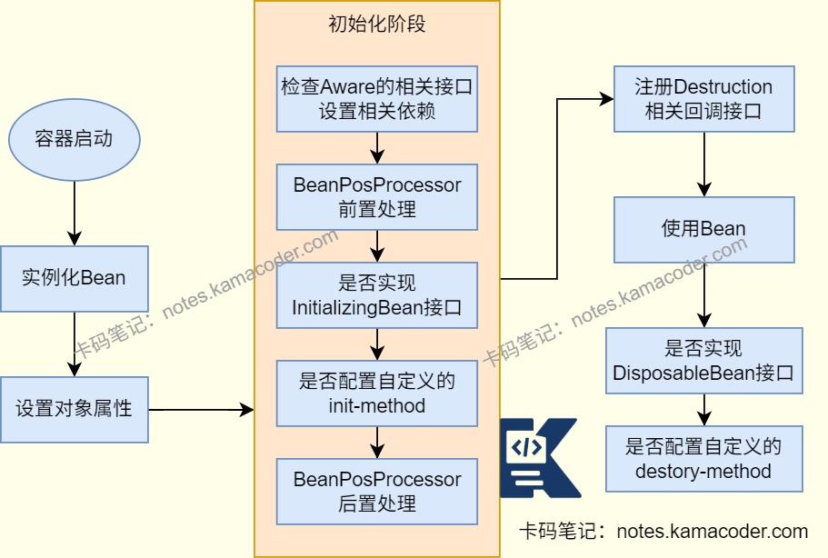

# Bean生命周期

> 来源: https://notes.kamacoder.com/java/bean-lifecycle.html

# `# Bean生命周期 

## `# 简要回答 
  - Bean的生命周期可以概括为**容器初始化、Bean实例化、依赖注入、初始化、使用和销毁阶段**，由Spring容器进行管理，通过注解、配置文件或接口进行配置管理。 

## `# 详细回答 
  - 在**容器初始化**阶段，Bean容器通过XML或注解扫描Spring Bean的定义，将其封装成BeanDefinition对象并注册到BeanFactory中。   - 在**实例化**阶段中，容器会通过构造器反射创建Bean实例。   - 在**依赖注入**阶段中，容器通过Autowired、Resource或者XML配置将Bean实例的属性值或者引用注入到其他Bean中。   - 在**Bean初始化**阶段：

    - 容器会检查**Aware相关的接口**：如果Bean实现了BeanNameAware接口，调用setBeanName方法，传入Bean的名字；如果Bean实现了BeanFactoryAware接口，调用setBeanFactory方法，传入BeanFactory实例；如果Bean实现了ApplicationContextAware接口，调用setApplicationContext方法，注入ApplicationContext实例。     - 执行**前置处理**：如果Bean实现了BeanPostProcessor接口，Spring会调用它们的postProcessBeforeInitialization()方法。     - 执行**自定义初始化方法**，调用Bean使用@PostConstruct或XML方式init-method声明的初始化方法，如果Bean实现了InitializingBean接口，Spring将调用他们的afterPropertiesSet()方法；     - 执行**后置处理**：如果Bean实现了BeanPostProcessor接口，Spring就调用他们的postProcessAfterInitialization()方法。   - Bean在初始化后就可以被应用程序使用，使用结束后进行**销毁**，执行@PreDestroy标注或者在XML中使用destroy-method指定的方法，如果Bean实现了DisposableBean接口，Spring会调用destroy()方法。 

## `# 知识图解 
  - Bean的生命周期示意图

 

## `# 知识扩展 
  - 面试官可能追问 
  - Q1：Bean的作用域对生命周期有什么影响？

    - 作用域为 **单例(singleton)** 时，Bean由容器管理完整的生命周期，在初始化后存入容器缓存，容器关闭时销毁。     - 作用域为**原型(prototype)** 时，容器仅负责实例化、依赖注入和初始化阶段，后续容器不会主动调用，销毁阶段由用户手动处理或JVM垃圾回收处理。     - 其他作用域如request、session、global session等生命周期与作用域一致，随着请求创建，请求结束销毁。   - Q2：@PostConstruct、InitializingBean、init-method有没有执行顺序，为什么？

    - **先执行@PostConstruct，再执行InitializingBean，然后执行init-method。**     - @PostConstruct是由Spring的CommonAnnotationBeanPostProcessor解析，属于BeanPostProcessor前置处理后的回调；     - InitializingBean是Spring内置接口，容器直接调用其方法，优先级高于自定义XML配置；     - init-method是XML配置的自定义方法，优先级最低   - Q3：Spring怎么解决单例Bean的循环依赖问题？为什么原型Bean无法解决？

    - Spring是通过**三级缓存**来解决循环依赖问题的。**一级缓存SingletonObjects**存储完全初始化好的Bean,**二级缓存EarlySingletonObjects**存储早期的Bean引用，是已经实例化但还未完全初始化的Bean，**三级缓存SingletonFactories**存储Bean的工厂，可以生成早期Bean引用。     - 假设A和B存在循环依赖问题，A创建实例后未注入属性时会存放ObjectFactory对象到三级缓存中，开始给A注入属性时发现A依赖B，此时容器开始创建B，B实例化后也会被存放ObjectFactory对象到三级缓存中，Spring给B注入属性时发现B依赖A，容器在三级缓存中找到A的ObjectFactory对象，获取A的早期引用并放入二级缓存，并清理三级缓存。将A的早期引用注入到B中，完成B的初始化后进入一级缓存。回到A的属性注入环节，将就绪的B注入A，完成A的初始化后进入一级缓存，解决循环依赖问题。     - **原型Bean无法解决循环依赖问题**，因为原型Bean每次获取都会创建新实例，会导致递归创建，Spring直接抛出BeanCurrentlyInCreationException异常。   - Q4：如何监听Bean的生命周期？

    - 实现BeanPostProcessor接口，在postProcessBeforeInitialization和postProcessAfterInitialization方法中添加监听逻辑。     - Bean实现Aware接口、InitializingBean接口、DisposableBean接口，在初始化、销毁前、销毁后添加监听逻辑。     - 使用@EventListener注解监听容器事件，如ContextRefreshedEvent容器初始化完成、ContextClosedEvent容器关闭等。
