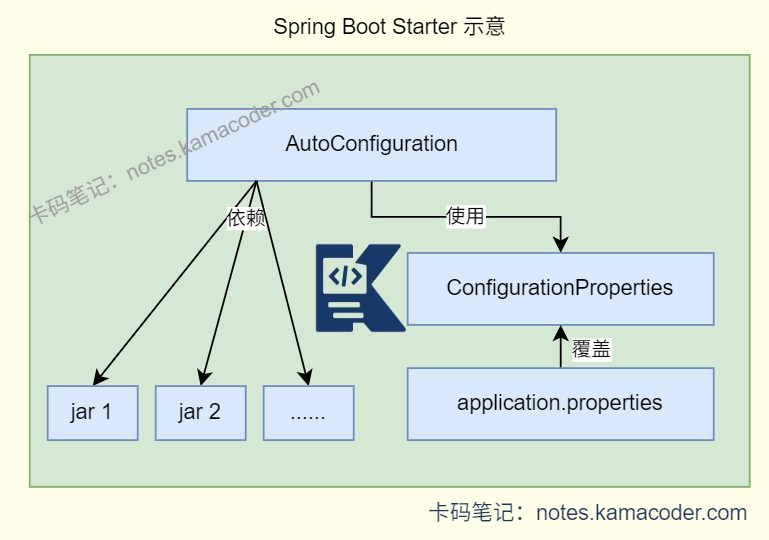

# SpringBoot Starter

> 来源: https://notes.kamacoder.com/java/spring-boot-starter.html

# `# SpringBoot Starter 

## `# 简要回答 
  - SpringBoot Starter是**依赖整合包**，把某类功能相关的常用依赖打包整合。   - 应用可以通过**引入不同的Starter来实现模块化的开发**，**简化和加速项目的配置与依赖管理**。每个Starter都关注一个特定的功能领域，如数据库访问、消息队列、Web开发等。   - 开发者可以创建**自定义的Starter**，能够在项目中共享和重用特定功能的配置和依赖项。 

## `# 详细回答 
  - SpringBoot Starter是一种预配置的模块，封装了特定功能的依赖项和配置，开发者只需引入相关的Starter依赖，就无需手动配置大量的参数和依赖项。**引入启动器后，SpringBoot会自动配置所需的组件和Bean，开发者只需关注业务逻辑。**   - Starter还管理了相关功能的依赖项，确保其他Starter和第三方库能够良好地协同工作，依赖版本由SpringBoot中的spring-boot-dependencies管理，**避免版本冲突和依赖问题**。   - 一个Starter由**自动配置类**、**依赖jar包**和**配置文件**组成。AutoConfiguration类用于自动配置应用程序，会根据依赖和配置自动向Spring容器中注入功能所需的Bean，是自动配置的实现载体；Starter中包含功能场景所需的依赖jar包；ConfigurationProperties类用于绑定配置文件中的属性，封装Starter的默认配置项，同时读取application.properties中的自定义配置。 

### `# 常用的Starter 
  - **spring-boot-starter-web**：用于快速构建Web应用程序，包含Spring MVC、Tomcat嵌入式服务器等组件。   - **spring-boot-starter-security**：提供了Spring Security的基本配置，帮助开发者快速实现应用的安全性、认证和授权。   - **mybatis-spring-boot-starter**：简化在SpringBoot应用中集成MyBatis的过程，自动配置了MyBatis的相关组件，包括SqlSessionFactory、MapperScannerConfigurer等，开发者可以快速地开始使用MyBatis进行数据库操作。   - **spring-boot-starter-data-jpa**包含了Hibernate等JPA实现以及数据库连接池等必要的库，适合在使用JavaPersistence API进行数据库操作场景，需要在application.properties中进行配置；**spring-boot-starter-jdbc**包含了JDBC驱动和数据库连接池等组件，提供了基础的JDBC支持。   - **spring-boot-starter-data-redis**：集成了Redis缓存和数据存储服务，包含了与Redis交互所需的客户端（默认是Lettuce客户端），以及Spring Data Redis的支持，需要在配置文件中添加Redis的连接信息。   - **spring-boot-starter-test**：提供了单元测试和集成测试所需的库，包括JUnit、Hamcrest、Mockito等，便于进行测试驱动开发(TDD)。 

### `# 自定义Starter 
  - 开发者可以创建自定义的Starter，能够在项目中共享和重用特定功能的配置和依赖项。当现有的Starter无法满足业务时，可以自定义Starter，封装专属依赖，**编写**XXXAutoConfiguration自动配置类，在META-INF/spring.factories中**配置**自动配置类，实现专属功能的快速集成。   - 创建自定义Starter：

    - 需要创建Maven项目，在pom.xml中添加必要的依赖；     - 在src/main/resources/META-INF/spring.factories中配置自己的自动配置类后，即可创建自动配置类，需要@Configuration和@EnableAutoConfigurationProperties两个注解，@Configuration注解用于标识该类是一个配置类，@EnableAutoConfigurationProperties注解用于启用自动配置属性绑定；还需结合条件注解@ConditionalOnClass，确保仅在依赖满足时生效。     - 创建配置属性类，用@ConfigurationProperties注解绑定配置文件中的属性；     - 创建服务类、服务实现类和控制器规定自定义Starter的功能；     - 随后可以在Maven仓库中发布自己的Starter，供项目使用。 

## `# 知识图解 
  - Starter结构示意图：

 

## `# 知识扩展 
  - 扩展

    - 约定优于配置：

      - SpringBoot遵循**约定优于配置**的原则，预设默认的配置和约定，开发者按照这些约定进行开发，可以大大减少配置文件的编写。       - SpringBoot提供**特定的项目结构**，将主应用程序类置于根包，将控制器类、服务类、数据访问类等分别放在相应子包中，使开发者更易理解项目结构与组织，新成员加入项目也能快速定位各功能代码的位置，提升协作效率。       - SpringBoot提供了大量**默认配置**，比如连接数据库、设置Web服务器、处理日志等，开发者无需配置日志级别、输出格式与位置。       - SpringBoot的**自动化配置**也是约定大于配置的体现，通过分析项目的依赖和环境，自动配置应用程序的行为。   - 面试官可能追问 
  - Q1：引入多个Starter时，若出现依赖冲突怎么办？

    - 可以通过mvn dependency:tree分析依赖树，找到冲突的依赖版本；再通过< exclusions >排除Starter中冲突的依赖，手动引入兼容版本；或优先使用Spring Boot官方维护的Starter，其依赖版本已做兼容性适配。   - Q2：自定义Starter时，如何确保自动配置类仅在特定条件下生效？

    - 通过Spring Boot的条件注解实现，例如@ConditionalOnClass实现类路径存在指定类时生效、@ConditionalOnMissingBean在容器中无指定 Bean 时生效、@ConditionalOnProperty在配置文件中存在指定属性时生效，结合这些注解实现 “按需配置”。   - Q3：spring-boot-starter和spring-boot-starter-parent的区别是什么？

    - spring-boot-starter是基础 Starter，包含核心依赖；spring-boot-starter-parent是Maven父工程，用于统一管理依赖版本、编译插件等配置；项目通常继承spring-boot-starter-parent，再引入具体功能的 Starter。
