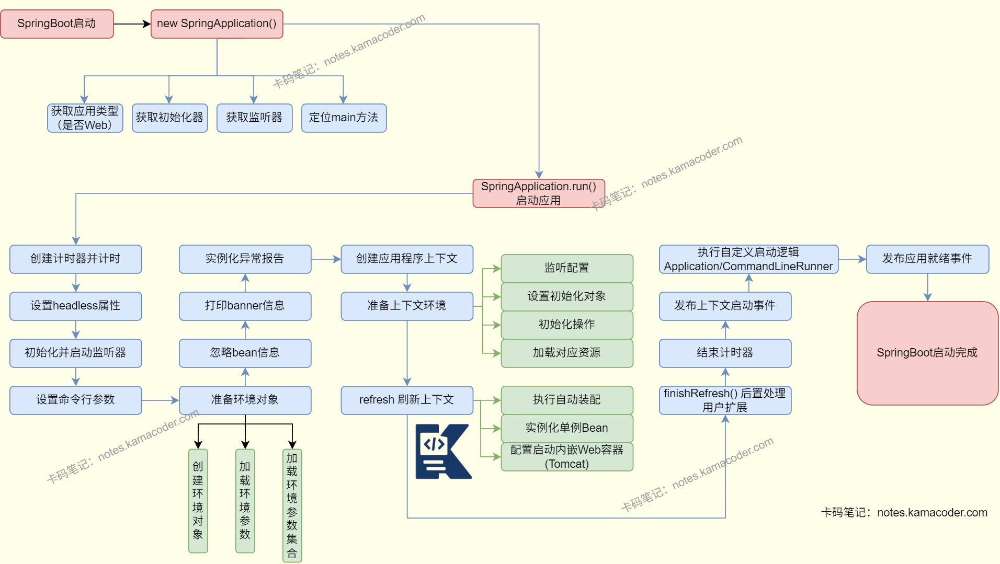

# SpringBoot启动流程

> 来源: https://notes.kamacoder.com/java/spring-boot-startup.html

# `# SpringBoot启动流程 

## `# 简要回答 
  - SpringBoot主要通过SpringApplication.run()方法启动，可以分成创建SpringApplication实例和调用run()方法两个阶段。**初始化SpringApplication实例**需要启动SpringBoot需要先创建一个SpringApplication构造器，在这个阶段主要做的是获取应用类型，加载所有初始化器与监听器，并通过调用栈寻找执行main方法的主类。**执行run()方法**需要执行run()方法会启动计时器并设置系统属性，初始化监听器并启动监听器，设置命令行参数，准备环境对象和应用上下文，刷新应用上下文并发布启动事件结束计时器，完成SpringBoot的启动。 

## `# 详细回答 
  - SpringBoot启动流程： 
  - **初始化SpringApplication实例**：启动SpringBoot需要先创建一个SpringApplication构造器，在这个阶段获取应用类型，加载所有初始化器与监听器，并通过调用栈寻找执行main方法的主类。

    - **获取应用类型**：通过deduceFromClasspath()方法，当返回值为NONE是应用为非web应用，不会启动服务器；如果返回SERVLET则是基于Servlet的web应用，会启动Tomcat服务器；如果返回REACTIVE则当前应用是响应式应用。     - **加载初始化器**：使用getSpringFactoriesInstances()方法可以获取所有初始化器的名称集合，然后根据名称实例化这些初始化器，进行排序后返回设置到initializers属性中。     - **加载监听器**：与初始化器类似，使用getSpringFactoriesInstances()读取spring.factories中的ApplicationListener，实例化并启动事件监听器。   - **执行run()方法**：执行run()方法会启动计时器并设置系统属性，初始化监听器并启动监听器，设置命令行参数，准备环境对象和应用上下文，刷新应用上下文并发布启动事件结束计时器，完成SpringBoot的启动。

    - **启动计时器**：调用run方法时，首先会创建并启动计时，同时配置java.awt.headless属性为true，保证无GUI界面。     - **初始化监听器**：通过getRunListeners()方法加载全周期事件监听器(SpringApplicationRunListener)，并发布启动准备的监听事件。     - **设置命令行参数**：将启动时的args参数设置到Environment对象中，并设置到SpringApplication对象中。     - **准备环境对象**：创建Environment对象，然后加载系统属性、环境变量和配置文件，然后把配置环境(Environment)加入监听对象。     - **打印banner图**：根据应用类型和配置打印banner图，默认是ASCII字符画。     - **准备异常报告器**：初始化启动失败时的异常分析器。     - **创建应用上下文**：根据应用类型创建对应的应用上下文实例，如果是Web应用，创建AnnotationConfigServletWebServerApplicationContext。     - **准备上下文环境**：需要给上下文绑定环境对象，执行ApplicationContextInitializer的初始化操作，然后加载配置类、扫描组件等资源。     - **刷新上下文**：是SpringBoot启动的关键步骤，调用refreshContext(context)方法，Spring在此完成自动装配，包括扫描主类及其子包的注解，对Bean进行注册和初始化，筛选生效的配置，加载自动配置类，如果是Web应用还会创建并启动Tomcat服务器。     - **finishRefresh**：上下文刷新完成后，用户可以在afterRefresh()方法中进行后置处理，自定义扩展功能。     - **结束阶段**：计时器结束，打印出启动耗时，触发上下文启动完成事件并通知监听器，同时调用用户自定义的启动后逻辑，即ApplicationRunner/CommandLineRunner，随后发布就绪事件，SpringBoot应用启动完成，内嵌容器开始监听端口，对外服务。 

## `# 知识图解 
  - SpringBoot启动流程

 

## `# 知识扩展 
  - 扩展

    - @SpringBootApplication

      - 是SpringBoot启动的关键注解，这个组合注解包含了@SpringBootConfiguration、@EnableAutoConfiguration和@ComponentScan三个注解。 **@SpringBootConfiguration** 注解表示这是一个配置类， **@ EnableAutoConfiguration** 注解开启自动配置，能够通过内部方法扫描classpath的META-INF/spring.factories配置文件，并且将其中EnableAutoConfiguration对应的配置项实例化并注册到spring容器中； **@ ComponentScan** 注解扫描主类所在包及其子包下的组件。   - 面试官可能追问 
  - Q1：SpringBoot启动时**Bean的加载顺序**是什么？

    - SpringBoot 启动时先通过自动配置类注册Bean定义，再加载用户自定义配置类的 Bean 定义；实例化阶段优先处理无依赖的 Bean，再处理有依赖的（按依赖关系）；初始化时按构造方法→依赖注入→@PostConstruct→InitializingBean→@Bean 指定的 initMethod 顺序执行；如果要控制顺序，建议用 @DependsOn 显式声明，避免依赖扫描或方法顺序，懒加载 Bean 则在首次使用时才初始化。   - Q2：SpringBoot是怎么**实现内嵌Tomcat**的？

    - SpringBoot会自动配置TomcatServletWebServerFactory并创建Tomcat实例，然后配置Tomcat连接器(Connector)、引擎(Engine)和主机(Host)，将SpringMVC的DispatcherServlet注册为Tomcat的Servlet，随后调用Tomcat.start()启动容器，绑定端口监听请求。   - Q3：SpringBoot启动时，为什么自定义的Bean会被自动配置的Bean覆盖？

    - 自定义Bean被自动配置的Bean覆盖可能是因为自动配置类使用了@Primary注解导致用户Bean被覆盖，或者用户Bean所在的包被扫描，可以使用@Primary注解标注用户Bean或排除对应的自动配置类解决。
