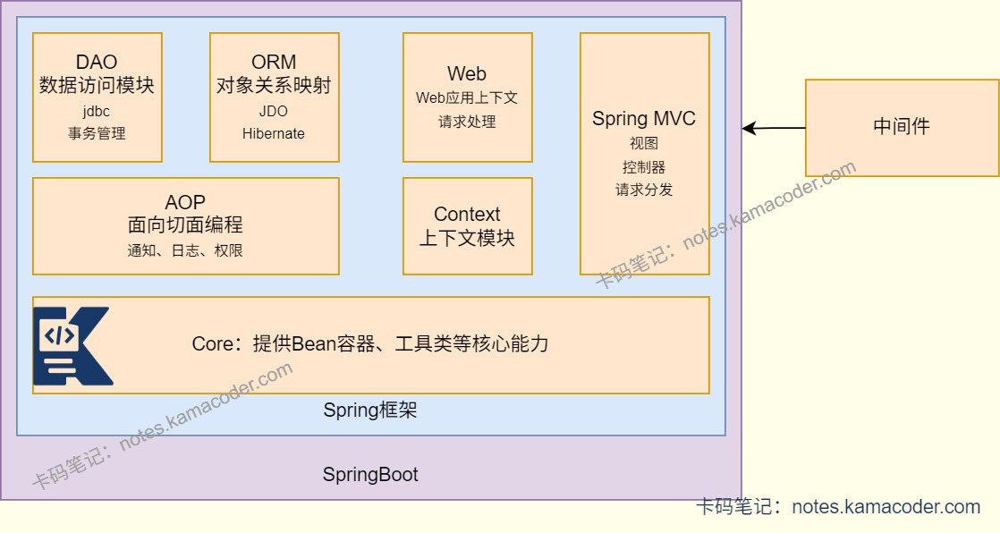
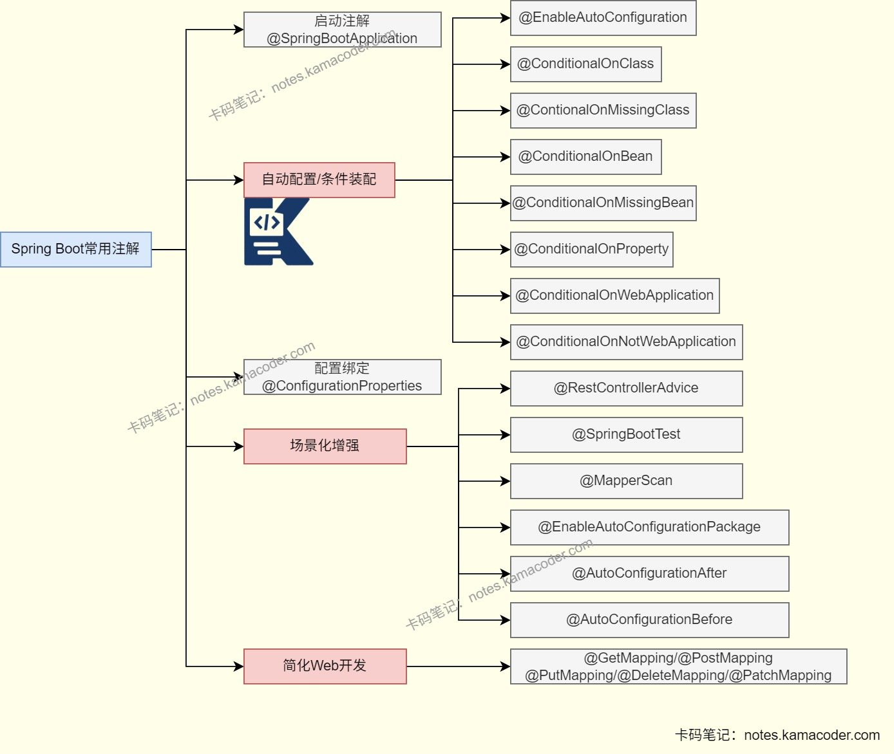

# SpringBoot常用注解

> 来源: https://notes.kamacoder.com/java/spring-boot-annotations.html

# `# SpringBoot常用注解 

## `# 简要回答 
  - SpringBoot的注解以Spring的注解为基础，做了轻量化、自动化和场景化的改进，在Spring注解的基础上做了封装与扩展，实现**约定大于配置**，减少开发者的配置工作。   - 自动配置核心注解 **@SpringBootApplication** ，整合了@SpringBootConfiguration、@EnableAutoConfiguration和@ComponentScan。   - 配置读取可使用 **@ConfigurationProperties** 绑定配置文件属性， **@Value** 读取单个配置值。   - Web开发在Spring注解基础上扩展了 **@GetMapping/@PostMapping** 等，新增@RestControllerAdvice处理全局异常。   - **条件装配**可通过@ConditionalOnClass、@ConditionalOnMissingBean等控制Bean的创建时机。   - 启动相关有 **@SpringBootApplication** 标记启动类， **@MapperScan** 扫描MyBatis映射接口。 

## `# 详细回答 
  - @**SpringBootApplication**：SpringBoot是应用的核心启动注解，是@SpringBootConfiguration、@EnableAutoConfiguration、@ComponentScan 三个注解的组合：

    - **@SpringBootConfiguration**：本质是 @Configuration，标记当前类为配置类；     - **@EnableAutoConfiguration**：开启自动配置，SpringBoot 会根据类路径下的依赖自动配置 Bean（如引入 spring-boot-starter-web 则自动配置 Tomcat、DispatcherServlet）；     - **@ComponentScan**：默认扫描当前类所在包及子包下的 @Component、@Service 等注解组件。   - **@ConfigurationProperties**：能够批量绑定配置文件中的属性到Bean中，支持前缀指定，例如@ConfigurationProperties(prefix = "app.datasource")可绑定app.datasource.url等配置到类的成员变量。   - **@Value**：可以从属性文件或配置中读取单个配置值并注入到成员变量，例如@Value("${server.port:8080}")读取端口配置，默认值 8080。   - **@RestControllerAdvice**：负责全局异常处理、数据绑定、响应增强的注解，结合 @ExceptionHandler 可统一处理 Controller 层异常，替代传统的 @ControllerAdvice+@ResponseBody 组合。   - **@ExceptionHandler**：在 @RestControllerAdvice 标注的类中使用，指定处理特定类型的异常，例如使用@ExceptionHandler(NullPointerException.class)处理空指针异常。   - **@ConditionalOnClass**：条件装配注解，当类路径下存在指定类时，才加载当前配置类Bean；反之 @ConditionalOnMissingClass 则是不存在指定类时生效。   - **@ConditionalOnBean**：当Spring容器中存在指定Bean时，才创建当前Bean；@ConditionalOnMissingBean 则是容器中不存在指定Bean时生效，常用于自定义Bean覆盖默认配置。   - **@MapperScan**：指定MyBatis映射接口的扫描包路径，替代在每个Mapper接口上标注@Mapper，例如@MapperScan("com.example.mapper")，让容器识别接口并创建代理实现类。   - **@EnableTransactionManagement**：开启Spring的事务管理功能，结合 @Transactional 注解实现声明式事务（SpringBoot 中引入 spring-boot-starter-jdbc/orm后会自动开启，无需手动标注）。   - **@Async**：能够标记方法为异步执行，需配合@EnableAsync 注解开启异步功能，Spring会为异步方法创建独立线程执行。   - **@EnableCaching**：开启缓存功能，结合@Cacheable、@CachePut、@CacheEvict等注解实现数据缓存。   - **@PathVariable**：从URL路径中提取参数，例如@GetMapping("/user/{id}")中通过@PathVariable("id") Long id获取路径中的 id 值。   - **@RequestParam**：获取请求参数（URL 拼接或表单提交的参数），支持指定参数名、是否必传、默认值，例如@RequestParam(value = "name", required = false, defaultValue = "guest") String name。 

## `# 知识图解 
  - Spring框架与Spring Boot的关系

   - SpringBoot常见注解

 

## `# 知识扩展 
  - 面试官可能追问： 
  - @SpringBootApplication的扫描范围是什么？可以修改吗？

    - **@SpringBootApplication注解默认扫描当前包及其所有子包下的组件**。     - 可以通过@ComponentScan注解或者使用@SpringBootApplication的scanBasePackages属性指定扫描包。@ComponentScan的excludeFilters属性可以排除特定组件。   - SpringBoot的@Transactional注解什么时候会失效？

    - 如果事务方法被private/static/final修饰，无法被AOP代理时，事务方法将不会被事务管理。     - 同类中非事务方法调用事务方法，注解无效。     - 如果异常被catch捕获但没有抛出或者异常类型不是运行时异常时，事务方法将失效。   - @Async注解的方法为什么不能是private或者static？

    - **@Async注解基于Spring AOP实现**，而AOP无法代理private/static方法。   - @RestControllerAdvice和@ControllerAdvice的区别是什么？

    - **@RestControllerAdvice是@ControllerAdvice和@ResponseBody的组合**，内部的@ExceptionHandler方法返回的数据会以json格式返回给前端。而@ControllerAdvice返回的是视图页面，手动添加@ResponseBody注解后才能返回json数据。   - 怎么通过@RestControllerAdvice实现全局异常处理？

    - 先定义异常枚举的错误码和错误信息，然后编写统一返回结果类(code/msg/data)，在@RestControllerAdvice类中使用@ExceptionHandler标注方法，捕获不同类型异常，封装为统一的返回结果返回。
