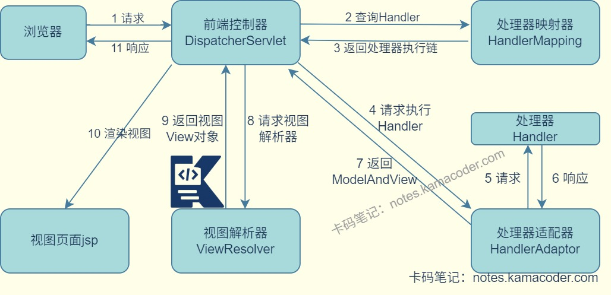

# SpringMVC执行流程

> 来源: https://notes.kamacoder.com/java/spring-mvc-flow.html

# `# SpringMVC执行流程 

## `# 简要回答 
  - SpringMVC的核心是**前端控制器与组件协作**，全程**由前端控制器DispatcherServlet统一调度，解耦组件**。执行流程可以概括为：

    - 用户发送请求至前端控制器（DispatcherServlet）。     - 前端控制器调用HandlerMapping，获取对应处理器和拦截器并返回执行链。     - HandlerAdapter进行适配调用具体的处理器Handler（页面控制器Controller）。     - 处理器Handler执行完成后返回ModelAndView。     - 视图解析器解析视图名后返回具体的View实例。     - View实例结合模型数据渲染并相应给用户。 

## `# 详细回答 
  - **请求接收**：客户端发送HTTP请求，经过Tomcat等Web服务器接收后转发到SpringMVC的**前端控制器(DispatcherServlet)** 。   - **查找处理器映射器**：前端控制器收到请求后，根据请求信息（请求URL、请求方法、请求参数）调用 **处理器映射器HandlerMapping**。   - **返回处理器执行链**：处理器映射器根据xml配置、注解找到具体的处理器，生成**处理器执行链**(HandlerExecutionChain)，包含处理器Handler以及处理器拦截器Interceptor，返回给DispatcherServlet。   - **适配处理器**：DispatcherServlet调用**处理器适配器(HandlerAdapter)** ，使用supports()方法找到适配当前处理器的适配器。   - **拦截器前置执行、处理器执行**：处理器适配器(HandlerAdapter)先调用处理器执行链中的拦截器preHandle()方法，再调用具体的**处理器(Handler)** 的业务方法。   - **处理器返回**：Handler执行完成返回ModelAndView对象，若为REST接口则直接返回JSON等数据。   - **拦截器后置执行**：HandlerAdapter调用拦截器的postHandle()方法，然后将Handler的执行结果ModelAndView返回给DispatcherServlet。   - **视图解析**：DispatcherServlet将ModelAndView传给**视图解析器(ViewResolver)** ，视图解析器(ViewResolver)根据ModelAndView的视图名解析为真实视图对象，返回具体的View实例。   - **视图渲染**：DispatcherServlet将模型数据传递给**View实例** ，View根据自身的视图模版与模型数据生成最终的响应内容，返回给DispatcherServlet。   - **拦截器完成执行、响应客户端**：DispatcherServlet调用拦截器的afterCompletion()方法后将渲染后的视图返回给**客户端**。 

## `# 知识图解 
  - SpringMVC的执行流程

 

## `# 知识扩展 
  - 扩展

    - **SpringMVC** 
      - 是Spring中一个重要模块，能够让Spring快速构建MVC架构的Web程序。MVC就是模型Model，视图View和控制器Controller，核心思想是通过将业务逻辑、数据和显示分离，主要关注处理Web请求、管理用户会话。控制应用程序流程。       - **模型Model**：分为数据模型和业务模型，可以作为实体类承载用户数据，也可以作为Service或DAO对象处理用户提交的请求，负责业务逻辑的处理。       - **视图View**：负责将模型数据展示给用户，直接与用户进行交互。如果使用@RestController注解代替传统的@Controller注解，方法会返回JSON格式数据，不会解析视图。       - **控制器Controller**：接收用户请求，将用户请求转发给响应的Model处理，根据Model的处理结果给用户提供响应，实现模型与视图的分离，不处理具体业务逻辑。       - 用户通过View界面向服务端提交请求，Controller接收到请求后对请求进行解析，找到相应的Model后，对用户请求进行处理后返回给Controller，对响应页面渲染后返回到客户端。     - **前端控制器**(DispatcherServlet)

      - DispatcherServlet是SpringMVC的核心控制器，它负责接收请求，调用相应的处理器，并返回相应的结果。核心作用是协调HandlerMapping、HandlerAdapter等组件，解耦各模块。     - **处理器适配器**(HandlerAdapter)

      - SpringMVC有多种处理器(Controller)，注解式、接口式、Servlet式，不同处理器的调用方式不同，HandlerAdapter可以将不同处理器的调用接口统一，让DispatcherServlet无需关心处理器类型，调用适配器的handle()方法符合开闭原则。   - 面试官可能追问 
  - Q1：DispatcherServlet是怎么初始化的？

    - 服务器启动时，DispatcherServlet会作为Servlet被初始化，执行init()方法，加载SpringMVC的配置文件并初始化核心组件如HandlerMapping、HandlerAdapter和ViewResolver并缓存，初始化完成后等待接收请求。   - Q2：处理器返回null时，SpringMVC怎么处理？

    - 如果方法标注@ResponseBody，会通过MessageConverter将返回值转换成空响应体(JSON)并返回给客户端。如果不是REST接口，DispatcherServlet会跳过视图解析和渲染步骤，返回空响应。   - Q3：@RestController和@Controller有什么区别？如果@Controller想返回JSON可以怎么做？

    - RestController注解是Controller注解和ResponseBody注解的结合，类中的所有方法默认返回JSON；所以在有Controller注解的方法上添加@ResponseBody注解可以返回JSON。
