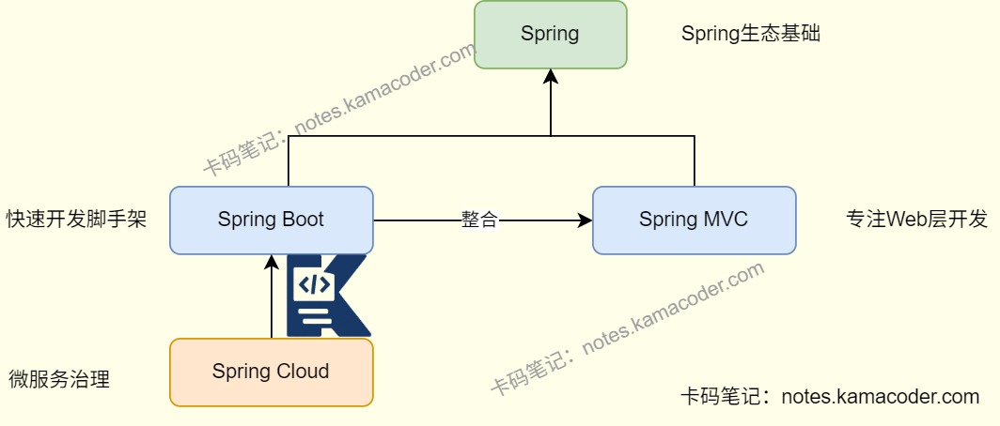

# Spring框架对比

> 来源: https://notes.kamacoder.com/java/spring-framework-comparison.html

# `# Spring框架对比 

## `# 简要回答 
  - **Spring**是最基础的应用程序开发框架，提供广泛功能包括依赖注入、AOP和事务管理等。SpringBoot,SpringMVC和SpringCloud都是基于Spring的IoC和AOP核心。   - **SpringBoot**是一个快速开发脚手架，延续了Spring框架的核心思想IOC和AOP，能够**简化**Spring应用的创建、运行、调试和部署过程，使用SpringBoot可以专注于应用开发无需过多关注XML配置。   - **SpringCloud**是基于SpringBoot的微服务治理框架，提供微服务架构中的组件。   - **SpringMVC**是Spring中一个重要模块，能够让Spring快速构建MVC架构的Web程序。MVC就是模型model，视图view和控制器Controller，核心思想是通过将业务逻辑、数据和显示分离，主要关注处理Web请求、管理用户会话。控制应用程序流程。 

## `# 详细回答 
  - **Spring是整个Spring生态的基础**，核心思想有DI（依赖注入）、AOP（面向切面编程）和IOC（控制反转）。

    - DI解决依赖关系的硬编码问题；IoC容器管理对象的创建和依赖关系；AOP可以实现事务管理、安全日志等横切关注点的模块化，提高代码可维护性和可重用性；同时提供了一系列事务管理接口。     - 能够解决传统Java开发中对象耦合度高、代码重复的问题，提供一套统一编程规范。   - **SpringMVC是Spring生态中专注于Web开发的MVC框架**，基于Spring核心功能构建。

    - 用于实现MVC模式，分别是模型model、视图view和控制器controller，可以分离数据、显示和控制逻辑。     - 可以处理HTTP请求，通过DispatcherServlet，将HTTP请求映射到控制器方法,处理后返回视图或数据。规范请求处理流程。     - 提供参数绑定、拦截器和数据验证登Web开发必备功能。   - **SpringBoot是一个基于Spring的快速开发工具**。

    - 能够进行自动装配，根据引入的依赖配置相关组件，减少XML或注解配置。     - 内置Tomcat，Jetty等服务器，可直接打包为jar运行，无需单独部署容器。     - 能够简化Spring应用的搭建和部署，解决传统Spring应用配置繁琐、依赖管理复杂和部署麻烦的问题，让开发者专注于业务逻辑。   - **SpringCloud是基于SpringBoot的微服务治理框架**，提供了微服务架构中的各个组件。

    - 解决微服务架构的复杂问题，比如服务注册、负载均衡、服务熔断与降级、API网关等。 
  - Spring是Spring生态基础，SpringMVC负责Web层交互，SpringBoot简化整体开发流程，SpringCloud解决微服务架构的治理问题。上层技术依赖下层技术，形成Spring技术体系。 

## `# 知识图解 
  - Spring生态示意 

 

## `# 知识扩展 
  - 扩展：

    - Spring IOC

      - 概念：控制反转是对程序执行流程的控制，原先由程序员控制整个程序的执行，使用IoC思想则是**将控制权交给了Spring**，由框架控制Bean的生命周期,负责对象的创建、初始化和销毁。       - 实现机制：

        - 利用Java的**反射机制**动态地加载类、创建对象实例和调用对象方法，实现灵活的对象实例化和管理；再通过**依赖注入**，让容器管理应用程序组件之间的依赖关系。         - 采用**工厂模式**管理对象的创建和生命周期容器作为工厂实例化Bean和管理它们的生命周期。     - Spring AOP

      - 概念：在Spring框架中实现面向切面的编程。切面包含很多种类型和对象，AOP就是以切面为单位对它们进行模块化的管理。AOP可以将核心业务和周边功能进行分离，将日志、事务管理和权限管理等周边功能封装，**减少系统重复代码，降低模块间的耦合度**。       - 实现：

        - 利用Java的动态代理机制，在运行时动态地创建代理对象，开发则在不修改源码的情况下增强方法功能。有基于JDK的动态代理和基于CGLIB的动态代理。
