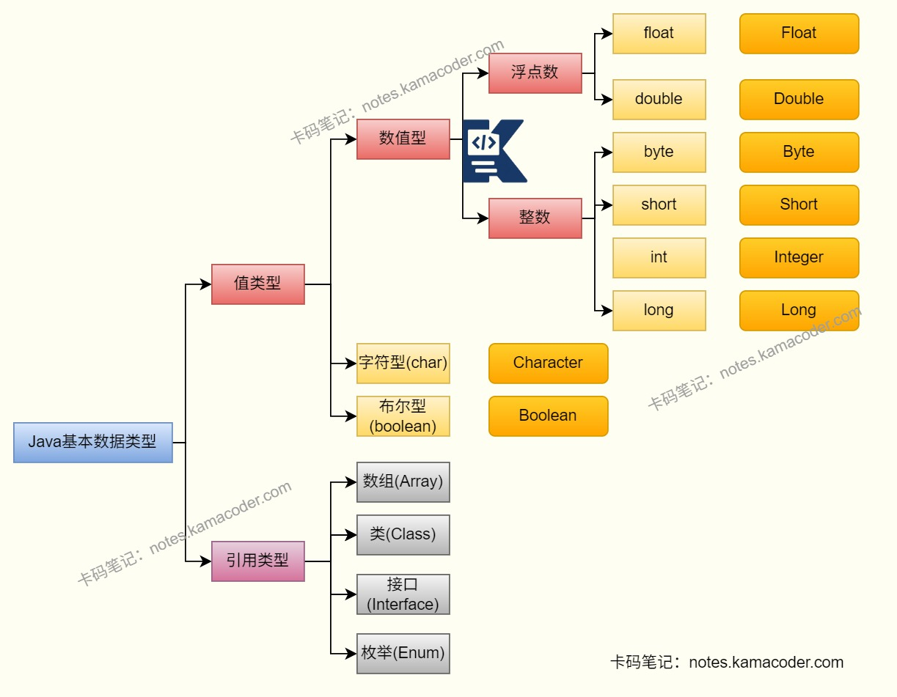

# Java中什么是自动装箱和拆箱？有什么坑？

> 来源: https://notes.kamacoder.com/java/java-autoboxing-and-unboxing.html

# `# Java中什么是自动装箱和拆箱？有什么坑？ 

## `# 简要回答 
  - 自动装箱（Autoboxing）是指：Java编译器把**基本类型**自动转换为对应的**包装类型**，如 `int -> Integer`。   - 自动拆箱（Unboxing）是指：Java编译器把**包装类型**自动转换为对应的**基本类型**，如 `Integer -> int`。   - 装箱/拆箱提升了代码的可读性和集合使用便利性，但是使用时需要注意：`==` 比较陷阱、`NullPointerException`、性能开销、三目运算符类型提升等问题。 

## `# 详细回答 
  - 什么是自动装箱/拆箱

    - 自动装箱：当需要对象的地方传入基本类型时，编译器会自动调用包装类的 `valueOf()`。     - 自动拆箱：当需要基本类型的地方传入包装类型时，编译器会自动调用如 `intValue()`、`longValue()`。     - 典型映射关系：

      - `int <-> Integer`       - `long <-> Long`       - `double <-> Double`       - `boolean <-> Boolean`       - `char <-> Character`       - `float <-> Float`       - `byte <-> Byte`       - `short <-> Short`   - 为什么会有这个机制

    - Java集合（如 `List`、`Map`）只能存对象，不能直接存基本类型。     - 泛型和很多框架API都以对象类型为核心，自动装箱/拆箱让编码更简洁。   - 编译器背后做了什么

    - 示例1：`Integer x = 10;` 本质接近 `Integer x = Integer.valueOf(10);`把基本类型 10 赋值给包装类变量 x，Java 编译器会自动帮你完成「基本类型 → 包装类对象」的转换，底层就是调用 Integer.valueOf(10)。     - 示例2：`int y = x;` 本质接近 `int y = x.intValue();`把包装类对象 x 赋值给基本类型变量 y，Java 编译器会自动帮你完成「包装类对象 → 基本类型」的转换，底层就是调用 x.intValue()，也就是说，这是编译阶段的语法糖。 

## `# 常见坑点 
  - `==` 比较包装类型，结果可能不符合预期

    - `Integer` 在 `[-128, 127]` 范围通常会走缓存，`==` 可能是 `true`。     - 超出缓存范围一般是不同对象，`==` 往往是 `false`。     - 结论：包装类型比较值请用 `equals()`（并注意空指针）。   - 拆箱时对象为 `null`，会触发 `NullPointerException` 
    - `Integer a = null; int b = a;` 会在拆箱时NPE。     - 常见于 `Map.get()` 返回 `null` 后直接参与算术运算或比较。   - 循环中频繁装箱/拆箱导致性能和内存开销上升

    - 大量创建包装对象会增加GC压力，热点路径性能下降。     - 高性能场景优先使用基本类型，必要时使用原生数组或专用集合。   - `equals()` 的跨类型比较容易踩坑

    - `Long.valueOf(1).equals(Integer.valueOf(1))` 是 `false`，因为类型不同。     - 如果是数值语义比较，先统一类型再比较。   - 三目运算符混用包装类型与基本类型会隐式拆箱

    - 如 `Integer a = null; int r = flag ? a : 0;` 可能因 `a` 拆箱导致NPE。   - 误用包装类型做锁对象

    - `Integer` 存在缓存复用，`synchronized(Integer.valueOf(1))` 可能锁住同一个共享对象，带来并发隐患。 

## `# 代码示例 

```
public class BoxingDemo {
    public static void main(String[] args) {
        // 1) == 陷阱（缓存区间）
        Integer a = 127;
        Integer b = 127;
        Integer c = 128;
        Integer d = 128;
        System.out.println(a == b); // true
        System.out.println(c == d); // false
        System.out.println(c.equals(d)); // true

        // 2) null 拆箱 NPE
        Integer x = null;
        // int y = x; // 会抛出 NullPointerException

        // 3) Map.get 返回 null 后拆箱
        java.util.Map<String, Integer> map = new java.util.HashMap<>();
        // int count = map.get("k"); // 也会 NPE

        // 4) 跨类型 equals
        Long l = 1L;
        Integer i = 1;
        System.out.println(l.equals(i)); // false
    }
}

```

 

## `# 知识图解 
  - 常见的数据类型及其包装类

 

## `# 知识扩展 
  - 扩展：

    - `Integer.valueOf()` 有缓存机制（默认 `-128~127`），而 `new Integer()` 每次都创建新对象，已不推荐使用。     - 在集合中删除元素时要区分重载：`list.remove(1)` 是按索引删；`list.remove(Integer.valueOf(1))` 是按值删。   - 面试官可能追问： 
  - Q1：为什么建议包装类型用 `equals()`，不用 `==`？

    - `==` 比较的是引用地址；`equals()` 比较的是值语义（实现正确时）。缓存导致 `==` 结果不稳定，容易出错。   - Q2：自动拆箱引发NPE最常见在哪？

    - `Map.get()`、数据库查询字段为空、RPC反序列化字段缺失后参与数值计算或条件判断时最常见。   - Q3：如何规避装箱/拆箱的性能问题？

    - 热点代码优先用基本类型；避免无意义的包装对象创建；必要时做对象池或批处理降低开销。   - Q4：包装类型和基本类型该怎么选？

    - 需要 `null` 语义、集合/泛型/反射交互时用包装类型；追求性能、并且不需要空值表达时优先基本类型。
