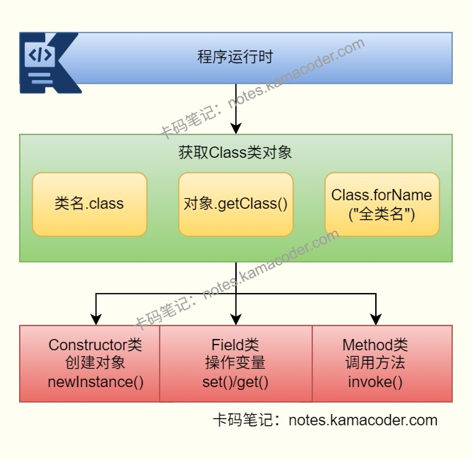

# Java反射的优缺点及应用场景是什么？

> 来源: https://notes.kamacoder.com/java/java-reflection.html

# `# Java反射的优缺点及应用场景是什么？ 

## `# 简要回答 
  - Java反射是指程序在**运行时**动态获取类信息（字段、方法、构造器、注解等），并完成对象创建与方法调用的机制，核心是 `Class` 对象，即JVM为每个加载的类生成的元数据对象。   - **优点**：灵活性高、扩展性强、解耦效果好，是Spring（IOC/AOP）、MyBatis（ORM）等框架的核心基础（AOP底层动态代理依赖反射实现）。   - **缺点**：反射调用比直接调用慢，运行时会解析元数据、进行访问权限检查；编译期的静态类型检查被弱化，错误推迟到运行期暴露；过度使用 setAccessible(true) 会破坏封装、带来安全风险，还会降低代码可读性与可维护性。   - **应用场景**：反射常常被应用于依赖注入、注解扫描、动态代理、配置绑定、序列化/反序列化、BeanUtils（对象拷贝）、Validator（参数校验）等通用工具。 

## `# 详细回答 
  - 反射是什么

    - 反射（Reflection）是Java提供的运行时元数据访问机制。程序可以在不知道具体实现类的前提下，动态地：**获取类结构信息**（字段、方法、构造器、注解、父类、接口）、**创建对象**（调用构造器）、**调用方法**、**读写字段**（包含私有成员）     - 常见API：

      - 获取Class对象：`Class.forName()`、`对象.getClass()`、`类名.class`       - 获取成员：`getDeclaredFields()`、`getDeclaredMethods()`、`getDeclaredConstructor()`       - 动态调用：`newInstance()`、`invoke()`、`set()/get()`   - Java反射的优点

    - **动态扩展能力强**：可以在运行时决定加载哪个类，适合插件化、SPI扩展、策略动态切换。     - **降低耦合**：业务代码依赖接口或配置，不依赖具体实现类，便于模块解耦。     - **通用框架能力**：很多“自动化”能力都基于反射，例如IOC注入、ORM映射、注解驱动校验。     - **提高开发效率**：可抽象出通用工具，减少重复代码（如对象映射、参数绑定、通用导出）。   - Java反射的缺点

    - **性能开销更高**：反射调用需要额外的访问检查和动态分派，热点路径中频繁使用会拖慢性能。     - **类型安全变弱**：编译期无法完全校验，很多错误会在运行时才暴露（如方法名写错、参数不匹配）。     - **可读性与维护性下降**：反射代码不直观，调试和排错成本高。     - **可能破坏封装**：通过 `setAccessible(true)` 可访问私有成员，不当使用会带来安全和设计风险。   - 使用反射的实践建议

    - 在框架层、基础设施层使用反射，在高频业务逻辑中尽量避免。     - 缓存 `Class/Method/Field` 元数据，减少重复查找。     - 能用接口、多态、工厂模式解决的场景，优先不用反射。     - 对私有成员反射访问要受控，避免滥用 `setAccessible(true)`。 

## `# 使用场景 
  - Spring IOC/DI

    - 容器扫描注解后，通过反射实例化Bean并完成属性注入。   - Spring AOP与动态代理

    - 通过JDK动态代理或CGLIB在运行时生成代理对象，拦截并增强方法调用。   - ORM框架（如MyBatis）

    - 将数据库结果集与Java对象字段动态映射，自动完成对象填充。   - 插件化与SPI

    - 根据配置动态加载实现类，支持按需扩展能力。   - 通用工具能力

    - 如对象拷贝、参数校验、配置绑定、JSON序列化/反序列化等。 

## `# 代码示例 

```
import java.lang.reflect.Constructor;
import java.lang.reflect.Field;
import java.lang.reflect.Method;

public class ReflectionDemo {
    public static void main(String[] args) throws Exception {
        // 1. 获取Class对象
        Class<?> clazz = Class.forName("demo.User");

        // 2. 通过构造器创建对象
        Constructor<?> constructor = clazz.getDeclaredConstructor(String.class, int.class);
        Object user = constructor.newInstance("Alice", 20);

        // 3. 访问私有字段
        Field nameField = clazz.getDeclaredField("name");
        nameField.setAccessible(true);
        nameField.set(user, "Bob");

        // 4. 调用方法
        Method method = clazz.getDeclaredMethod("sayHello");
        method.invoke(user); // 输出：Hello, I am Bob
    }
}

```

 

## `# 知识图解 
  - Java反射机制示意

 

## `# 知识扩展 
  - 扩展：

    - 反射是“运行时动态能力”，泛型是“编译期类型约束”，两者关注点不同但经常配合使用。     - Java9之后模块化（JPMS）增强了封装边界，对非法深度反射访问限制更严格。   - 面试官可能追问： 
  - Q1：反射一定会触发类初始化吗？

    - 不一定。仅获取 `Class` 元数据不一定触发初始化；执行静态方法、访问静态字段或反射创建实例通常会触发初始化。   - Q2：`Class.newInstance()` 和 `Constructor.newInstance()` 有什么区别？

    - `Class.newInstance()` 要求无参构造且异常处理能力弱，已不推荐；更推荐 `Constructor.newInstance()`，控制更细。   - Q3：反射性能慢，线上怎么优化？

    - 缓存反射元数据、减少热路径反射调用、提前初始化、必要时改为字节码增强或 `MethodHandle`。   - Q4：反射和动态代理有什么关系？

    - 动态代理底层通常借助反射调用目标方法，代理负责“拦截与增强”，反射负责“动态调用能力”。
