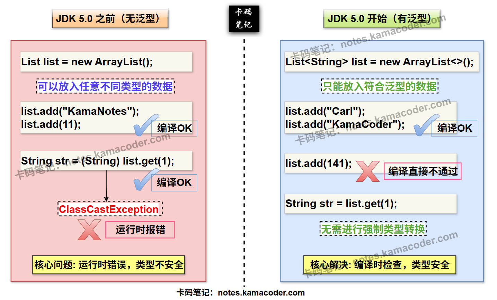

# Java泛型

> 来源: https://notes.kamacoder.com/java/java-generics.html

# `# Java泛型 

## `# 简要回答 
  - **泛型的概念**：

    - 泛型（**Generics**）是 Java 的一种**参数化类型**机制，允许在定义类、接口或方法时声明类型参数，并在使用时指定具体类型，实现类型安全的代码复用。   - **泛型的作用**：

    - **类型安全**：泛型强制在编译时检查类型匹配，避免运行时出现 ClassCastException。     - **消除强制转换**：泛型自动处理类型转换，无需手动进行强制类型转换。     - **代码复用**：适用于编写通用算法和数据结构（如 `List<T>`、`Map<K,V>`）。   - **泛型的应用**：

    - **自定义泛型类**：泛型最后代表的**数据类型**是**在创建对象时确定的**。     - **自定义泛型接口**：泛型最终代表的数据类型是在**继承该接口**或者**实现该接口**时确定的。     - **自定义泛型方法**：**泛型最终代表的数据类型是在调用方法时确定的**，**每次调用泛型方法，都可以指定不同的泛型类型**。     - 通过使用**通配符**（`?`）和**边界**（`<? extends T>`、`<? super T>`），可以实现灵活的类型匹配。  

## `# 详细回答 
  - **泛型的概念**：

    - **定义**：  
 **泛型（Generics），又称参数化类型(Parameterized Types)**，是一种可以“表示其他数据类型”的数据类型。泛型是**JDK5.0中出现的新特性**，解决数据类型的安全性问题，在类声明或实例化时只要指定好具体的类型即可。     - **语法**：  

① 在指定泛型时，**必须要求** 最终确定的数据类型为**引用类型** ，而不可以是基本数据类型。  

② 若在定义类时使用了泛型，实例化该类时却什么都没有传入，**默认使用Object类型。**     - **特性**：  

① **类型参数化**：在定义类、接口或方法时声明 类型参数，实际使用时再指定 具体类型。  

② **类型擦除（Type Erasure）**：泛型仅在**编译期**存在，**运行时 类型参数会被擦除**。  

③ **编译时类型检查**：编译器会确保泛型代码的 类型一致性，防止非法赋值或操作。   - **泛型的作用**：

    - **类型安全**：  

泛型强制在编译时检查类型匹配，避免运行时出现 ClassCastException。     - **消除强制转换**：  

泛型自动处理类型转换，无需手动进行强制类型转换。     - **代码复用**：
通过泛型抽象化类型，可以实现 通用算法和数据结构。例如，`Collections.sort()` 可排序任何实现了 `Comparable<T>` 接口的类型。   - **泛型的应用**：

    - **自定义泛型类**：  

① 泛型最后代表的**数据类型**是**在创建对象时确定的**；如果在创建泛型类对象时没有给出指定类型，**默认会以Object替代**。  

② 自定义泛型类中，类的**非静态**成员**可以**使用泛型（属性，方法，构造器等）；**静态成员**则**不可以**使用类的泛型。  

③ **在自定义泛型类中，使用了泛型的数组只可以被定义，不可以被初始化**。     - **自定义泛型接口**：  

① 泛型最终代表的数据类型是在**继承该接口**或者**实现该接口**时确定的；若在使用时没有给出具体泛型，**默认使用Object类型替代**。  

② 同自定义泛型类一样，自定义泛型接口的**静态成员**也**不能使用泛型**。     - **自定义泛型方法**：  

① 泛型最终代表的数据类型是在**调用方法时确定的**，每次调用泛型方法，都可以**指定不同的泛型类型**。  

② 自定义泛型方法，既可以定义在**普通类**中，也可以定义在**泛型类中**。  

③ **注意区分自定义泛型方法 和 泛型在方法上的应用。**，如下所示：

```
//以下代码仅作为演示，无实际意义
class<T, U> Watermelon {
	public<K> void taste(T t, U u, K k) {
		System.out.println(" T 和 U 代表泛型在方法上的应用；而 K 则是自定义泛型方法的使用。");
	}
}

```

      - **通配符与边界**： Java 泛型默认是**不变的（Invariant）**，即 `List<String>` 并不是 `List<Object>` 的子类型。为了增加泛型的灵活性和类型兼容性，引入了通配符和边界。  

① **无界通配符 `<?>`** ：单独使用表示未知类型，支持任意泛型类型。例如 `List<?>`，它通常是可读不可写的（除了 `null`）。  

② **上界通配符 `<? extends T>`** ：表示支持 `T` 类以及 `T` 类的子类，规定了泛型的上限。它实现了**协变（Covariance）**，主要用于 **生产者（Producer）** 场景，即从集合中**读取**数据。  

③ **下界通配符 `<? super T>`** ：表示支持 `T` 类以及 `T` 类的父类，规定了泛型的下限。它实现了**逆变（Contravariance）**，主要用于 **消费者（Consumer）** 场景，即向集合中**写入**数据。  

## `# 知识拓展 

### `# 泛型的图解 
  - **引入泛型前 和 引入泛型后 的对比图** 如下：

 

### `# 类型擦除（Type Erasure） 
  - 

**类型擦除的本质**：类型擦除的核心规则是： 
    - **泛型类型参数在编译后会被擦除**，替换为**原始类型**（Raw Type）或**边界类型**（Bound）。     - **泛型仅在编译期存在**，运行时无法获取类型参数的具体信息（如 `List<String>` 运行时仅为 `List`）。   - 

**擦除规则**： 
    - 

**无界类型参数（`<T>`）**：替换为 `Object`。 

```
// 编译前
public class Box<T> { private T data; }
// 编译后（字节码等效）
public class Box { private Object data; }

```

      - 

**有界类型参数（`<T extends Number>`）**：替换为边界类型（如 `Number`）。 

```
// 编译前
public class NumericBox<T extends Number> { private T data; }
// 编译后
public class NumericBox { private Number data; }

```

    - 

**类型擦除的影响与限制**： 
    - 

**运行时类型信息丢失**： 

```
List<String> strList = new ArrayList<>();
List<Integer> intList = new ArrayList<>();
// 以下结果为 true，因为两者运行时类型均为 ArrayList
System.out.println(strList.getClass() == intList.getClass());

```

      - 

**无法实例化类型参数**： 

```
public class Box<T> {
	// 编译错误：Cannot instantiate the type T
	private T instance = new T();
}

```

      - 

**无法检查泛型类型**： 

```
if (list instanceof List<String>) {} // 编译错误

```

      - 

**重载冲突**：
类型擦除后，以下方法会因签名相同导致编译错误： 

```
void print(List<String> list) {}
void print(List<Integer> list) {} // 编译报错

```
