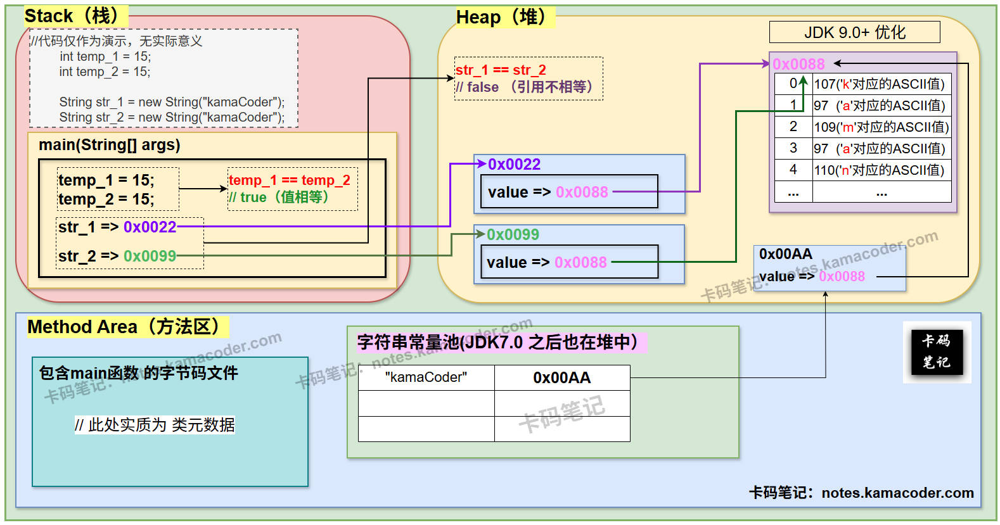
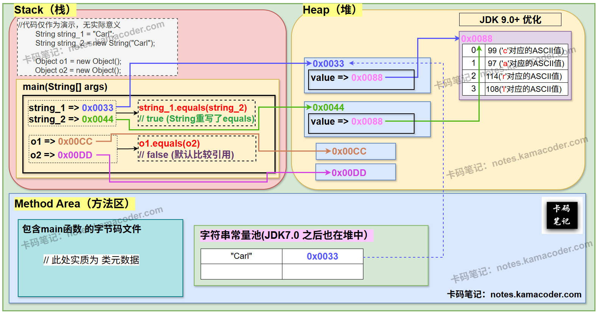
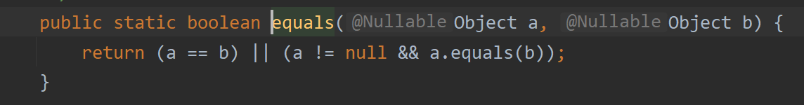

# equals与==

> 来源: https://notes.kamacoder.com/java/equals-vs-operator.html

# `# equals与== 

## `# 简要回答 
  - **使用"=="进行比较**：

    - ==是一个**比较运算符**，既可以判断基本类型，又可以判断引用类型。     - 如果**判断基本类型**，判断的是二者的**值**是否相等(eg : 判断1 == 1，结果为true；判断1 == 3，结果为false)；     - 如果**判断引用类型**，判断的是二者的**地址**是否相同，即判定是否为同一对象(eg : Student student1 = new Student();，Student student2 = student1；判断student2 == student1，结果为true)。   - **使用equals()方法进行比较**：

    - 

equals()方法是顶层父类Object类中的方法，**equals方法**本身在Object类中的**源码如下** : 

```
public boolean equals(Object obj) {
	return (this == obj);
}

```

      - 

可以看到，Object类中的 equals 方法用来检测两个对象是否相等，即**默认情况下比较的是两个对象的引用**(地址)。这一点和 == 用于判断引用类型时一致。     - 

**equals的特点**在于，它是Object类中的方法，因此，equals方法**往往在子类中被重写**，例如在String类中，equals方法被重写去判断两个字符串的内容是否相等。并且，在我们自己创建的类中，equals方法也常常被重写，去判断两个对象的指定的具体内容是否一致。     - 

还有一点要注意，**“==”的运行速度通常比“equals方法”更快**；因为==比较引用类型时，仅比较地址；而equals方法的性能要取决于具体实现。  

## `# 详细回答 

### `# 使用"=="进行比较 
  - 

**基本类型比较**：直接比较两个变量的**值**是否相等。 

```
int temp_a = 10;
int temp_b = 10;
System.out.println(temp_a == temp_b); // true

```

    - 

**引用类型比较**：比较两个对象的**内存地址**是否相同（即是否为同一对象）。 

```
Object obj1 = new Object();
Object obj2 = obj1;
System.out.println(obj1 == obj2); // true（同一对象）
System.out.println(new Object() == new Object()); // false（不同对象）

```

  

### `# 使用equals()方法进行比较 
  - 

**默认行为**：
Object类中的 equals()方法 默认比较对象的**地址**，与 == 在进行引用类型比较时行为一致，**equals方法**本身在Object类中的**源码如下** : 

```
public boolean equals(Object obj) {
	return (this == obj);
}

```

    - 

**子类重写**：
大多数类会 **重写 equals()** 以比较对象的**内容**而非地址。eg： 
    - 

**String类**：比较字符串的字符序列。 

```
String s1 = new String("Hello");
String s2 = new String("Hello");
System.out.println(s1 == s2);       // false（地址不同）
System.out.println(s1.equals(s2));  // true（地址不同但内容相同）

```

      - 

**Integer类**：比较整数值。     - 

**自定义类**：按照实际业务逻辑手动重写 equals()方法，比较指定内容。  

## `# 知识拓展 

### `# == 和 equals 的jvm示意图 
  - **使用`==`进行比较的 内存图解**：  
 
   - **使用`equals()`进行比较的 内存图解**：  
 
 

### `# 重写 equals()的注意事项 
  - 

**遵守 equals() 契约**： 
    - 自反性：`a.equals(a)` 必须为 `true`。     - 对称性：若 `a.equals(b)` 为 `true`，则 `b.equals(a)` 必须为 `true`。     - 传递性：若 `a.equals(b)` 和 `b.equals(c)` 为 `true`，则 `a.equals(c)` 必须为 `true`。     - 一致性：多次调用 `a.equals(b)` 结果应一致（除非对象被修改）。     - 非空性：`a.equals(null)` 必须为 `false`。   - 

**必须同时重写hashCode()** ：
若两个对象通过 equals()方法 比较为 **true**，则它们的 **hashCode()** 必须相同。代码演示如下： 

```
@Override
public int hashCode() {
    return Objects.hash(name, age); // 使用相同字段生成哈希值
}

```

    - 

**正确处理 null 和 对象类型**：
在 equals()方法中 需检查参数是否为 **null** 或对象类型是否匹配。代码演示如下： 

```
@Override
public boolean equals(Object obj) {
    if (this == obj) return true;
    if (obj == null || getClass() != obj.getClass()) return false;
    Person person = (Person) obj; // 强制类型转换
    return age == person.age && Objects.equals(name, person.name);
}

```

    - 

`Objects.equals()`方法源码如下：  
 
