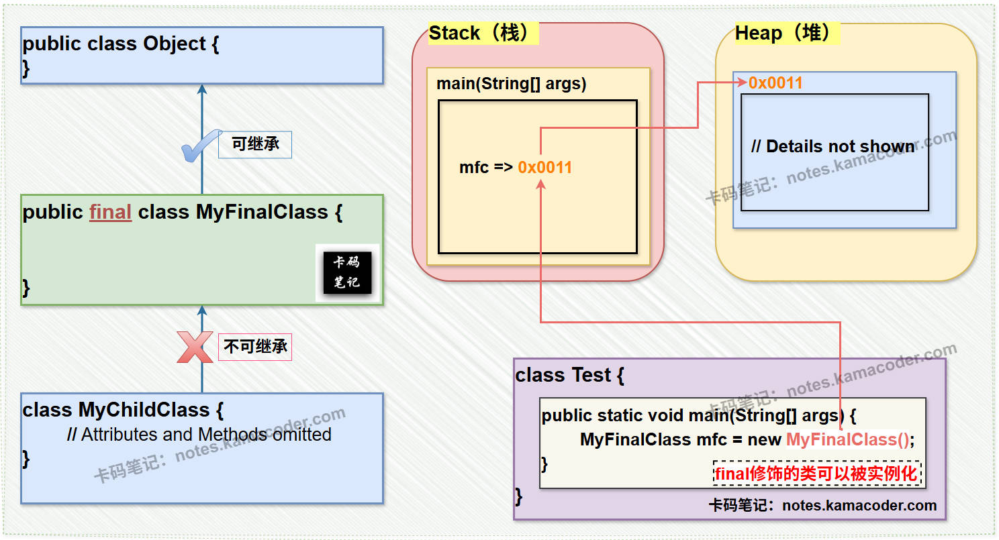
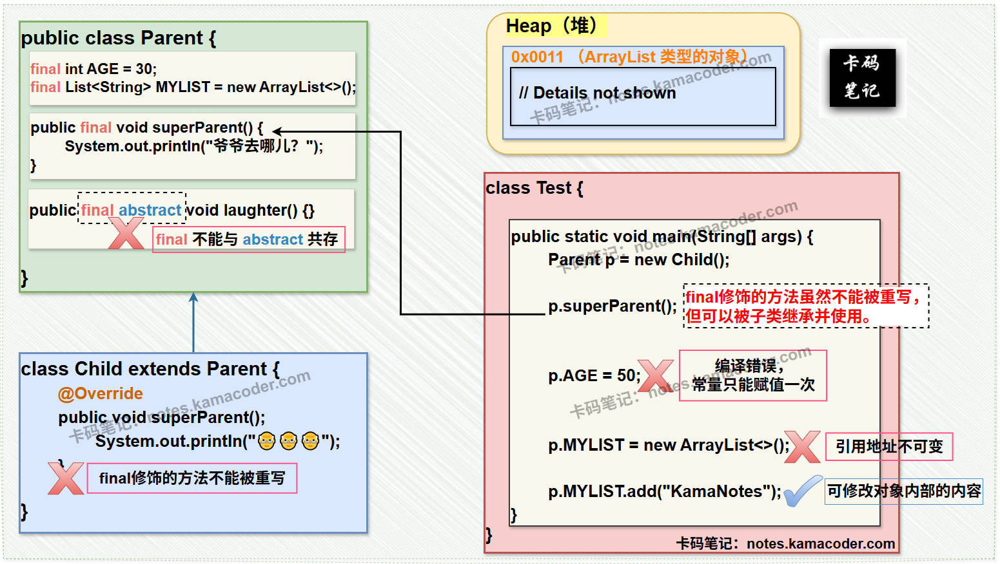

# final关键字

> 来源: https://notes.kamacoder.com/java/final-keyword.html

# `# final关键字 

## `# 简要回答 
  - **final**作为Java中的一个关键字**可以用来修饰 类 ， 方法 ，和 变量**。（但**final不能修饰构造器**）

    - **修饰类**：  

被final修饰的类**不能被继承，但该类可以去继承别的 (没有被final修饰的)类**，例如String类和System类，它们被final修饰，是不可以被继承的，但是它们有自己的父类——即顶层父类Object类。  

被final修饰的类虽然不能被继承，但 **可以被实例化**。     - **修饰方法**：  

被final修饰的方法**不能被子类重写，但可以被子类继承并使用（在满足访问权限规则的前提下）**。当修饰方法时， **final关键字不能与abstract关键字共存**；因为abstract修饰的方法是必须被非抽象子类重写的。     - **修饰变量**：  

被final修饰的变量称为**最终变量，即常量**——根据被修饰变量的定义位置又可分为**成员常量和局部常量**。**常量只能赋值一次，不能被二次更改**。  

## `# 详细回答 
  - **final**作为Java中的一个关键字**可以用来修饰 类 ， 方法 ，和 变量**。（但**final不能修饰构造器**）

    - **修饰类**：  
 ① 核心特点：  

被final修饰的类**不能被继承，但该类可以去继承别的 (没有被final修饰的)类**，例如String类和System类，它们被final修饰，是不可以被继承的，但是它们有自己的父类——即顶层父类Object类。  

被final修饰的类虽然不能被继承，但 **可以被实例化**。例如，**Java中所有的包装类都被final关键字修饰了**。也就是说，所有的包装类都不能被继承，但都可以被实例化。  

一般地，如果**一个类已经被final关键字**修饰，那么从逻辑上讲，**该类中的方法是没有必要再次用final修饰的**。这是因为用final修饰方法的目的就是为了不让该方法被子类重写；而final修饰的类本身就已经不能被继承了，也就不可能被重写。  
 ② 设计意图：  

保证类的**不可变性**（如 **String** 类防止子类破坏字符串内容）。
确保**安全性**（如 **System** 类防止核心 API 被篡改）。     - **修饰方法**：  
 ① 核心特点：  

被final修饰的方法**不能被子类重写，但可以被子类继承并使用（在满足访问权限规则的前提下）**。当修饰方法时， **final关键字不能与abstract关键字共存**；因为abstract修饰的方法是必须被非抽象子类重写的。  
 ② 设计意图：  
 **防止核心逻辑被修改**（如模板方法模式中的关键步骤）。     - **修饰变量**：  
 ① 核心特点：  

被final修饰的变量称为**最终变量，即常量**——根据被修饰变量的定义位置又可分为**成员常量和局部常量**。**常量只能赋值一次，不能被二次更改**。  
 **成员常量**——成员常量必须进行初始化，可以在定义成员常量时就对它赋初值来显式初始化，若在定义成员常量时没有赋初值——需要在构造器 或者 代码块中进行初始化。  
 **局部常量**——局部常量如果未被使用，可以不赋初值；但如果局部常量被调用了，就必须赋初值。  
 **静态常量**——对于静态常量来说，只能通过在定义时为其赋初值；或者先定义，然后在静态代码块中为其赋值，这样来初始化。但是不可以在构造器中进行静态常量的初始化。  
 ② 设计意图：  

确保变量引用或值的**不可变性**（提升线程安全性与代码可读性）。  

## `# 知识拓展 
  - **final 修饰类**的示意图如下：  
 
   - **final 修饰属性和方法**的示意图如下：  
 
   - **关于 常量的命名**：

    - 一般来说，常量名所有字母都大写，多个单词之间用下划线隔开。eg : MAX_VALUE（最大值）。   - **关于 引用常量**：

    - 若final关键字修饰的是一个引用类型变量，则该引用指向的地址值无法改变。（相当于一个 固定指针）     - PS : 然而，需要注意的是，`final` 仅保证引用本身不可变，即不能再指向其他对象。但如果引用的对象是可变的（例如 `List`、`StringBuilder`），则该对象内部的数据仍然可以被修改。这在设计不可变类时需要注意，如果希望对象内容也完全不可变，需要额外的设计（如防御性拷贝或使用不可变集合）。   - **final and Method Parameters**：

    - 

When a method parameter is declared as **final**, it means:  

① **The parameter cannot be reassigned** within the method body.  

② For **primitive types** (eg: `int`, `double`), the value cannot be modified.  

③ For **reference types** (eg: `String`, `List`), the reference cannot point to a new object, but the object’s internal state can still be modified.     - 

Codeing Demonstration: 

```
public void process(final int id, final List<String> data) {
	id = 100;          			// WRONG, Compile error (primitive)
	data = new ArrayList<>();  // WRONG, Compile error (reference)
	data.add("newItem");       // OK, Allowed (modify object state)
}

```
