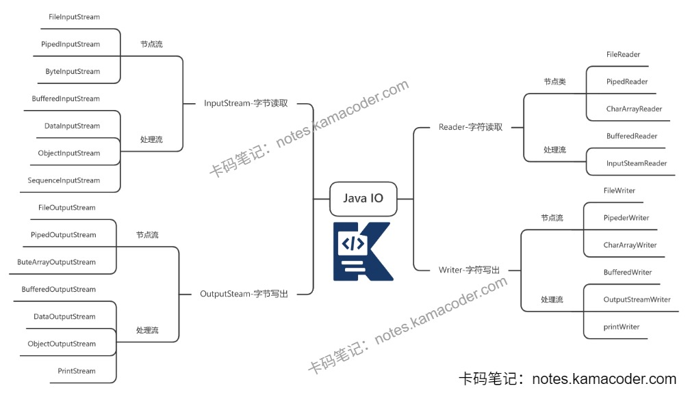

# 介绍一下Java的IO流？

> 来源: https://notes.kamacoder.com/java/java-io-streams.html

# `# 介绍一下Java的IO流？ 

## `# 简要回答 
  - Java IO流是Java用于**数据输入/输出**的一套抽象机制，核心思想是“将程序与数据源的交互过程抽象为‘流’，像水流一样单向、顺序读写数据”。   - IO流可按多个维度分类：按数据单位分为**字节流**（8bit）和**字符流**（字节+编码转换）；按方向分为**输入流**（读数据到程序）和**输出流**（写数据到外部）；按功能分为**节点流**（直接连接数据源）和**处理流（包装流）**（增强其他流的能力）。   - 常见字节流基类是 `InputStream/OutputStream`，常见字符流基类是 `Reader/Writer`。   - 实际开发中：二进制文件优先字节流，文本优先字符流；使用 `Buffered` 包装流减少系统调用提升性能，并配合 `try-with-resources` 自动关闭资源（无需手动flush）。 

## `# 详细回答 
  - 什么是IO流

    - IO是Input/Output的缩写，即输入和输出。     - Java把不同数据源（文件、内存、网络、控制台）统一抽象为“流”，程序通过流来读取或写入数据。   - IO流的分类

    - 按数据单位：

      - **字节流**：以字节（8 bit）为单位，适合图片、视频、音频、压缩包等二进制数据。       - **字符流**：以字符为单位，内部会处理字符编码，适合文本数据。     - 按流向：

      - **输入流**：把数据读入程序（`InputStream`、`Reader`）。       - **输出流**：把数据从程序写出（`OutputStream`、`Writer`）。     - 按角色：

      - **节点流**：直接连接数据源，如 `FileInputStream`、`FileReader`。       - **处理流（包装流）**：对节点流增强，如 `BufferedInputStream`、`BufferedReader`、`DataInputStream`、`ObjectOutputStream`。   - 常见IO类

    - 字节流常用类：

      - `FileInputStream/FileOutputStream`：文件字节读写       - `BufferedInputStream/BufferedOutputStream`：缓冲加速       - `DataInputStream/DataOutputStream`：按基本类型读写       - `ObjectInputStream/ObjectOutputStream`：对象序列化     - 字符流常用类：

      - `FileReader/FileWriter`：文件字符读写       - `BufferedReader/BufferedWriter`：缓冲、按行读写       - `InputStreamReader/OutputStreamWriter`：字节流与字符流桥接，可指定编码   - 读写流程：先创建流对象（必要时套上缓冲流），然后进行循环读取/写入（通常用缓冲区数组），最后需要刷新并关闭资源（推荐 `try-with-resources`）。   - 使用注意点

    - 文本处理要显式指定编码（如UTF-8），避免乱码。     - 不要逐字节频繁读写，尽量使用缓冲区提高效率。     - `flush()` 负责把缓冲区数据刷出，`close()` 会自动调用 `flush()` 并释放资源。     - 多线程并发写同一文件要做好同步控制，避免数据错乱。 

## `# 代码示例 

```
import java.io.*;
import java.nio.charset.StandardCharsets;

public class IoDemo {
    public static void main(String[] args) {
        String src = "input.txt";
        String dst = "output.txt";

        // 使用字符流 + 缓冲流 + try-with-resources（自动close，无需手动flush）
        // FileOutputStream第二个参数为true时追加写入，false（默认）覆盖写入
        try (BufferedReader br = new BufferedReader(
                new InputStreamReader(new FileInputStream(src), StandardCharsets.UTF_8));
             BufferedWriter bw = new BufferedWriter(
                new OutputStreamWriter(new FileOutputStream(dst, false), StandardCharsets.UTF_8))) {

            String line;
            while ((line = br.readLine()) != null) {
                bw.write(line);
                bw.newLine(); // 写入换行符（跨平台兼容）
            }
            // 无需手动flush：try-with-resources会自动调用close()，BufferedWriter的close()包含flush()
        } catch (IOException e) {
            e.printStackTrace();
        }
    }
}

```

 

## `# 知识图解 
  - JavaIO体系示意图

 

## `# 知识扩展 
  - 扩展：

    - Java传统IO（`java.io`）是阻塞式、面向流；NIO（`java.nio`）是面向缓冲区/通道，支持非阻塞能力，适合高并发场景。     - 大文件拷贝可考虑 `Files.copy()` 或 `FileChannel`，通常比手写小缓冲循环更高效。   - 面试官可能追问： 
  - Q1：字节流和字符流怎么选？

    - 二进制数据用字节流；文本数据用字符流，且注意字符集一致。   - Q2：为什么要用 `Buffered` 流？

    - 减少系统调用次数，提升IO效率，尤其是频繁小数据读写场景。   - Q3：`flush()` 和 `close()` 有什么区别？

    - `flush()` 仅刷新缓冲区，不释放资源；`close()` 会先刷新再关闭流并释放资源。   - Q4：`FileReader` 和 `InputStreamReader` 的区别？

    - `FileReader` 使用平台默认编码，不够可控；`InputStreamReader` 可显式指定编码，更推荐。
