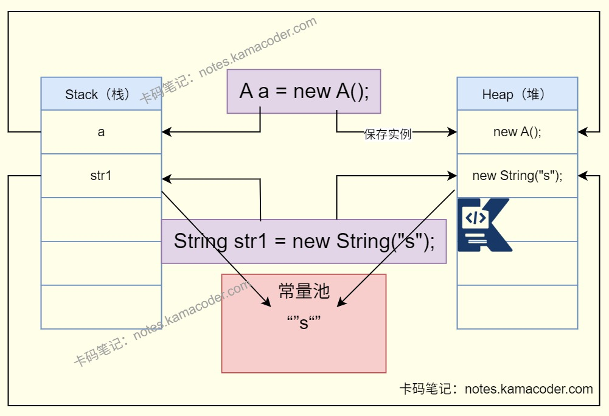

# 堆与栈

> 来源: https://notes.kamacoder.com/java/heap-vs-stack.html

# `# 堆与栈 

## `# 简要回答 
  - 堆和栈都是内存管理单元，两者在**用途**、**生命周期**、**存取速度**、**存储空间**和**可见性**方面存在不同。   - 堆内存是由JVM管理的，栈内存由操作系统管理。   - 堆的生命周期是不确定的，栈则会在函数调用结束后被回收。   - 堆在分配速度上比栈慢，分配栈内存只需要移动一个指针。   - 堆是一块一块的内存，内存大小在运行时确定，栈则采用数据结构中的栈实现，具有先后出的顺序特点，内存大小则是在编译时确定的。   - 堆是线程共享的，栈是线程私有的。 

## `# 详细回答 
  - 用途：

    - 栈用于存储局部变量、方法调用的参数，方法返回地址以及一些**临时数据**。每个线程在创建时会创建一个栈，这个栈随着方法执行增长和缩小。每当一个方法执行时会创建一个栈帧，用于存储该方法的信息，当方法执行完毕，栈帧就会从栈中弹出。     - 堆用于**存储对象实例**（类的实例和数组）。使用new关键字创建的对象实例会在堆上分配空间。   - 生命周期：

    - **栈**中的数据具有**确定的生命周期**，当方法调用结束时其对应的栈帧会被销毁，栈中的局部变量也会消失。当线程结束执行时，栈内存也会被自动回收。     - **堆**中的**对象生命周期不确定**，对象会在垃圾回收机制检测到对象不再被引用时进行回收。   - 存取速度：

    - **栈的存取速度快**，因为栈遵循先进后出原则，操作简单快速。     - **堆存取速度较慢**，对象在堆上的分配和回收需要更多的时间，而且垃圾回收机制的运行也会影响性能。   - 存储空间：

    - **栈**的**空间相对较小且固定**，由操作系统管理。栈溢出时可能是递归过深或者局部变量过大。     - **堆**的**空间可以动态分配**，具有可扩展性，可能会导致内存碎片化问题，分配和回收由JVM管理。堆溢出通常是创建了太多的大对象，或者未能及时回收不再使用的对象。   - 可见性：

    - **栈**中数据对**线程私有**，每个线程有自己的栈空间，天生线程安全。     - **堆**的数据对**线程共享**，所有线程都可以访问堆上的对象。 

## `# 知识图解 
  - **栈内存和堆内存存储示意** 
 

## `# 知识扩展 
  - 扩展： 
  - 堆的内部细分：JVM会把堆分成**新生代**和**老年代**，可以**提高GC的回收效率**，对不同区域采用不同回收算法。

    - **新生代**：存储刚创建的对象，特点是“**对象生命周期短、创建和销毁频繁**”。进一步分为Eden区（新对象优先分配这里）和两个Survivor区（From/To，用于存放GC后存活的对象）。采用**“复制算法”**：将Eden和From区存活的对象复制到To区，然后清空Eden和From区，效率极高。     - **老年代**：存储在新生代多次GC后仍存活的对象（如长期使用的缓存对象、单例对象），特点是“**生命周期长**”。采用**“标记-清除”或“标记-整理”算法**：不需要频繁回收，重点是减少内存碎片。 
  - 面试官可能追问： 
  - 

Q1：为什么局部变量存在栈中，而对象要放在堆里？ 
    - 因为对局部变量和对象生命周期的要求符合栈和堆的生命周期。     - **局部变量的生命周期与方法的执行周期严格一致**，方法结束后就可以立即释放，栈的“自动管理”特性正好匹配这种短生命周期、大小固定的需求，效率极高。     - **对象的生命周期往往更长且不确定**（可能被多个引用持有，跨方法、跨线程使用），其大小也常是动态的（如集合的容量可动态变化）。堆的“动态分配+GC回收”模式，能灵活应对这种长生命周期、动态大小的存储需求，同时实现线程间的数据共享。   - 

Q2：栈内存溢出（StackOverflowError）和堆内存溢出（OutOfMemoryError）的原因有什么不同？ 
    - **堆内存溢出**：通常是因为**创建的对象过多且无法被GC回收**，比如循环创建大量对象并长期持有引用（如将对象不断添加到一个静态集合中且不清理）。堆的容量也有上限，当新对象无法分配到内存时，就会触发 OutOfMemoryError 。     - **栈内存溢出**：通常是因为方法调用栈过深，比如无限递归 

```
public void test(){
  test();
}
// 每个方法调用都会创建一个栈帧压入栈
栈的容量有限
递归过深会导致栈帧堆满
触发 StackOverflowError 。

```
