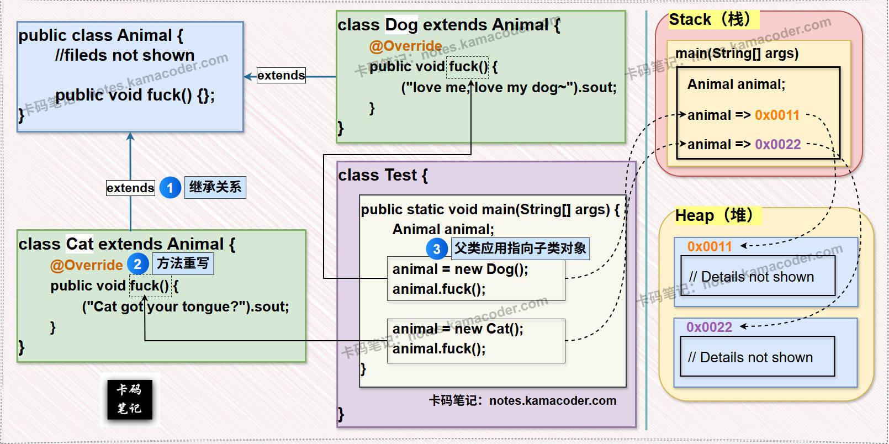

# 多态

> 来源: https://notes.kamacoder.com/java/polymorphism.html

# `# 多态 

## `# 简要回答 
  - **定义**：

    - 多态（Polymorphism）是指“**一个接口，多种实现**”。在 Java 中，多态主要体现在——允许**父类引用指向子类对象**，并在运行时根据对象的实际类型调用相应的方法，即动态绑定机制。   - **特点**：

    - **运行时绑定（动态绑定）**：这是多态的核心机制，编译器在编译时只知道引用变量的类型（静态类型），但在程序运行时，JVM 会根据对象的实际类型（动态类型）来查找并调用相应的方法。     - **提高可扩展性**：增加新的子类时，无需修改现有代码，只需让新子类重写父类方法。   - **实现多态的三个必要条件**：

    - **继承或实现关系**：必须存在子父类继承关系或接口实现关系。     - **方法重写（Override）**：子类必须重写父类的方法（或实现接口方法）。     - **父类引用指向子类对象**。   - **优点**：

    - **可维护性高**：修改具体实现不影响调用方。     - **可扩展性强**：新增子类只需实现父类接口或重写方法，无需修改调用方代码。   - **缺点**：

    - **父类引用不能直接使用子类的特有成员**：这是多态的一个限制。例如，`Animal animal = new Dog();`，`animal` 引用对象无法直接调用 `Dog` 类特有的方法，除非进行强制类型转换。  

## `# 详细回答 

### `# 多态的概念 
  - **为什么需要多态？** 
    - 在没有多态的情况下，如果我们需要处理多种不同类型的对象（但它们有共同的行为），就可能需要使用大量的 `if-else` 或 `switch-case` 语句来判断对象的具体类型，然后再分别调用对应的方法。这会导致代码冗余、结构复杂且难以维护和扩展。多态的出现正是为了解决这种问题，它允许我们**以统一的方式处理不同类型的对象**。   - **什么是多态？** 
    - 多态（Polymorphism）在 Java 中，它表现为**父类引用指向子类对象**，并在程序**运行时**根据对象的**实际类型**来决定调用哪个方法。多态成为可能，即同一个方法调用，在不同对象上会产生不同的行为。   - **多态的实现步骤（必要条件）**：

    - **有继承或实现关系**：必须存在**父子类继承**关系，或者**类实现接口**的关系，这是多态的基础。     - **方法重写（Override）**：子类必须重写（覆盖）父类的方法，或者实现接口中定义的方法，这是多态行为差异的来源。     - **父类引用指向子类对象**：这是多态的语法形式，即 `父类类型 变量名 = new 子类类型();`。 

### `# 多态的使用 
  - **多态中成员方法的使用（“编译看左，运行看右”）**：

    - **编译时看左边（引用类型）**：编译器在编译阶段，会检查引用变量的**声明类型**（即左边的父类类型），看它里面是否存在被调用的方法。如果父类中没有这个方法，编译就会报错。这决定了我们**能调用哪些方法**。     - **运行时看右边（实际对象类型）**：在程序运行时，JVM 会根据引用变量实际指向的**对象类型**（即右边的子类类型）来决定调用哪个方法。如果子类重写了该方法，则调用子类重写后的方法；如果子类没有重写，则向上查找并调用父类的方法。这决定了运行时**实际使用哪个方法**。   - **多态中成员变量的使用（“编译看左，运行看左”）**：

    - **编译时看左边（引用类型）**：编译器在编译阶段，会检查引用变量的声明类型中是否存在被访问的成员变量。     - **运行时看左边（引用类型）**：在多态关系中，成员变量**不涉及重写**。无论引用变量实际指向哪个子类对象，通过该引用访问的成员变量始终是**声明类型（左边）中定义的那个成员变量**。 

### `# 多态的优缺点 
  - **多态的优点**：

    - **提高代码的灵活性和可扩展性**：通过多态机制可以编写更通用的代码来处理不同类型的对象，而无需为每种具体类型编写特定逻辑。当需要增加新的子类时，也无需修改现有代码。     - **降低耦合度**：调用者只需面向父类类型或接口编程，而无需关心具体的子类实现，从而实现了 **调用者** 与 **具体实现** 之间的解耦。     - **提高代码复用性**：通过父类引用或接口，可以统一处理多种不同类型的对象，以提高代码的复用性。     - **简化代码**：避免了大量的 `if-else` 或 `switch-case` 语句来判断对象的具体类型，使代码更加简洁。   - **多态的缺点**：

    - **父类引用不能直接使用子类的特有成员**：这是多态的一个主要限制。当父类引用指向子类对象时，它只能访问父类中声明的成员（包括方法和变量），而不能直接访问子类中特有的成员。如果需要访问子类特有成员，必须进行**向下转型**。 

### `# 多态的类型转换 
  - **向上转型（自动）**：

    - **概念**：将子类对象或引用赋值给父类类型的引用变量。这是**自动发生**的，不需要强制类型转换。     - **格式**：`父类类型 变量名 = new 子类类型();`     - **特点**：向上转型后，引用变量只能访问父类中声明的成员。   - **向下转型（强制）**：

    - **概念**：将父类类型的引用变量强制转换为子类类型。这是**强制发生**的，需要显式地进行类型转换。     - **格式**：`子类类型 变量名 = (子类类型) 父类引用变量;`     - **特点**：向下转型后，可以访问子类特有的成员。   - **注意事项**：

    - **只有在继承关系的基础上才能进行类型转换**：否则，会抛出 `ClassCastException`（类型转换异常）。     - **对引用变量进行向下转型之前，必须要保证该引用变量指向的堆中真正的对象就是目标类型**：即只有当父类引用变量实际指向的对象就是**目标子类类型** 或 **目标子类类型的子类型**时，向下转型才能成功。例如，`Animal animal = new Cat();`，如果想将 `animal` 强制转型为 `Dog` 类型，就会失败，因为 `animal` 实际指向的是 `Cat` 对象，而不是 `Dog` 对象。   - **`instanceof` 关键字**：

    - 为了避免在向下转型时发生 `ClassCastException`，可以使用 **`instanceof`** 关键字在转型前进行类型判断。     - **格式**：`if (引用变量 instanceof 目标类型) { ... }`     - **作用**：判断引用变量所指向的实际对象是否是指定类型或其子类型。 

### `# 多态的应用场景 
  - **多态数组**：

    - **概念**：定义一个**父类类型（或接口类型）的数组**，数组中可以**存放**该父类（或接口）的**各种子类（或实现类）的对象**，方便统一管理和操作不同类型的对象。     - **示例**：`Animal[] animals = new Animal[3];` `animals[0] = new Dog();` `animals[1] = new Cat();`   - **多态参数**：

    - **概念**：方法的**参数类型定义为父类类型（或接口类型）** ，在调用方法时可以**传入**任何该父类（或接口）的**子类（或实现类）的对象**，每传入一个子类对象，都相当于形成了一次多态（父类引用指向子类对象），多态参数可以提高方法的通用性，减少方法重载的数量。     - **示例**：`public void showAnimal(Animal animal) { //。。。 }`。调用时可以传入 `new Dog()` 或 `new Cat()`。  

## `# 知识拓展 
  - **多态的必要条件 与 基本形式**，如下图所示：  
 
   - **面试官可能的追问1：多态中“编译看左，运行看右”的底层原理是什么？** 
    - “编译看左”是基于**静态绑定（Static Binding）**，发生在编译阶段，此时编译器会根据引用变量的**声明类型**来检查方法是否存在，以确保语法的正确性。     - “运行看右”是基于**动态绑定（Dynamic Binding）**，发生在运行时。JVM 在执行方法调用时，会根据引用变量实际指向的**堆中对象的真实类型**来查找并执行对应的方法，通常通过 **虚方法表（Virtual Method Table, VMT 或 vtable）** 来实现：每个类都有一个虚方法表，其中存储了该类及其父类所有可被重写方法的实际地址。当调用一个虚方法时，JVM 会根据对象的实际类型查阅其虚方法表，从而找到正确的方法地址并执行。   - **面试官可能的追问2：为什么多态性不能应用于成员变量？** 
    - 多态的**主要设计目的**，就是实现行为上的差异化，即“同一个行为在不同对象上有不同表现”，而成员变量代表的是对象的状态，其访问通常是直接的，不涉及运行时查找。     - 成员变量的访问是在**编译时**根据引用变量的**声明类型**来确定的。编译器在编译时就知道 `Parent p = new Child();` 中的 `p` 是 `Parent` 类型，因此访问 `p` 的成员变量时，会直接访问 `Parent` 类中定义的成员变量，即使子类有同名的成员变量（这被称为**成员变量隐藏**），也不会被多态机制所影响。     - 如果成员变量也支持多态，会使得代码的语义变得复杂和不确定，增加理解和维护的难度。
