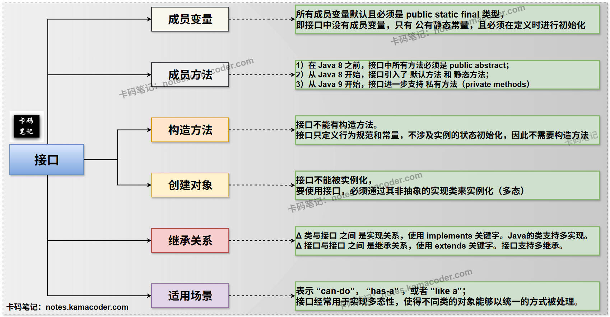

# 抽象类与接口

> 来源: https://notes.kamacoder.com/java/abstract-class-vs-interface.html

# `# 抽象类与接口 

## `# 简要回答 

### `# 抽象类 和 接口 的概念 
  - **抽象类**：  

是一种**不能被实例化**的类，它**可能**包含抽象方法（没有方法体）和具体方法（有方法体）。抽象类通常是作为对应子类的基类，提供共同的属性和部分行为的实现，并强制子类实现某些特定行为。   - **接口**：  

是一种**完全抽象**的类型，接口技术用于描述类 **应该具有什么功能，但并不给出具体实现**，等到当某个类要使用接口时，再去实现接口中的这些方法。类需要遵从接口中描述的统一规则进行定义，所以，接口是对外提供的**一组规则，标准**。 

### `# 抽象类 和 接口 的区别 
  - 

如下表所示： 

| **维度**  **抽象类**  **接口** 
| **成员变量**  可有各种访问修饰符的实例变量、静态变量和常量。  默认且必须是 `public static final`（常量），且必须在定义时就初始化。 
| **成员方法**  可有抽象方法（无实现）和具体方法（有实现）。抽象方法不能是 `private`, `static`, `final`。  Java 8之前：只能有 `public abstract` 方法。  
Java 8及之后：可有默认方法、静态方法。  
Java 9及之后：可有私有方法。 
| **构造方法**  可以有构造方法，用于子类初始化父类成员，但不能直接实例化。  不能有构造方法。 
| **创建对象**  不能直接实例化。只能通过子类（非抽象）实例化。  不能直接实例化。只能通过实现类（非抽象）实例化，并通常通过多态引用。 
| **继承关系**  使用 `extends` 关键字继承，只支持单继承。  使用 `implements` 关键字实现，支持多实现（一个类可实现多个接口）。  
接口之间可多继承。 
| **适用场景**  表示 “is-a” 关系，作为类族共同的基类，提供模板方法模式。  表示 “can-do” 或 “has-a” 关系，定义行为规则/标准，实现多态，弥补单继承机制的不足。 

## `# 详细回答 

### `# 抽象类 和 接口 的概念 
  - **抽象类**：

    - 抽象类是Java中用于实现**抽象概念**的一种特殊类，它使用 `abstract` 关键字修饰，**不能被直接实例化**（即不能使用 `new` 关键字创建对象）。     - 抽象类通常是作为对应子类的**基类**，提供一个通用的模板或骨架，定义一组共同的属性和部分行为，并强制子类实现某些特定的、对于每个子类来说比较特别 的行为。   - **接口**：

    - 是一种**完全抽象**的类型，它使用 `interface` 关键字定义，与抽象类类似，也不能被直接实例化。     - 接口技术用于描述类 **应该具有什么功能，但并不给出具体实现**，等到当某个类要使用接口时，再去实现接口中的这些方法。类需要遵从接口中描述的统一规则进行定义，所以，接口是对外提供的**一组规则，标准**。     - 接口的**主要目的**是实现**多重继承**的效果，定义不同的类可以拥有的共同的 能力或行为，强调 “做什么” 而非 “怎么做”。 

### `# 抽象类 和 接口 的区别 
  - **成员变量**：

    - **抽象类**：在抽象类中，可以定义各种类型的成员变量，包括**实例变量（非静态）、静态变量，以及静态和非静态的 常量**。这些变量可以使用**任何访问修饰符**（`public`, `protected`, `default`, `private`），并且可以 不需要被 `final` 修饰，也可以不进行初始化（因为对于实例变量，可以在构造方法中初始化）。     - **接口**：在接口中，所有成员变量都必须是 `public static final` 类型，即**接口中没有成员变量，只有 公有静态常量** 。由于它们是常量，因此**必须在定义时进行初始化**。而因为接口不包含构造方法或静态代码块来初始化这些常量，所以定义时就进行赋值是**唯一**的初始化途径。   - **成员方法**：

    - **抽象类**：  

Δ 抽象类可以包含 **抽象方法** （抽象方法没有方法体，用 `abstract` 关键字修饰）和 **具体方法** （具体方法有方法体）。  

Δ 抽象方法不能是 `private` 修饰的，因为私有方法无法被子类继承和实现，也不能是 `static` 修饰的，因为静态方法属于类，与实例无关，无法强制子类实现，还不能是 `final` 修饰的，因为 `final` 方法不能被重写，而抽象方法必须被重写，这就有矛盾。  

Δ 具体方法（非抽象方法）则可以有任何访问修饰符，并且也可以是 `static` 或 `final`修饰的。     - **接口**：  

Δ 在 **Java 8 之前**，接口中所有方法必须是 `public abstract`，即**公有的抽象方法**，不允许有方法体。事实上，接口中的方法**默认**就是**公有抽象方法**，因此在接口中定义抽象方法时，可以省略掉abstract关键字。  

Δ 从 **Java 8 开始**，接口引入了 **默认方法（default methods）** 和 **静态方法（static methods）** 。默认方法使用 `default` 关键字修饰，允许接口提供方法的默认实现，实现了接口的**向后兼容性**，因为默认方法是可以被实现类重写的。静态方法使用 `static` 关键字修饰，可以通过接口名直接调用，与类中的静态方法类似。  

Δ 从 **Java 9 开始**，接口进一步支持 **私有方法（private methods）** 。私有方法可以是实例方法或静态方法，它们主要用于在接口 **内部** 封装默认方法和静态方法的公共逻辑，提高代码复用性，但不能被外部或实现类直接访问。   - **构造方法**：

    - **抽象类**：抽象类可以拥有构造方法，并且支持构造方法的重载。尽管抽象类不能被直接实例化，但其构造方法会在子类实例化时被调用，用于初始化抽象类中定义的成员变量。这是因为子类的构造方法在执行时，会隐式或显式地调用其父类的构造方法。     - **接口**：接口不能有构造方法。接口只定义行为规范和常量，不涉及实例的状态初始化，因此不需要构造方法。   - **创建对象**：

    - **抽象类**：抽象类不能直接使用 `new` 关键字创建对象（即**不能被实例化**）。要使用抽象类，必须通过其**非抽象子类**来实例化。通常，我们会通过**多态**的方式，将子类对象 赋值给 抽象类类型的**引用**，从而调用抽象类中定义的方法（包括抽象方法和具体方法）。     - **接口**：接口也不能直接使用 `new` 关键字创建对象（即**不能被实例化**）。要使用接口，必须通过其**非抽象的实现类**来实例化。同样，通常会通过**多态**的方式，将实现类对象 赋值给 接口类型的**引用**，以实现接口定义的功能。接口的**实现类**可以是抽象类（抽象类允许部分实现接口方法）或普通类（普通类要求 必须实现接口中所有抽象方法）。   - **继承关系**：

    - **抽象类**：  

Δ 类与抽象类之间是**继承关系**，使用 `extends` 关键字。  

Δ Java只支持**单继承**，即一个类只能继承一个抽象类（或普通类）。这使得抽象类更适合表示 “is-a” 的**强关联**关系，例如“猫是一种动物”，“程序员是一种生物”。     - **接口**：  

Δ 类与接口之间 是**实现关系**，使用 `implements` 关键字。Java支持**多实现**，即**一个类可以实现多个接口**。这使得接口能够弥补Java单继承的不足，允许一个类拥有多种 不相关的“能力”或“行为”。  

Δ 接口与接口之间 是**继承关系**，使用 `extends` 关键字。接口支持**多继承**，即**一个接口可以同时继承多个接口**。   - **适用场景**：

    - **抽象类**：  

① 适用于表示 “is-a” 关系，我们上面也提到了，例如，当一组类之间存在共同的属性和行为，并且其中一些行为是共同实现的，而另一些行为是必须由子类各自实现的（但具体实现方式不同），这时候，就可以将子类共同的属性和行为抽象出来，把它们封装到一个抽象类中。  

② 抽象类常用于**模板方法模式**，就是定义一个操作中的算法骨架，而将一些步骤延迟到子类中去实现。     - **接口**：  

① 适用于表示 “can-do”， “has-a” ，或者 “like a” 这样一种关系，例如，当需要定义 一组不相关的类 **都必须遵循**的规则或者标准时，就可以通过接口来解决。  

② 接口经常用于实现**多态性**，使得不同类的对象能够以统一的方式被处理。  

③ 有时候需要定义一个纯粹的规范，不涉及任何实现细节时（传统接口），也可以通过定义接口来解决。  

④ 而且 从Java 8开始，有时候需要为 现有接口 添加新方法，同时还不去破坏已有的实现类时，就可以在接口中添加新的默认方法来解决。  

## `# 知识拓展 
  - **接口的特性示意图如下**：  
 
   - **面试官可能的追问1：Java 8 以后接口可以有默认方法和静态方法，这使得接口和抽象类看起来更相似了。那么，在什么情况下我仍然应该选择抽象类而不是接口？** 
    - 尽管Java 8引入的默认方法和静态方法增强了接口的功能，使其能够包含方法实现，从而在表面上与抽象类更加相似，但它们的核心设计理念和适用场景依然有本质区别。     - 比方说，当已经明确了子类是父类的一种特殊类型时，抽象类显然更符合这种继承的语义；当基类需要包含实例变量（非常量）或者需要使用 `protected`、`private` 等访问修饰符的成员变量来维护状态时，那么就只能使用抽象类；当基类需要构造器来初始化其内部状态或执行一些初始化逻辑，那么也必须使用抽象类。     - 抽象类非常适合“**模板方法模式**”，它定义了算法的**骨架**，骨架中的一些步骤由抽象类实现，而另一些抽象步骤则留给子类实现。**接口的默认方法**虽然可以提供实现，但它**更侧重于**为接口添加新功能时的兼容性，而非作为算法骨架。   - **面试官可能的追问2：既然接口可以多继承，抽象类可以单继承，那么在设计时，什么时候优先考虑使用接口，什么时候优先考虑使用抽象类？** 
    - **优先使用接口（定义行为规范）**：  

① 当需要定义一组**规则或标准**，而**与实现这组规则的 具体实现类的类型无关**时，往往优先用接口而不是抽象类，例如，`Runnable`（可运行的）、`Serializable`（可序列化的）。  

② 当需要实现**多重继承的效果**时，因为Java类只支持单继承，但可以实现多个接口，所以这时候可以让实现类去实现一个继承了多个接口的接口。  

③ 当项目对于耦合性比较严格时，一般更倾向于使用接口。     - **优先使用抽象类（定义共同基类）**：  

Δ 具体请见 “面试官可能的追问1” 。     - 总的来看，如果侧重于 “**做什么**”（行为），而不关心 “**怎么做**” ，选接口；如果侧重于 “**是什么**”（类型），且需要共享部分实现和状态，选抽象类。
