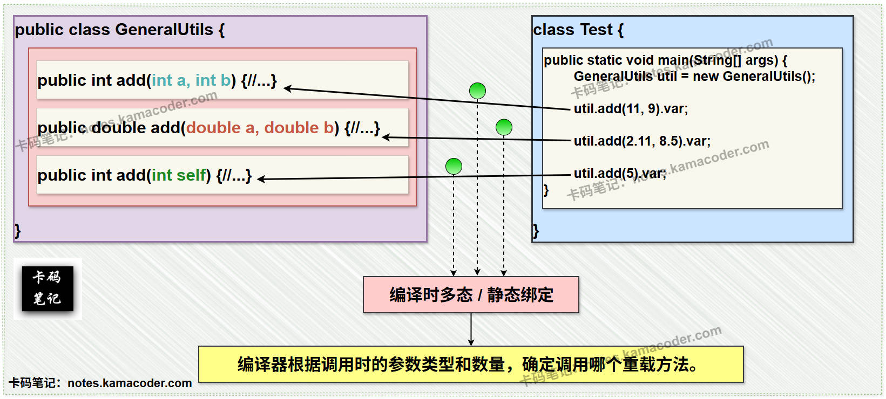
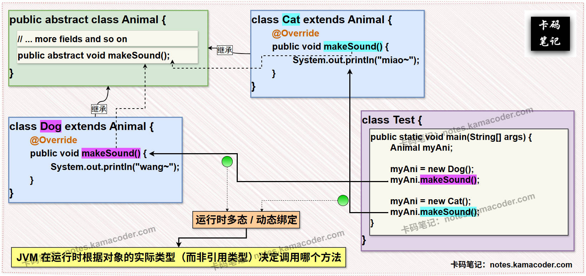

# 方法重载与方法重写

> 来源: https://notes.kamacoder.com/java/overloading-vs-overriding.html

# `# 方法重载与方法重写 

## `# 简要回答 

### `# 方法重载 和 方法重写 的概念 
  - **方法重载（Overload）**：在同一个类中定义多个**同名**方法，**但参数列表（类型、数量或顺序）不同**。   - **方法重写（Override）**：在子类中重新定义父类的方法，要求**方法签名（方法名、参数列表、返回类型）完全相同**。 

### `# 方法重载 和 方法重写 的区别 
  - 

如下表所示 : 

| **维度**  **方法重载**  **方法重写** 
| **作用范围**  同一类中  子类与父类之间（继承关系） 
| **参数列表**  必须不同（类型、数量、顺序至少一个不同）  必须相同 
| **返回类型**  可以不同  必须相同或兼容（子类可返回父类返回类型的子类） 
| **访问修饰符**  无限制  子类方法权限不能比父类更严格（访问权限：子类≥父类） 
| **异常处理**  可抛出不同异常  不能抛出比父类方法更宽泛的检查异常 
| **静态/非静态**  允许静态方法重载  静态方法不能被重写 
| **多态性**  编译时多态（静态绑定）  运行时多态（动态绑定）  

## `# 详细回答 

### `# 方法重载 和 方法重写 的概念 
  - **方法重载（Overload）** ：在同一个类中定义多个**同名**方法，**但参数列表（类型、数量或顺序）不同**。方法重载可以有效地增强代码灵活性，例如，一个工具类可能提供多种参数类型的 `add()` 方法。   - **方法重写（Override）** ：子类通过**完全一致的方法签名**重新定义父类方法，以实现多态性。例如，子类自定义的 `toString()` 方法覆盖 **Object** 类的默认实现。 

### `# 方法重载 和 方法重写 的区别 
  - **作用范围**：

    - 重载仅发生在**同一类**中。     - 重写需要**继承关系**，由子类覆盖父类的方法。   - **参数列表**：

    - 重载必须修改参数列表（参数的类型、数量或顺序**至少需要一个不同点**）。     - 重写参数列表**必须完全一加粗致**。   - **返回类型**：

    - 重载**允许返回类型不同**。     - 重写**要求返回类型相同或兼容**（协变返回类型）。例如，父类返回 **Object** 类型，子类可返回 **String** 类型。   - **访问修饰符**：

    - 重载方法可以使用任意访问修饰符（**public**、**protected**、**private**）。     - 重写方法的访问权限不能比父类更严格（如父类为 **public**，子类不能为 **protected**）。   - **异常处理**：

    - 重载可以抛出**不同**的异常。     - 重写要求子类方法抛出的检查异常（Checked Exception）**不能比父类更宽泛**。例如，父类抛出 **IOException**，子类可抛出 **FileNotFoundException**，但不能抛出 **Exception**。   - **静态方法**：

    - 静态方法可以重载（例如 `public static void log(String username)` 和 `public static void log(int identitycode)`）。     - 静态方法不能被重写。若**子类定义同名静态方法**，属于“**方法隐藏**”（Method Hiding），而非重写。   - **多态性**：

    - 重载在**编译时**决定调用哪个方法（静态绑定）。     - 重写在**运行时**根据对象实际类型决定调用哪个方法（动态绑定）。 

### `# 方法重载 和 方法重写 的代码演示 
  - 

**JDK 源码中的方法重载示例**： 
    - 

如 **java.io.PrintStream** 类中的 `println()` 方法： 

```
public class PrintStream {
	public void println() { ... }          // 参数个数不同
	public void println(boolean x) { ... } // 参数类型不同
	public void println(int x) { ... }     // 参数类型不同
	public void println(char[] x) { ... }  // 参数类型不同
}

```

    - 

**JDK 源码中的方法重写示例** 
    - 

如 **java.util.AbstractList** 类中的 `equals()` 方法在 **ArrayList** 类中的重写： 

```
public class ArrayList<E> extends AbstractList<E> {
	// 重写 AbstractList 的 equals 方法
	@Override
	public boolean equals(Object o) {
		if (o == this) return true;
		if (!(o instanceof List)) return false;
		// 自定义比较逻辑...
	}
}

```

   

## `# 知识拓展 
  - **方法重载 的示意图**：  
 
   - **方法重写 的示意图**：  
 
   - **静态方法与重载/重写的关系**：

    - **静态方法可以重载**：同一类中允许定义多个同名静态方法，只要参数列表不同。     - **静态方法不能重写**：若子类定义与父类同名的静态方法，属于“方法隐藏”（Method Hiding）。父类静态方法不会被覆盖，具体调用哪个方法取决于引用类型（编译时决定）。   - **Ultra-Condensed-Version**：

    - **Overloading**: Same method name with different parameter list (within a class).     - **Overriding**: Subclass redefines a superclass method with the same method signature (polymorphism).
