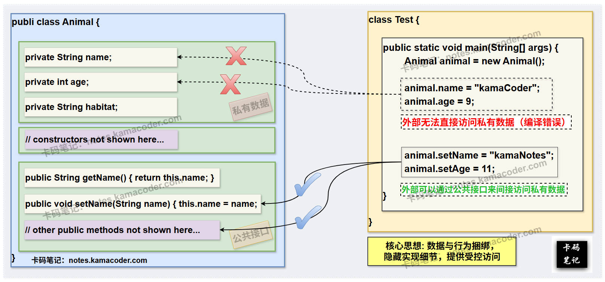

# 面向对象三大特性

> 来源: https://notes.kamacoder.com/java/oop-principles.html

# `# 面向对象三大特性 

## `# 简要回答 
  - **封装（Encapsulation）**：

    - **概念**：是指将**数据**（属性）和**操作数据的方法**（行为）**捆绑**在一起形成一个**独立的单元**（类/对象），并**隐藏其内部实现细节**，而是仅通过公共方法对外提供访问接口。     - **好处**：数据被保护在封装体内部，对外隐藏实现细节。   - **继承（Inheritance）**：

    - **概念**：是指让类与类之间产生**父子关系**。它允许一个类（子类）从另一个已存在的类（父类）中继承属性和方法，从而实现代码的复用，并建立类之间的层级关系。     - **好处**：提高代码复用性，类与类之间建立“is-a”的关系。   - **多态（Polymorphism）**：

    - **概念**：是指允许**父类引用指向子类对象**，并在运行时根据对象的实际类型调用相应的方法。它使得“一个接口，多种实现”成为现实。     - **好处**：提高代码的灵活性和可扩展性。  

## `# 详细回答 

### `# 1. 封装（Encapsulation） 
  - **定义**：

    - 封装是指将对象的**数据**（属性）和**操作数据的方法**（行为）**捆绑**在一起形成一个**独立的单元**（类/对象）。     - 同时，它通过控制访问权限来 **隐藏对象的内部实现细节**，而只对外提供**有限的、受控的**公共接口进行交互。   - **JavaBean**：JavaBean 是封装的典型应用，符合JavaBean标准的类，必须是具体，公共的；并且不但具有空参构造，通常也需要写出它的带参构造；成员变量全部用 private关键字 修饰，并且要提供用来操作这些成员变量的 setter和getter方法。   - **关键实现**：

    - **访问修饰符**：主要通过 `private` 关键字来实现数据和内部方法的隐藏。`public` 关键字则用于暴露对外接口。     - **`this` 关键字**：在类的方法内部，`this` 关键字用于引用当前对象的实例，常用于解决“成员变量和形参重名”的问题，以及在构造器中调用其他构造器。     - **与抽象的关系**：封装与抽象紧密相关，**抽象**是识别事物的共同特征和行为的过程，而封装则将这些抽象出来的特征和行为及其实现细节捆绑并隐藏起了。   - **优点**：

    - **数据安全性高**：数据被保护在封装体内部，外部不能随意访问和修改，保证了数据完整性。     - **降低耦合度**：只要接口不变，类内部实现的变化就不会影响外部调用者。     - **提高代码复用性**：封装好的组件可以更容易地在不同项目中复用。 

### `# 2. 继承（Inheritance） 
  - **定义**：

    - 继承是面向对象中实现 **代码复用** 和 建立**类之间层级关系（“is-a”关系）** 的机制。它允许一个类（**子类/派生类**）从另一个已存在的类（**父类/基类/超类**）中继承其属性和方法。     - 子类可以在继承的基础上，添加新的属性和方法，或者重写（Override）父类的方法，以实现特有的行为。     - 子类不能直接访问父类的私有（`private`）成员，但可以通过父类提供的 `public` 或 `protected` 方法间接访问。   - **特点**：

    - **单继承**：Java 类只支持单继承，即**一个类只能直接继承一个父类**。     - **多层继承**：但是 Java 支持多层继承，即一个子类可以有自己的子类。     - **传递性**：子类不但可以继承直接父类的非私有成员，还可以继承直接父类的父类的非私有成员。     - **构造器不被继承**：子类不继承父类的构造器，但子类构造器在执行前会**隐式或显式地**调用父类的构造器。   - **关键实现**：

    - **`extends` 关键字**：Java中如果使用**继承**，需要用到 **extends关键字**，在定义子类时，子类类名后跟上“extends + 要继承的父类类名”，即可。     - **`super` 关键字**：用于在子类中访问父类的成员（属性和方法），特别是调用父类的构造器（如`super()`）来完成属性的初始化。     - **方法重写（Override）**：子类对父类中已有的方法进行重新实现，以适应子类的特定行为。方法重写是实现多态的基础。   - **优点**：

    - **提高可维护性**：修改父类中的公共逻辑，可以影响所有子类。     - **模拟现实世界**：继承关系可以体现现实世界中的层级结构 和 “is-a”的关系。   - **缺点**：

    - **高耦合性**：子类与父类之间形成强耦合关系，不符合“**低耦合，高内聚**”的程序设计要求。并且子类暴露了父类的实现细节（“白盒复用”）。     - **灵活性限制**：Java 的单继承机制限制了类的功能扩展性。 

### `# 3. 多态（Polymorphism） 
  - **定义**：

    - 是指“**一个接口，多种实现**”。在 Java 中，多态主要体现在——允许**父类引用指向子类对象**，并在运行时根据对象的实际类型调用相应的方法，即动态绑定机制。   - **特点**：

    - **运行时绑定（动态绑定）**：这是多态的核心机制，编译器在编译时只知道引用变量的类型（静态类型），但在程序运行时，JVM 会根据对象的实际类型（动态类型）来查找并调用相应的方法。     - **提高可扩展性**：增加新的子类时，无需修改现有代码，只需让新子类重写父类方法。   - **实现多态的三个必要条件**：

    - **继承或实现关系**：必须存在子父类继承关系或接口实现关系。     - **方法重写（Override）**：子类必须重写父类的方法（或实现接口方法）。     - **父类引用指向子类对象**。   - **优点**：

    - **可维护性高**：修改具体实现不影响调用方。     - **可扩展性强**：新增子类只需实现父类接口或重写方法，无需修改调用方代码。   - **缺点**：

    - **父类引用不能直接使用子类的特有成员**：这是多态的一个限制。例如，`Animal animal = new Dog();`，`animal` 引用对象无法直接调用 `Dog` 类特有的方法，除非进行强制类型转换。  

## `# 知识拓展 
  - **三大特性——封装**，示意图如下：  
 
   - **面试官可能的追问1：封装、继承、多态这三大特性之间有何内在联系？** 
    - **封装是基础**：它既保护了对象的内部状态，又隐藏了实现细节，为继承提供了安全的基石。没有良好的封装，继承可能导致子类随意破坏父类内部，使得系统脆弱。     - **继承是前提**：它建立了类之间的“is-a”层级关系，实现了代码复用，并为多态提供了父类引用和方法重写的机制。     - **多态是目的**：它在继承的基础上，通过父类引用指向子类对象，实现了运行时动态绑定，使得代码更加灵活、可扩展性变强，是面向对象设计最终追求的目标之一。   - **面试官可能的追问2：面向对象设计中，为什么提倡“组合优于继承”？** 
    - **继承的强耦合性**：继承是一种“白盒复用”，子类会暴露父类的实现细节，父类内部的修改可能影响所有子类，导致“脆弱的基类问题”。     - **继承的单一性**：Java 只支持单继承，限制了代码复用的灵活性。     - **组合的优势**：  

① **弱耦合**：组合是“黑盒复用”，被组合的对象内部实现对外部是隐藏的，只通过接口交互，降低了耦合度。  

② **高灵活性**：一个类可以组合多个对象，实现多重功能，且可以在运行时动态改变组合关系。  

③ **易于测试**：组合的模块更独立，易于进行单元测试。
