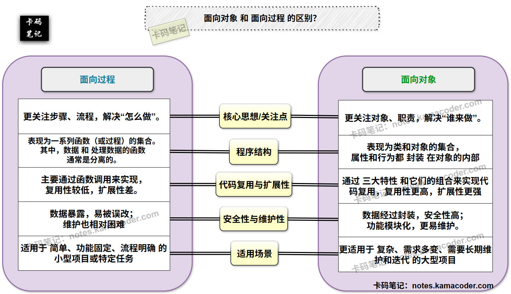
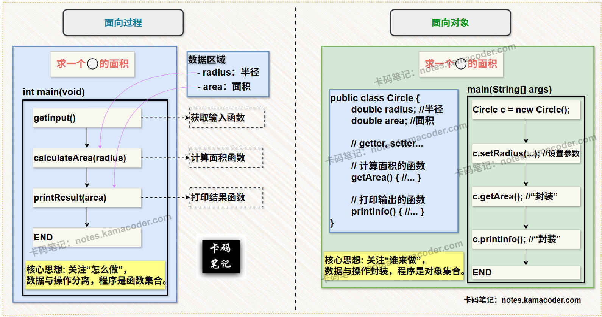

# 面向对象与面向过程

> 来源: https://notes.kamacoder.com/java/oop-vs-procedural.html

# `# 面向对象与面向过程 

## `# 简要回答 

### `# 面向对象 和 面向过程 的概念 
  - **面向过程 (Procedural Programming)** ： 一种编程范式，强调**“怎么做”**。面向过程编程以 **功能** 为中心，并通过一系列的 **步骤**（函数/过程）来解决问题，在此期间，数据与操作通常是分离的。   - **面向对象 (Object-Oriented Programming, OOP)** ： 另一种编程范式，强调**“谁来做”**。面向对象以 **数据（对象）** 为中心，将数据和操作数据的方法**封装**在一起，并通过对象之间的相互配合来解决问题。 

### `# 面向对象 和 面向过程 的对比 
  - 

如下表所示 : 

| 维度  面向过程(POP)  面向对象(OOP) 
| **核心思想/关注点**  更关注**步骤、流程**，解决“怎么做”。  更关注**对象、职责**，解决“谁来做”。 
| **程序结构**  函数/过程的集合，其中数据与函数分离。  类和对象的集合，其中数据与方法封装在一起。 
| **代码复用与扩展性**  主要通过函数调用来实现，复用性较低，扩展性差。  通过封装、继承、多态 以及 它们的组合来实现，复用性高，扩展性强。 
| **安全性与维护性**  数据暴露，易被误改；维护困难。  数据封装，安全性高；功能模块化，更易维护。 
| **适用场景**  简单、固定流程的小型项目。  复杂、需求多变、大型项目。  

## `# 详细回答 

### `# 面向对象 和 面向过程 的概念 
  - **面向过程 (Procedural Programming)** ：

    - 面向过程是一种以 **过程（函数）** 为中心的编程范式。它的核心思想是要把问题分解成**一系列的步骤或功能**，然后用函数（或者叫过程）来实现这些步骤。     - 在面向过程中编程中，数据和处理数据的函数通常是**分离的**。整个程序执行的流程是**线性的**，一步一步地完成任务。它强调的是 **“怎么做”** ，即通过详细的步骤来指导计算机完成任务。   - **面向对象 (Object-Oriented Programming, OOP)** ：

    - 面向对象是一种以 **对象** 为中心的编程范式。它的核心思想是要将现实世界中的实体**抽象**为程序中的对象，每个对象包含 **数据（也就是属性）和操作数据的方法（也就是行为）** 。     - 程序通过对象之间的**消息传递**和**协作**来完成任务。它强调的是 **“谁来做”** ，即通过定义具有特定职责的对象来解决问题。Java、C++、Python 这些都是典型的面向对象语言。 

### `# 面向对象 和 面向过程 的对比 
  - **核心思想/关注点**：

    - **面向过程**：  

其核心思想是**“自顶向下，逐步求精”**。它关注的是解决问题的**步骤和流程**，往往将一个大问题分解为若干个子问题，每个子问题对应一个函数或过程。     - **面向对象**：  

其核心思想是**“万物皆对象”**。它关注的是构成问题的**实体（对象）及其对应的职责**，往往将问题分解为相互协作的不同对象。   - **程序结构**：

    - **面向过程**：  

程序结构表现为一系列**函数（或过程）的集合**。其中，数据和处理数据的函数通常是分离的。     - **面向对象**：  

程序结构表现为**类和对象的集合**，属性和行为都**封装**在对象的内部，形成一个独立的模块。程序通过创建对象，并让对象之间相互发送消息（调用方法）来完成任务。   - **代码复用与扩展性**：

    - **面向过程**：  

主要通过**函数调用**来实现代码复用。所以说，如果某个功能需要修改，就可能需要修改多个调用点，甚至影响到不相关的部分，导致代码**复用性较低，扩展性较差**。     - **面向对象**：  

通过**三大特性**和它们的组合来实现代码复用。每当需求变化时，通常只需修改或添加新的类，而无需修改现有类的代码（开闭原则），这使得代码的**复用性更高，扩展性更强**。   - **安全性与维护性**：

    - **面向过程**：  

数据通常是全局的或在函数间自由传递，**数据暴露**，容易被不相关的函数意外修改，可能导致数据不一致或程序错误，所以面向过程**安全性较低**。又因为功能与数据紧密耦合，所以**维护也相对困难**。     - **面向对象**：  

通过**封装**机制，将数据隐藏在对象内部，只通过公共方法对外提供访问接口，因而**数据安全性高**，又因为对象与对象之间耦合度较低，所以**维护起来也更加容易**。   - **适用场景**：

    - **面向过程**：  

适用于**简单、功能固定、流程明确**的小型项目或特定任务。例如，操作系统底层（如C语言编写的内核部分）、嵌入式系统、简单的脚本程序或一次性计算任务。     - **面向对象**：  

更适用于**复杂、需求多变、需要长期维护和迭代**的大型项目。例如，图形用户界面（GUI）应用、Web 应用、企业级系统、游戏开发等。  

### `# 知识拓展 
  - **面向对象 和 面向过程 的对比图**如下所示：  
 
   - **面向对象 和 面向过程 的程序示意图**，如下：  
 
   - **面试官可能的追问1：Java 是一种纯粹的面向对象语言吗？为什么？** 
    - **简答：**  

① Java **不是**一种纯粹的面向对象语言。  

② 因为 Java 也包含了**基本数据类型**（如 `int`, `char`, `boolean` 等），这些基本类型不是对象，它们也没有自己的属性和方法，也不支持继承和多态。而纯粹的面向对象语言（如 Smalltalk）中，它应该是一切皆是对象，包括数字和布尔值。  

③ 不过 Java 仍然是**高度面向对象**的，它的核心特性，比如说类、对象、封装、继承、多态等，这些都严格遵循了面向对象范式。基本数据类型的存在主要是为了性能优化和简化编程。   - **面试官可能的追问2：面向对象的三大基本特征是什么？它们如何体现在面向对象和面向过程的区别中？** 
    - **简答：**  

① 面向对象的三大基本特征是**封装（Encapsulation）、继承（Inheritance）和多态（Polymorphism）**。它们是面向对象区别于面向过程的核心体现。  

② 对于 **封装** 来说，它把属性和行为抽象出来并放到一块儿，形成一个独立的单元（也就是对象），并隐藏内部实现细节，只对外提供有限的接口。这直接对应了我们上面提到的 **“数据与行为的关系”** 以及 **“安全性与维护性”** 的区别。即面向过程数据暴露，面向对象数据封装。  

③ 对于 **继承** 来说，允许一个类（子类）继承另一个类（父类）的属性和方法，从而实现代码的复用和层次结构的建立。这直接对应了我们上面提到的 **“代码复用与扩展性”** 的区别。即面向过程通过函数调用来实现代码复用，面向对象则通过三大特性和它们的组合来实现代码复用。  

④ 最后，对于 **多态** 来讲，多态允许不同类的对象对同一个消息（方法调用）作出不同的响应，并在运行时根据对象的实际类型来决定调用哪个方法，也就是动态绑定。这间接体现在 **“程序结构”** 和 **“代码复用与扩展性”** 的区别中，因为多态是实现面向对象**灵活性**的关键机制。
