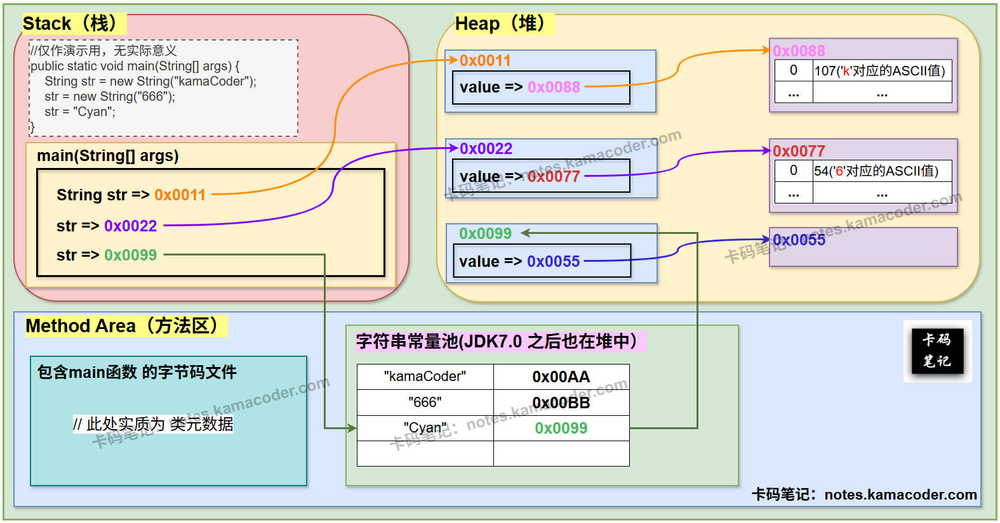

# String、StringBuffer与StringBuilder

> 来源: https://notes.kamacoder.com/java/string-stringbuffer-stringbuilder.html

# `# String、StringBuffer与StringBuilder 

## `# 简要回答 
  - **可变性（Mutability）** ：

    - `String` 不可变，一旦创建了一个`String`对象，它的值就不能被修改；     - `StringBuffer` 和 `StringBuilder` 可变，修改在原有对象上进行。   - **线程安全性（Thread Safety）** ：

    - `String` 线程安全（因其不可变），     - `StringBuffer` 线程安全（方法同步），     - `StringBuilder` 非线程安全。   - **性能（Performance）** ：

    - `String` 性能最低（频繁创建对象），     - `StringBuffer` 性能居中（同步开销），     - `StringBuilder` 性能最高（无同步）。   - **应用场景（Application Context）** ：

    - `String` 适用于存储字符串常量、少量修改字符串的场景；     - `StringBuffer` 适用于多线程环境下需要频繁修改字符串的场景；     - `StringBuilder` 适用于单线程环境下需要频繁修改字符串的场景。  

## `# 详细回答 
  - **可变性（Mutability）** ：

    - **String** ：  

① **不可变**：一旦创建了一个 `String` 对象，它的值就不能被修改。 任何对 `String` 对象进行修改的操作都会创建一个新的 `String` 对象。  

② **JVM 实现角度** ：**`String` 对象本身总是存储在 Java 堆内存中。JVM 中存在一个称为字符串常量池（String Pool）的特殊区域（也位于堆内存中），字符串常量池本身并不直接“存储”完整的 `String` 对象，而是存储对堆中那些唯一的、不可变的 `String` 对象实例的引用**， 可以把它看作一个“目录”。  

③ **JDK 源码角度** ： 在 JDK 9 之前，`String` 内部使用 `char[]` 数组存储字符。 JDK 9 之后，改用 `byte[]` 数组存储字符，并使用 `coder` 字段来标识字符的编码方式（LATIN1 或 UTF16），字节数组 **value** 和编码字段 **coder** 均声明为 **private final** 类型。而且无论使用哪种方式存储，`String` 类都没有提供任何修改内部字符数组的方法。 所有的修改操作都会创建一个新的 `String` 对象。 例如，`String` 类的 `substring()` 方法会创建一个新的 `String` 对象，而不是修改原始字符串。     - **StringBuffer 和 StringBuilder** ：  

① **可变**：`StringBuffer` 和 `StringBuilder` 类允许在不创建新对象的情况下修改字符串的内容。  

② **JVM 实现角度**：`StringBuffer` 和 `StringBuilder` 对象在 JVM 中存储在堆内存中。 它们内部使用一个**可变的字符数组**来存储字符串。 当需要修改字符串时，可以直接修改内部的字符数组，而不需要创建新的对象。  

③ **JDK 源码角度：** `StringBuffer` 和 `StringBuilder` 类都继承自 **AbstractStringBuilder** 类。 **AbstractStringBuilder** 类内部使用 `byte[] value` 数组存储字符。 `StringBuffer` 和 `StringBuilder` 类都提供了修改 `value` 数组的方法，例如 `append()`、`insert()`、`delete()` 等，这些方法可以直接修改 `value` 数组的内容，而不需要创建新的对象。`StringBuffer` 和 `StringBuilder` 内部还维护了一个 `count` 变量，用于记录字符串的长度。 当字符串的长度超过 `value` 数组的容量时，`StringBuffer` 和 `StringBuilder` 会自动扩容 `value` 数组。   - **线程安全性（Thread Safety）** ：

    - **String**：`String` 类是**线程安全**的，因为它的不可变性保证了多个线程可以安全地访问同一个 `String` 对象，而不会发生数据竞争。 任何线程都无法修改 `String` 对象的值，因此不存在线程安全问题。     - **StringBuffer**： `StringBuffer` 类是**线程安全**的。 它的方法都经过同步（使用 **synchronized** 关键字），可以保证在多线程环境下对字符串的修改是安全的。查看 `StringBuffer` 类的源码，可以看到它的 `append()`、`insert()`、`delete()` 等方法都使用了 **synchronized** 关键字进行同步。 这意味着在同一时刻，只有一个线程可以访问 `StringBuffer` 对象的这些方法。 这种同步机制保证了多线程环境下对 `StringBuffer` 对象的修改是线程安全的。     - **StringBuilder：** `StringBuilder` 类是**非线程安全**的。 它的方法没有进行同步，因此在多线程环境下使用可能会导致数据不一致的问题。查看 `StringBuilder` 类的源码，可以看到它的 `append()`、`insert()`、`delete()` 等方法都没有使用 **synchronized** 关键字进行同步。 这意味着多个线程可以同时访问 `StringBuilder` 对象的这些方法，从而导致数据竞争和线程安全问题。   - **性能（Performance）** ：

    - **String**：由于 `String` 的不可变性，每次修改都会创建新的对象，导致大量的内存分配和垃圾回收，性能较低。 尤其是在循环中频繁修改字符串时，性能问题会更加明显。     - **StringBuffer：** `StringBuffer` 在多线程环境下性能略低于 `StringBuilder`，因为它需要进行同步操作。 同步操作会带来一定的性能开销，例如线程上下文切换、锁竞争等。     - **StringBuilder**：`StringBuilder` 在单线程环境下性能最高，因为它没有同步开销。 所有的操作都是在同一个对象上进行的，避免了频繁创建对象的开销。   - **应用场景（Application Context）** ：

    - **String**：  

① 存储字符串常量。  

② 少量字符串修改操作。  

③ 需要在多线程环境下共享字符串对象。     - **StringBuffer**：  

① 在多线程环境下需要频繁修改字符串。  

② 需要保证线程安全。     - **StringBuilder**：  

① 在单线程环境下需要频繁修改字符串。  

② 不需要保证线程安全。  

## `# 知识拓展 
  - 

**String类对象的内存图解 示意图如下**：  
 
   - 

**String 转换为 StringBuffer**： 
    - 

**方法 1：使用 StringBuffer 的构造方法**  

这是最直接的方法。 你可以使用 `StringBuffer` 的构造方法，将 `String` 对象作为参数传入。 这样会创建一个新的 `StringBuffer` 对象，其初始内容与 `String` 对象相同。eg : 

```
String str = "kamanotes";
StringBuffer stringBuffer = new StringBuffer(str);

```

      - 

**方法 2：先创建 StringBuffer 对象，再使用 append() 方法**  

首先创建一个空的 `StringBuffer` 对象，然后使用 `append()` 方法将 `String` 对象的内容添加到 `StringBuffer` 中。eg : 

```
String str = "kamaCoder";
StringBuffer stringBuffer = new StringBuffer();
stringBuffer.append(str);

```

    - 

**StringBuffer 转换为 String**： 
    - 

**方法 1：使用 toString() 方法**  
 `StringBuffer` 类继承自 `AbstractStringBuilder` 类，并重写了 `toString()` 方法。 `toString()` 方法会将 `StringBuffer` 对象的内容转换为一个 `String` 对象。 

```
StringBuffer stringBuffer = new StringBuffer("kamanotes");
String str = stringBuffer.toString();

```

      - 

**方法 2：使用 String 的构造方法**  

可以使用 `String` 的构造方法，将 `StringBuffer` 对象作为参数传入。 这样会创建一个新的 `String` 对象，其初始内容与 `StringBuffer` 对象相同。 

```
StringBuffer stringBuffer = new StringBuffer("kamaCoder");
String str = new String(stringBuffer);

```
