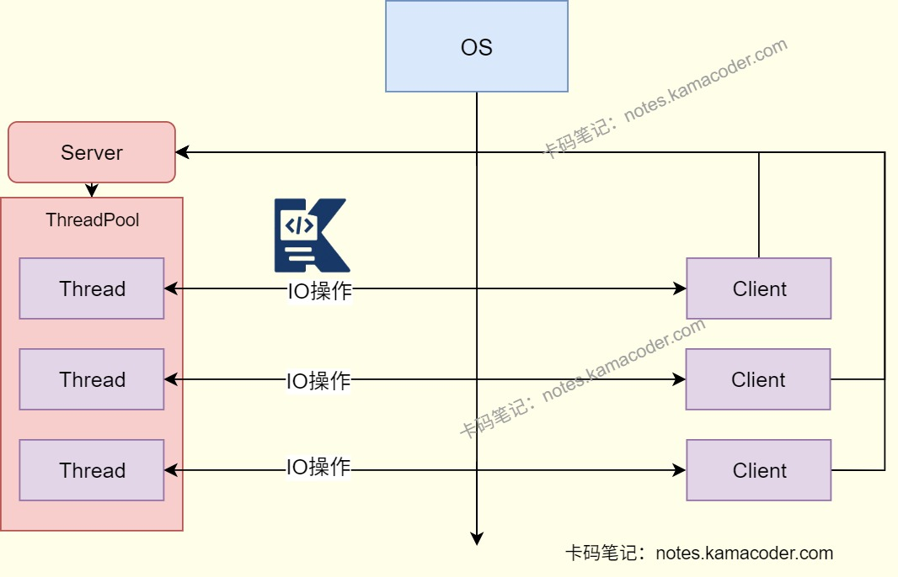
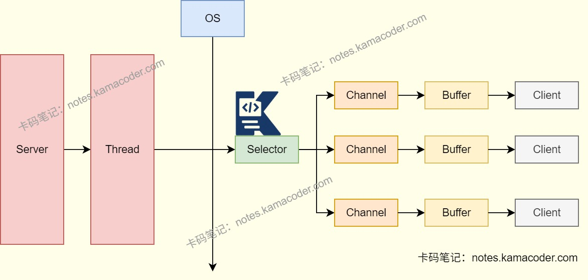

# BIO、NIO与AIO

> 来源: https://notes.kamacoder.com/java/bio-nio-aio.html

# `# BIO、NIO与AIO 

## `# 简要回答 
  - BIO、NIO、AIO是Java中用于**处理I/O操作的几种不同的模型**。   - BIO是**同步阻塞**模型，适合连接数较少且固定的情况   - NIO是**同步非阻塞**模型，适合连接数较多且连接时间较短的情况   - AIO是**异步非阻塞**模型，适合连接数较多且连接时间较长的情况。 

## `# 详细回答 
  - BIO(Blocking I/O)

    - BIO指的是同步阻塞模型。     - 当执行到IO操作的代码时，**线程会一直阻塞**（无论是在等待操作还是进行读写操作），直到IO操作完成后才会执行后续的代码。如果有大量的并发连接，会导致大量线程阻塞，造成资源浪费。     - 传统的java.io包，**基于流模型**实现的。     - 优点：代码比较简单直观，由于阻塞IO操作的结果可靠     - 缺点：阻塞等待会导致资源浪费，并且每个连接都需要一个独立线程并发能力有限，系统整体性能下降。   - NIO(Non-Blocking I/O)

    - NIO是同步非阻塞模型。     - NIO**引入了Selector、Channel和Buffer**，Channel是双向的，可以读也可以写，而Buffer是负责传输的缓冲区。使用NIO不再阻塞，而是**采用轮询的方式进行IO操作**，一个线程可以进行多个IO操作，可以利用while循环在里面不断的询问多个IO是否准备好了，某一个IO准备好了就进行IO操作，如果没有就询问下一个IO。     - Java1.4引入的java.nio包，提供了更接近操作系统底层高性能的数据操作方式。     - 优点：可以提供更高的并发性和可扩展性，使用更少的线程处理相同数量的连接，节省了系统资源。     - 缺点：可靠性较低，可能出现部分读写或者错误数据。   - AIO(Asynchronous I/O)

    - AIO是异步非阻塞模型。     - AIO是在NIO的基础上进一步发展的，使用AIO时，该线程会开启另一个线程，并将IO操作交给另一个线程执行，然后执行后续的代码，当另一个线程执行完IO操作后会通知该线程，然后**使用回调函数**的方式执行AIO。     - Java1.7后引入的包，异步IO是**基于事件和回调机制**实现的。     - 优点：不会阻塞线程，更加高效。     - 缺点：每个操作都要创建一个回调函数，可能会消耗更多的系统资源。 

## `# 适用场景 
  - BIO：适合**连接数较小且固定**的情况，但在高并发环境中，性能可能会受到限制。   - NIO：适合**连接数较多且连接时间较短**的场景，能够通过单一线程管理多个连接，提高了系统的扩展性和并发性。   - AIO：适用于**处理大量并发连接，且连接时间较长**的场景，能够在I/O操作完成后异步通知应用程序。 
  - 在实际开发中，NIO比BIO更常用，而AIO的应用相对较少。 

## `# 知识图解 
  - BIO流程示意

   - NIO流程示意

 

## `# 知识扩展 
  - 面试官可能追问： 
  - Q1：NIO的Selector是如何实现“多路复用” 的？底层依赖操作系统的什么机制？

    - Linux依赖**epoll机制**，Windows依赖**IOCP机制**。     - Selector的工作流程：先将Channel**注册**到Selector中，操作系统内核会**监听**IO事件，当事件发生时，内核通知Selector，**唤醒**线程处理事件，这样可以**避免线程阻塞**在单个IO操作上，实现**多路复用**。   - Q2：AIO的 “异步” 与NIO的 “非阻塞” 常被混淆，二者的核心差异是什么？AIO 在哪些场景下优势更明显？

    - NIO的非阻塞是**线程需要主动调用select()轮询**就绪事件，线程需要参与IO的就绪检查。     - AIO的异步是线程发起IO操作后立即返回，由操作系统完成整个IO操作，完成后通过回调通知线程，**线程无需参与中间过程**。   - Q3：Netty 作为高性能网络框架，为何基于 NIO 而非 AIO？日常开发中应如何根据场景选择 BIO、NIO、AIO？

    - NIO的多路复用在**高并发场景下性能稳定**，而且Netty通过优化线程模型可以改善其效率。     - AIO在操作系统层面实现还不够完善。   - Q4：三种 IO 模型在处理 “读数据” 时的流程有何不同？分别体现了什么设计思想？

    - BIO：线程**调用read()后阻塞**，直到数据从内核缓冲区拷贝到用户缓冲区。     - NIO：线程通过**Selector检查Channel是否非阻塞**，然后**调用read()方法**，数据从内核缓冲区拷贝到用户缓冲区（时间短于BIO）。     - AIO：线程**调用read()并注册回调**，返回继续处理其他任务。
