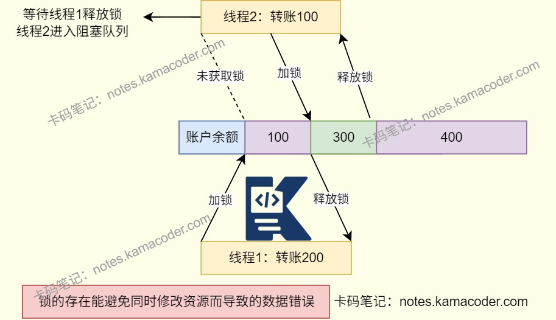

# Java锁

> 来源: https://notes.kamacoder.com/java/java-locks.html

# `# Java锁 

## `# 简要回答 

Java中有很多关于锁的概念，可以分类成下面几个方面理解： 
  - 按照锁的获取机制（看待并发同步的角度）：**乐观锁**/**悲观锁**   - 按照锁的竞争策略：**公平锁**/**非公平锁**   - 按照锁控制的资源范围：**偏向锁**/**轻量级锁**/**重量级锁**/**分段锁**   - 按照功能特性：**可重入锁**/**读写锁**/**自旋锁**/**互斥锁**   - 按照持有方式：**独享锁**/**共享锁** 

## `# 详细回答 
  - 乐观锁：**假设线程的并发访问不会发生冲突**，操作时不加锁，在更新数据时采用尝试更新，如有冲突则重试。

    - 乐观锁在Java中即**无锁编程**     - 例如原子类，通过CAS自旋实现原子操作的更新。   - 悲观锁：假设线程并发一定会有冲突，**每次操作前必须先加锁**，阻止其他线程干扰。   - 公平锁：线程**按照申请锁的顺序获取锁**，先等待先获得。

    - 优缺点：公平,但是效率低，存在线程唤醒开销。   - 非公平锁：**线程获取锁时不按顺序**，允许“插队”。

    - 优缺点：效率高，吞吐量大，但是可能导致优先级反转或饥饿现象。 
  - **偏向锁、轻量级锁、重量级锁都是锁的状态**，是针对synchronized的概念，通过对象监视器在对象头中的字段来表明的。 
  - 偏向锁：是JVM对synchronized的优化，如果只有一个线程访问同步资源，一旦**线程获取锁，后续无需重复加锁**。   - 轻量级锁：当**偏向锁被多个线程竞争时升级**为轻量级锁，其他线程会通过自旋尝试获取锁，**不会阻塞**。   - 重量级锁：轻量级锁**自旋失败一定次数后升级**为重量级锁，线程进入阻塞。重量级锁依赖操作系统的互斥量实现，**重量级锁会使其他申请的线程进入阻塞**，性能降低。   - 分段锁：将大对象拆分为多个小段，对每个段单独加锁，细化锁的粒度，减少锁竞争。

    - 分段锁是一种锁的设计，**不是具体的锁**。     - 以ConcurrentHashMap中put操作为例，不会对整个hashmap加锁，会先通过hashcode计算放入的分段，对分段加锁。**如果不是放在同一个分段中，可以实现并行插入**。   - 可重入锁（递归锁）：**线程可以重复获取已持有的锁**，避免自己锁死自己。

    - 实现方式：synchronized（隐式）ReentrantLock（显式） 

```
// 由于可重入锁的特性，setB可以正常执行
synchronized void setA() throws Exception{
  Thread.sleep(1000);
  setB();
}
synchronized void setB() throws Exception{
  Thread.sleep(1000);
}

```

 
  - 读写锁：区分“读操作”、“写操作”，**允许多个读线程并发访问**，读和写互斥，写和写互斥。

    - ReadWriteLock   - 自旋锁：线程获取锁失败时不立即阻塞，而是**循环尝试获取锁**，循环有次数限制。

    - 优缺点：减少线程上下文切换开销，但是循环会消耗CPU。   - 互斥锁：通过**互斥机制保证同一时间只允许一个线程持有锁**。

    - ReentrantLock 
  - 互斥锁/读写锁是独享锁/共享锁的具体体现。 
  - 独享锁：**同一时间只能有一个线程持有锁** 
    - ReentrantLock 是独享锁     - ReadWriteLock 写锁是独享锁   - 共享锁：同一时间允许多个线程同时持有锁，**线程间不互斥**。

    - ReadWriteLock 读锁是共享锁，保证并发读高效，而读写、写读、写写的过程互斥。 

## `# 使用场景 

| 锁  使用场景 
| 乐观锁  读操作频繁，冲突概率低的场景 
| 悲观锁  写操作频繁，冲突概率高 
| 偏向锁  单线程反复访问同步块 
| 轻量级锁  短时间、低冲突并发场景 
| 重量级锁  长耗时、高冲突并发场景 
| 分段锁  对大对象的并发访问 
| 读写锁  读多写少 

**Java中具体工具** 

| 工具  适用场景 
| synchronized  实现互斥锁。对共享资源的访问进行同步控制 
| ReentrantLock  实现可重入锁。可手动控制锁的获取和释放，支持公平锁，适合更高级别控制场景 
| ReadWriteLock  读写锁接口。适用于读多写少场景 
| StampedLock  乐观读写锁。并发性能更高，适用于读多写少场景。 
| AtomicInteger  基于CAS的原子操作类（无锁）。实现共享变量的原子更新 

## `# 知识图解 
  - 锁的使用 


 2. CAS操作流程 


 3. 死锁的出现 


 

## `# 知识扩展 
  - 扩展： 
  - CAS操作（Compare and Swap）是一种无锁的原子操作机制，广泛应用于多线程编程中，实现高效的线程安全。

    - CAS有三个操作数：内存位置（V），预期原值（A），新值（B）。     - 具体操作：

      - 从内存位置V读取当前值。       - 比较当前值和预期原值A是否相等。       - 如果相等就将内存位置V的值更新为B。       - 如果不相等，则说明该内存位置的值已经被修改过了，则不进行更新操作，选择重试或者执行其他逻辑。   - 死锁 
    - 两个线程分别对两个共享资源使用了两个互斥锁，造成**两个线程都在等待对方释放锁**。     - 需要同时满足四个条件：

      - 互斥条件       - 持有并等待条件       - 不可剥夺条件       - 环路等待条件 
  - 面试官可能追问： 
  - Q1：如何避免死锁的产生？

    - 破坏死锁出现的四个条件之一就可以避免死锁产生。 
    - 破坏环路等待条件：强制所有线程按固定顺序申请资源。是最常用和有效的避免死锁产生措施。     - 破坏持有并等待条件：线程在执行任务前一次性申请所有需要的资源，如果无法申请其中某资源，则释放已申请的所有资源并等待。     - 破坏不可剥夺条件：允许资源被强制回收。     - 破坏互斥条件：将资源设计成共享资源，局限性高，不常使用。
