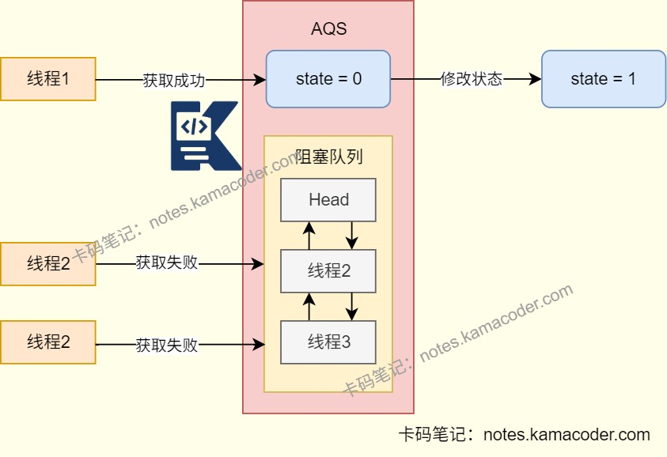

# synchronized与Lock对比

> 来源: https://notes.kamacoder.com/java/synchronized-vs-lock.html

# `# synchronized与Lock对比 

## `# 简要回答 
  - synchronized：是**基于JVM的内置锁**，只能**用于方法和代码块**，需要与**wait()** 和**notify()/notifyAll()** 方法一起使用，用于线程等待和通知。   - lock：是接口，Java提供的**显式锁机制**，需要**手动获取和释放**锁，更加**灵活**，支持响应中断、设置锁的公平性等，与Condition接口结合可以实现**更细粒度的线程等待和通知机制**。   - ReentrantLock：是Lock接口的一个**具体实现类**，拥有Lock的特性。 

## `# 详细回答 
  - 相同点：

    - 他们都是可重入锁，同一个线程可以多次获取同一个锁。   - 不同点：

    - synchronized和lock（以ReentrantLock为例） 
    - **公平性**：synchronized是非公平锁，ReentrantLock支持公平性设置。     - **中断响应**：synchronized不支持响应中断，ReentrantLock支持响应中断，即线程在等待锁时可以中断。     - **等待与通知**：synchronized不**支持绑定多个条件**，只能与wait()和notify()/notifyAll()方法一起使用，实现线程等待与通知。ReentrantLock可以**与多个Condition对象结合**，实现复杂的线程同步机制。     - **实现原理**：synchronized通过**互斥锁**保证共享数据不会被访问，ReentrantLock通过**AQS**来实现。     - **操作锁方式**：synchronized是**隐式锁**，线程进入/退出代码时JVM自动获取释放锁，ReentrantLock是**显式锁**，必须手动调用lock()/unlock()方法。     - **性能**：ReentrantLock可以提供更细粒度的控制和灵活性，性能高于synchronized。 

## `# 使用场景 

| 锁  适用场景  优势 
| synchronized  简单、低并发  无需手动管理 
| Lock  作为接口，不直接使用  定义锁的操作规范 
| ReentrantLock  复杂同步场景、高并发  支持中断、超时、公平性选择 

## `# 代码示例 
  - ReentrantLock中断特性 

```
// 线程1先获取锁并持有
Thread t1 = new Thread(() -> {
    lock.lock();
    try { Thread.sleep(5000); } // 持有锁5秒
    finally { lock.unlock(); }
});
t1.start();
Thread.sleep(100); // 确保t1先拿到锁

// 线程2尝试获取锁，1秒后被中断
Thread t2 = new Thread(() -> {
    try {
        // 可中断地获取锁
        lock.lockInterruptibly();
        System.out.println("t2获取到锁");
        lock.unlock();
    } catch (InterruptedException e) {
        System.out.println("t2被中断，放弃等待"); // 预期执行
    }
});
t2.start();
Thread.sleep(1000); // 等待1秒后中断t2
t2.interrupt();

```

 
  - ReentrantLock超时特性 

```
// 线程1先获取锁并持有3秒
new Thread(() -> {
    lock.lock();
    try { Thread.sleep(3000); }
    finally { lock.unlock(); }
}).start();
Thread.sleep(100);

// 线程2尝试获取锁，设置最多等2秒
new Thread(() -> {
    try {
        // 超时获取锁（2秒）
        boolean success = lock.tryLock(2, TimeUnit.SECONDS);
        if (success) {
            System.out.println("t2获取到锁");
            lock.unlock();
        } else {
            System.out.println("t2等待超时，放弃"); // 预期执行
        }
    }catch(){...}
}).start();

```

 

## `# 知识图解 
  - AQS获取锁

   - AQS释放锁

 

## `# 知识扩展 
  - 扩展： 
  - AQS：

    - 是一个用于构建锁和同步容器的框架，ReentrantLock、Semaphore、CountDownLatch等都基于AQS构建。     - 使用一个volatile int**变量state**表示同步状态，内部维护一个**CLH变体双向队列**（FIFO）管理等待线程。

      - 当线程竞争同步状态失败时会被封装成**节点**加入阻塞队列，当同步状态释放时，会把节点中的线程唤醒，使其再次获取同步状态。     - AQS有**独占锁**和**共享锁**两种资源共享方式，AQS对于独占模式有一个独占线程标记，记录当前持有锁的线程，实现可重入。 
  - 面试官可能追问: 
  - Q1：CAS和AQS有什么关系？

    - CAS：一种**乐观锁机制**，即尝试修改，若条件不符合则不做操作，满足原子性。     - **AQS内部会使用CAS操作更新state变量**实现线程安全的状态修改。线程获取资源时使用CAS操作更新值，线程释放资源时会使用CAS操作恢复state的值，保证状态更新的原子性。   - Q2：高并发下，synchronized 的重量级锁和 ReentrantLock 的性能差异主要来自哪里？

    - synchronized重量级锁依赖Monitor结构，**线程阻塞/唤醒开销大**，ReentrantLock在高并发下通过**AQS的自旋和CLH队列减少内核态切换**。   - Q3：ReentrantLock的公平锁和非公平锁哪个性能好？

    - 公平锁需要**按照CLH队列顺序**唤醒线程，可能会导致线程频繁阻塞/唤醒，非公平锁允许“**线程插队**”和**刚释放锁的线程直接重入**，避免一部分开销。
