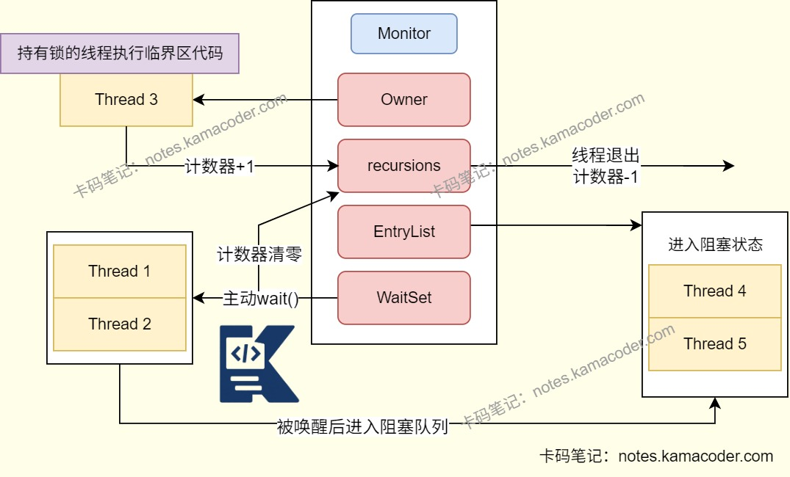
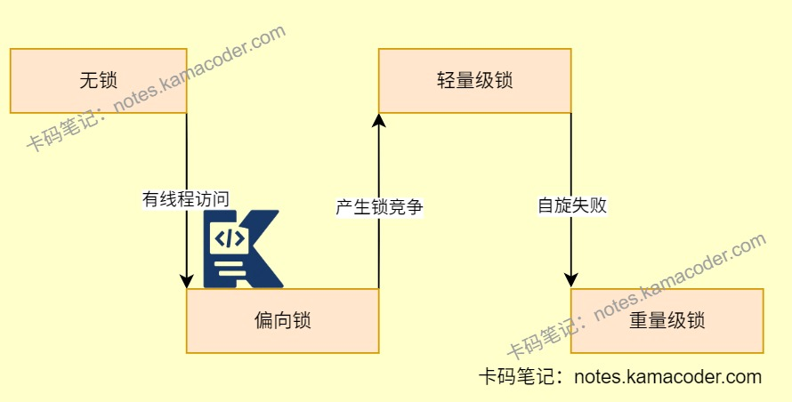

# synchronized关键字

> 来源: https://notes.kamacoder.com/java/synchronized-keyword.html

# `# synchronized关键字 

## `# 简要回答 

synchronized是Java中最基础的**线程同步关键字**，通过**互斥锁机制**保证多线程对共享资源的安全访问，可以**修饰方法或代码块**。 

## `# 详细回答 
  - synchronized是Java提供的**内置锁（监视器锁）**，其实现依赖软件层面上的JVM，其性能会随着Java版本的升级而提高。   - 当方法或代码快被synchronized修饰时，它将成为**临界区**，同一时刻只能由一个线程访问。   - 当线程通过synchronized等待锁的时候**不能被Thread.interrupt()中断**，需要保证程序合理防止造成死锁。   - 使用synchronized后，会在编译之后在代码前后加上**monitorenter**和**monitorexit**字节码指令。

    - 执行**monitorenter**指令时尝试获取对象锁，如果对象没有被锁或者已经获得了锁，锁的**计数器加一**。此时其他竞争锁的线程会进入阻塞队列等待。     - 执行**monitorexit**指令时会把计数器减一，当**计数器值为0时，锁释放**，处于等待队列中的线程会竞争锁。   - **加锁**的过程中会清除工作内存中的共享变量，再从主内存读取，**释放锁**的过程则是将工作内存中的共享变量写回主内存。 

```
public synchronized void synchronizedMethod(){
  //这个方法内部的代码被锁定，同一时间只有一个线程可以执行
}

public void someMethod(){
  synchronized(this){
    //这个代码块被锁定
  }
}

```

 
  - Java对象在内存中包含“对象头”，其中有一个**Mark Word字段会记录锁的状态**（无锁/偏向锁/轻量级锁/重量级锁）。   - synchronized版本更新：

    - JDK6之前，synchronized是重量级锁，线程阻塞/唤醒时需要进行操作系统内核态切换，造成很大开销。     - JDK6及以后引入了**锁升级机制**，即偏向锁-轻量级锁-重量级锁的升级规则，大幅减小开销。 

## `# 知识图解 
  - synchronized底层示意图

   - 锁升级示意图

 

## `# 知识扩展 
  - 扩展： 
  - Monitor结构（适用于**重量级锁**）

    - Monitor是synchronized实现线程同步的核心底层结构，通过**EntryList**和**WaitSet**管理线程的竞争和等待。     - Monitor核心结构包含：

      - **Owner**（指向当前持有锁的线程）       - **EntryList**（未获取到锁的线程）       - **WaitSet**（调用wait()方法的线程，如果被唤醒线程进入EntrySet）       - **recursions**（当前线程持有锁的重入次数） 
  - 面试官可能追问： 
  - 

Q1：详细介绍一下锁的升级机制？ 
    - 无锁：没有开启偏向锁时为无锁，**JDK6之后默认开启偏向锁**。     - 偏向锁：没有线程拿到锁，称为匿名偏向。有线程拿到偏向锁会**记录线程ID**，如果还有相同ID的线程竞争锁则直接获取。**JDK8后默认为轻量级锁**，可以设置附加偏向锁。     - 轻量级锁：**新线程竞争偏向锁时升级**为轻量级锁。每个线程通过CAS操作尝试将锁对象头的MarkWord设置为指向自身，如果成功设置则已获得锁。     - 重量级锁：**自旋次数/自旋线程数超过阈值升级**为重量级锁。线程被挂起节约CPU资源，但是内核态和用户态切换消耗大。   - 

Q2：synchronized锁静态方法和普通方法有什么区别？ 

| 锁静态方法  锁普通方法 
| 锁当前类对象  锁当前对象实例 
| 对所有实例调用都互斥  仅对同一对象互斥 
| 同一时间只有一个线程能执行  多线程可同时访问不同对象
