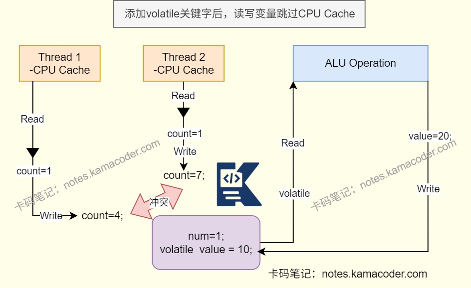

# volatile关键字

> 来源: https://notes.kamacoder.com/java/volatile-keyword.html

# `# volatile关键字 

## `# 简要回答 
  - volatile是Java并发编程中常用的关键字，作为变量修饰符，无法修饰方法以及代码块，被修饰的共享变量保证了不同线程对该变量操作的内存可见性且禁止指令重排序。 

## `# 详细回答 
  - 保证可见性：一个线程修改了变量值，其他线程能够立即看到修改的值。

    - 对非volatile变量进行读写时，每个线程先从主内存拷贝变量到CPU缓存中，如果计算机有多个CPU，每个线程可能在不同的CPU上被处理，所以每个线程可以拷贝到不同CPU cache中。     - volatile修饰的变量不会被缓存在寄存器或者对其他处理器不可见的地方，保证每次读写变量都从主内存中读，跳过CPU cache。所以当一个线程修改了这个变量的值，新值对于其他线程是立即得知的。     - 避免了多线程环境下因缓存不一致导致的读取脏数据问题。   - 禁止指令重排：对一个volatile变量的写操作，执行在任意后续对这个volatile变量的读操作之前。

    - 在读写操作指令前后插入内存屏障，指令重排序时不能把后面的指令重排序到内存屏障。     - 指令重排是JVM为了优化指令，提高程序运行效率，在不影响单线程程序执行结果的前提下，尽可能提高并行度。     - 指令重排序包括编译器重排序和运行时重排序。   - 不能保证原子性：volatile不能保证复合操作的原子性,需要结合synchronized或原子类来保证原子性。 

## `# 使用场景 
  - volatile适用于读写操作不依赖其当前值（如状态标志、单例模式中的延迟初始化）的场景，比synchronized更轻量级，不会引起线程上下文切换和调度。 

## `# 代码示例 
  - 状态标记变量：用volatile修饰线程的中断/停止标记，确保一个线程能及时感知到其他线程的状态变化。

    - isRunning不加volatile修饰可能导致一直读取本地缓存的true,无法停止。     - isRunning加volatile修饰，修改会立即被感知，可以保证线程安全。 

```
public class VolatileDemo {
    // 用volatile修饰状态标记
    private static volatile boolean isRunning = true;

    public static void main(String[] args) throws InterruptedException {
        // 启动线程
        Thread worker = new Thread(() -> {
            while (isRunning) { // 读取标记
                // 执行任务...
            }
            System.out.println("线程已停止");
        });
        worker.start();

        // 主线程休眠后修改标记
        Thread.sleep(1000);
        isRunning = false; // 修改标记，会立即同步到主内存
    }
}

```

 
  - 单例模式的双重检查锁定：volatile用于禁止指令重排序，避免因初始化对象时的指令重排序导致的线程安全问题。

    - 禁止instance = new Singleton()指令重排序，确保instance在初始化完成后才会被其他线程可见。 

```
public class Singleton {
    // 用volatile修饰单例对象
    private static volatile Singleton instance;

    private Singleton() {}

    public static Singleton getInstance() {
        if (instance == null) { // 第一次检查（避免不必要的同步）
            synchronized (Singleton.class) {
                if (instance == null) { // 第二次检查（确保线程安全）
                    // 若不加volatile，可能发生指令重排序：
                    // 1. 分配内存 -> 2. 初始化对象 -> 3. 赋值给instance
                    // 重排后可能变成 1->3->2，导致其他线程获取到未初始化的对象
                    instance = new Singleton();
                }
            }
        }
        return instance;
    }
}

```

 
  - 独立观察变量：多个线程共享同一个变量，变量的更新不依赖当前值时，volatile保证读取及时性。

    - 记录程序运行状态（加载中、运行中、已停止） 

```
public class StatusTracker {
    private volatile String status = "INIT"; // 初始状态

    // 线程A更新状态
    public void updateStatus(String newStatus) {
        status = newStatus; // 简单赋值，无依赖
    }

    // 线程B观察状态
    public String getStatus() {
        return status; // 保证读取到最新值
    }
}

```

 

## `# 知识图解 
  - volatile关键字的作用示意图 


 

## `# 知识扩展 
  - 扩展： 
  - JVM的内存屏障：

    - LoadLoad屏障:在第二段数据指令被访问前保证第一大段读数据指令执行完毕。     - StoreStore屏障:在第二段数据指令被访问前保证第一段写数据指令执行完毕。     - LoadStore屏障:在第二段数据指令被访问前保证第一段读数据指令执行完毕。     - StoreLoad屏障:在第二段数据指令被访问前保证第一段写数据指令执行完毕。 
  - 面试官可能追问: 
  - Q1：如果一个volatile变量是引用类型（比如对象），它能保证对象内部字段的可见性吗？

    - 不能。当volatile修饰引用类型变量时，它只能保证的是引用本身的可见性（即引用指向的对象地址的变化能被其他线程及时感知），但无法保证该对象内部字段的可见性。   - Q2：volatile和原子类（如AtomicInteger）的适用场景有何不同？原子类能替代volatile吗？

    - 不能简单替代，volatile保证变量的可见性和禁止指令重排序，不支持原子性；原子类则可以通过CAS保证原子性，不能保证可见性。     - volatile适合做状态标记和线程间通信。     - 原子类适合做计数器/累加器，需要原子更新的变量（如i++）。   - Q3：针对volatile变量JVM采用了什么内存屏障？

    - 对于写操作，在写操作前插入StoreStore屏障，在写操作后插入StoreLoad屏障。     - 对于读操作，在读操作前插入LoadLoad屏障，在读操作后插入LoadStore屏障。
