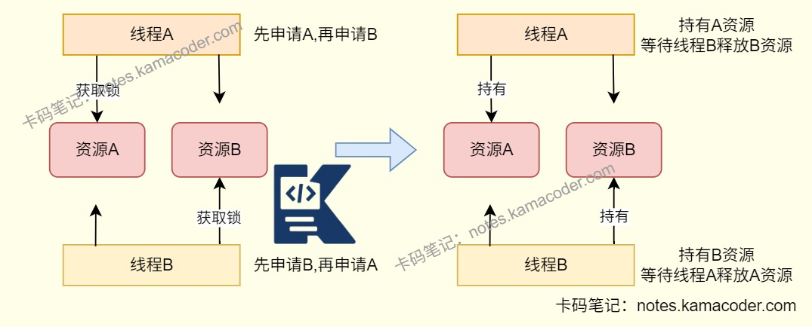

# 什么是死锁？如何避免和排查死锁？

> 来源: https://notes.kamacoder.com/java/deadlock_avoid_troubleshoot.html

# `# 什么是死锁？如何避免和排查死锁？ 

## `# 简要回答 
  - 死锁是指**多个线程在竞争多个资源时，互相持有对方需要的资源**，导致所有线程都无法继续执行的永久阻塞状态。   - 发生死锁通常需要同时满足四个条件：**互斥条件、持有并等待条件、不可剥夺条件、环路等待条件**。   - 避免死锁的核心思路是**破坏这四个条件中的任意一个**，工程上最常见的方法是：**统一加锁顺序、减少嵌套锁、使用tryLock超时机制、不要在锁内执行耗时操作**。   - 排查死锁时可以通过**jps + jstack**、**jcmd Thread.print -l**、**jconsole/arthas**查看线程栈，重点关注`BLOCKED`线程、锁持有关系以及输出中的`Found one Java-level deadlock`。 

## `# 详细回答 
  - 什么是死锁 
    - 死锁本质上是**循环等待**。线程A持有资源1等待资源2，线程B持有资源2等待资源1，双方都不释放自己已经拿到的资源，最终谁也执行不下去。     - 在Java里，死锁不仅可能发生在**synchronized**之间，也可能发生在**ReentrantLock**、数据库锁、分布式锁以及多种锁组合使用的场景中。   - 死锁产生的四个必要条件 
    - **互斥条件**：同一时刻一个资源只能被一个线程占有。     - **持有并等待条件**：线程已经持有一个资源，同时继续申请其他资源。     - **不可剥夺条件**：线程已经拿到的资源，在自己释放前不能被强行抢走。     - **环路等待条件**：多个线程之间形成首尾相接的资源等待环。 
    - 只有这四个条件同时成立时，才会形成死锁，所以**只要破坏其中任意一个条件，就能避免死锁**。   - Java中常见的死锁场景 
    - **加锁顺序不一致**：线程A先锁A再锁B，线程B先锁B再锁A，是最常见的死锁原因。     - **多资源混合加锁**：本地锁、数据库行锁、分布式锁混用，如果获取顺序不统一，容易出现循环等待。     - **锁内执行耗时操作**：在线程持锁期间执行RPC、数据库查询、文件IO，会放大锁竞争时间，增加死锁概率。     - **线程池任务互相等待**：固定大小线程池中的任务互相`Future.get()`等待，也可能形成“线程池死锁”或饥饿型死锁。   - 如何避免死锁 
    - **统一资源申请顺序**：这是最常用的方法。比如所有线程都先锁A再锁B，就不会形成环路等待。     - **一次性申请所有资源**：如果某个资源拿不到，就释放已经获取的资源后重试，避免“持有并等待”。     - **使用可超时锁**：`ReentrantLock.tryLock(timeout)`可以让线程在等待一段时间后放弃，避免永久阻塞。     - **使用可中断锁**：`lockInterruptibly()`允许线程在等待锁时响应中断，适合复杂协作场景。     - **缩小锁粒度，减少嵌套锁**：只锁真正需要同步的代码，尽量不要在一个锁里再套另一个锁。     - **不要在锁内做耗时操作**：例如网络调用、长事务、远程接口、复杂计算等，都会显著增加死锁风险。     - **优先使用并发工具类**：能用`ConcurrentHashMap`、原子类、阻塞队列解决的问题，就尽量不要手写多把锁配合。 

## `# 代码示例 

```
public class DeadLockDemo {
    private static final Object LOCK_A = new Object();
    private static final Object LOCK_B = new Object();

    public static void main(String[] args) {
        Thread t1 = new Thread(() -> {
            synchronized (LOCK_A) {
                sleep(100);
                synchronized (LOCK_B) {
                    System.out.println("t1 done");
                }
            }
        }, "t1");

        Thread t2 = new Thread(() -> {
            synchronized (LOCK_B) {
                sleep(100);
                synchronized (LOCK_A) {
                    System.out.println("t2 done");
                }
            }
        }, "t2");

        t1.start();
        t2.start();
    }

    private static void sleep(long millis) {
        try {
            Thread.sleep(millis);
        } catch (InterruptedException e) {
            Thread.currentThread().interrupt();
        }
    }
}

```

 
  - 上面代码中，`t1`先拿`LOCK_A`再等`LOCK_B`，`t2`先拿`LOCK_B`再等`LOCK_A`，满足死锁四个条件后就会永久卡住。   - 如果想避免这类问题，可以让所有线程都**按照固定顺序获取锁**，例如统一先拿`LOCK_A`再拿`LOCK_B`。 

## `# 排查步骤 
  - **先看现象** 
    - 接口长时间无响应、线程一直不结束、CPU不一定很高，但业务明显“卡住”。     - 线程状态中经常能看到多个线程长期处于`BLOCKED`或等待锁的状态。   - **定位Java进程** 
    - 使用`jps -l`查看Java进程ID。   - **导出线程栈** 
    - 使用`jstack <pid>`导出线程栈。     - 或者使用`jcmd <pid> Thread.print -l`查看更详细的线程和锁信息。   - **重点看线程栈中的锁关系** 
    - 如果输出中直接出现`Found one Java-level deadlock`，说明JVM已经帮你识别出Java层面的死锁。     - 继续看死锁线程名称、线程栈、等待的锁对象以及锁的持有者是谁。     - 如果没有直接打印死锁，也要关注多个线程是否互相`waiting to lock`对方持有的对象。   - **结合代码和日志回溯** 
    - 根据线程名、类名、方法栈定位到具体业务代码。     - 检查不同线程的加锁顺序是否一致，是否存在锁内调用数据库、RPC、MQ等耗时逻辑。     - 如果涉及数据库事务，还要结合慢SQL日志、InnoDB死锁日志一起分析。   - **线上临时处理** 
    - 如果已经确认实例死锁且无法自行恢复，通常需要先**重启实例或摘流处理**，避免请求持续堆积。     - 后续再通过线程栈、日志和代码复盘根因，不能只靠重启掩盖问题。 

## `# 知识图解 
  - 死锁的出现

 

## `# 知识扩展 
  - 扩展： 
  - `jstack`典型会打印出线程的等待关系，例如某个线程“waiting to lock”某个对象，而这个对象又被另一个线程持有。   - 如果输出中出现`Found one Java-level deadlock`，说明JVM已经检测到Java层面的循环等待，这也是排查死锁时最直接的证据。   - 在业务代码中还可以使用`ThreadMXBean#findDeadlockedThreads()`做定时探测，适合接入监控系统做告警。 
  - 面试官可能追问： 
  - Q1：`synchronized`和`ReentrantLock`都可能发生死锁吗？

    - **都会**。只要线程之间形成循环等待，就可能死锁。区别在于`ReentrantLock`支持`tryLock()`、超时和可中断等待，因此**更容易做死锁预防**。   - Q2：死锁、活锁、饥饿有什么区别？

    - **死锁**：线程彼此等待，完全不再向前推进。     - **活锁**：线程没有阻塞，一直在重试或让步，但是业务仍然没有进展。     - **饥饿**：某个线程长期抢不到资源，其他线程还能继续执行。   - Q3：线程池也会发生死锁吗？

    - **会**。例如固定大小线程池中，任务A等待任务B结果，任务B又等待任务A或者等待线程池中尚未执行的任务，就可能出现线程池内部互相等待的问题。
