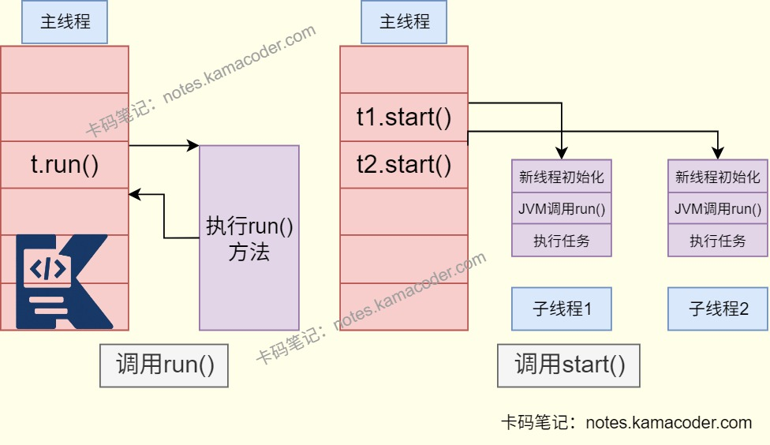
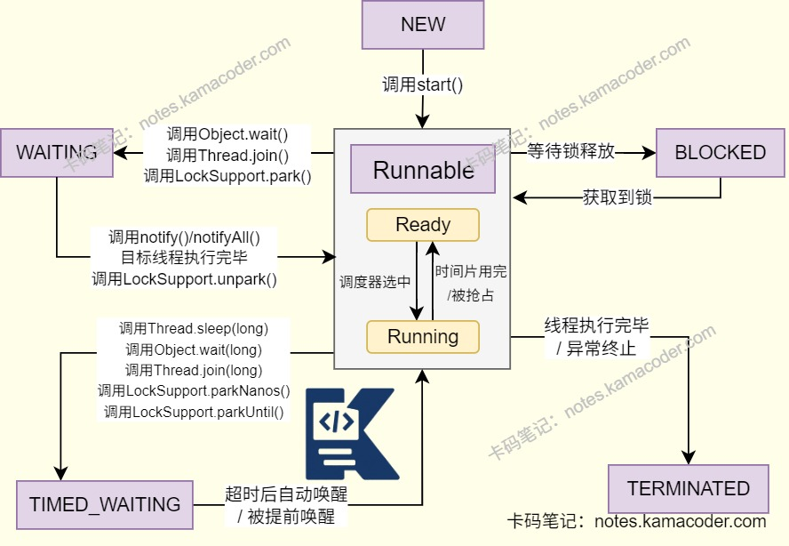

# 线程start与run

> 来源: https://notes.kamacoder.com/java/thread-start-vs-run.html

# `# 线程start与run 

## `# 简要回答 
  - run() 方法不会创建一个新的线程，只会在当前线程中执行run方法的代码。   - start() 方法可以启动一个新线程，能够实现多线程执行。 

## `# 详细回答 

在Java多线程中： 
  - run方法 
  - 是**线程的执行体**，包含线程要执行的**代码**。   - 当**直接调用**run方法时，代码直接在当前线程中作为**普通方法**执行，不会创建新的线程。   - run方法也**可以被子类重写**，实现特定任务。 
  - start方法 
  - 会**启动一个新的线程**，会在新线程中执行run方法代码。   - start方法会为线程分配系统资源，并将线程置于**就绪状态**，当**调度器选择该线程**时，会**执行run方法**中的代码。   - start方法**只能调用一次**，如果再次调用，将抛出IllegalThreadStateExeception异常。 

| 方法  创建线程  执行run  多线程 
| run()  不创建线程  立即执行  没有多线程 
| start()  创建新的线程  创建线程后  多线程，允许并行 

## `# 使用场景 
  - start()：适用于**任务需要与主线程或其他线程并行执行**时，例如后台下载、异步处理数据。**利用多线程来提高效率**，实现并行处理。   - run()：适用于需要重写来**实现线程任务**，或者需要**在当前线程同步执行**的场景。   - 使用时注意，**直接调用run()方法无法实现多线程**，**一个线程对象只能调用一次start()** 。 

## `# 知识图解 
  - **run()与start()区别示意** 
   - **线程的状态示意** 
 

## `# 知识扩展 
  - 扩展： 
  - 线程的状态：

    - 线程的状态能够反映线程在生命周期的不同阶段，由JVM和操作系统共同管理，状态转换一般就是“就绪-运行-阻塞/等待-就绪”的循环，直到线程终止。 
    - NEW：尚未启动线程状态。线程创建，**还没有调用start方法**，未分配系统资源。     - RUNNABLE：
**就绪状态** 已经获取除了CPU外全部资源，**等待操作系统调度**分配CPU时间片。
**正在运行状态** 线程获得时间片，**执行run()** 方法。两个状态合并称为Runnable。     - BLOCKED：阻塞状态。竞争同步锁失败，**等待锁释放**。     - WAITING：等待状态的线程正在等待另一线程执行特定的操作。     - TIMED_WAITING：线程在**指定时间内等待**，超时后**自动唤醒**。     - TERMINATED：线程完成执行，终止状态。 
  - 面试官可能追问: 
  - Q1：sleep和wait的区别是什么？

    - sleep是Thread类的静态方法，可以在任何地方**通过Thread.sleep()调用**，无需依赖对象实例。wait是Object类的实例方法，必须**通过对象实例调用**。     - sleep()在调用时，线程会暂停执行指定的时间，**不会释放持有的对象锁**。wait()在调用时**会释放持有的对象锁**，进入**等待状态**。     - sleep可以在**任意位置调用**，无需事先获取锁。wait必须在同步块或同步方法内调用，线程**需持有该对象的锁**，否则会抛出IlleaglMonitorStateException。     - sleep**休眠时间结束后，线程自动恢复**到就绪状态。等待CPU调度。wait需要其他线程**调用相同对象的notify()或notifyAll()** 方法才能被唤醒。   - Q2：为什么不能调用多次start()方法？

    - 线程对象的生命周期只允许调用一次start()     - 首次调用会将线程状态**从New转为Runnable**，同时触发操作系统创建新线程，若再次调用，**线程状态已经不是New，JVM会抛出IllegalThreadStateException**。   - Q3：多个线程调用start()，执行顺序由什么决定？

    - 由操作系统的**线程调度算法**决定，与start()调用顺序无关。   - Q4：线程从New到Runnable的过程中，JVM会做什么？

    - 调用start()后，JVM会**向操作系统申请**创建线程，分配栈空间、程序计数器等。随后操作系统将线程**加入调度队列**，此时状态变为Runnable。
