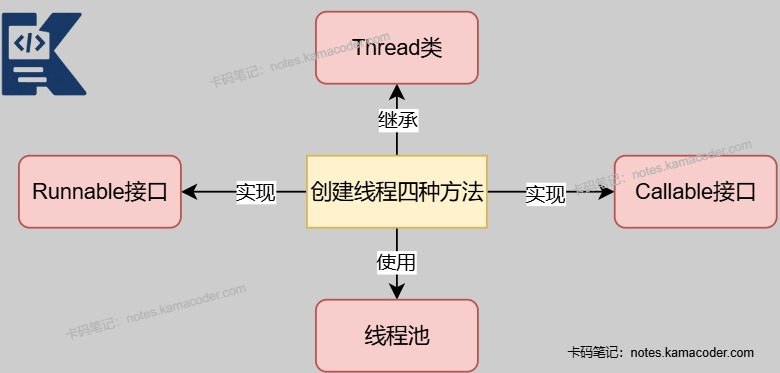
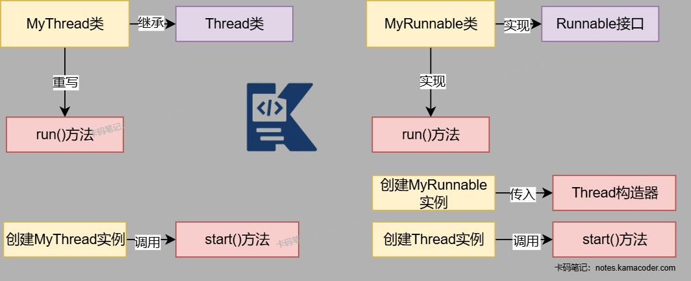
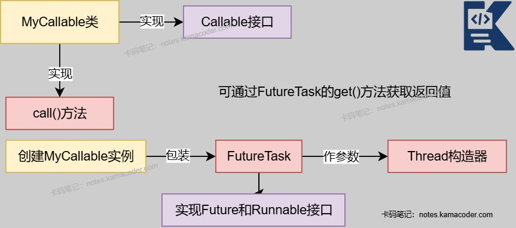

# 线程创建方式

> 来源: https://notes.kamacoder.com/java/thread-creation.html

# `# 线程创建方式 

## `# 简要回答 

在Java中,创建线程有四种方式: 
  - 继承Thread类,重写run()方法。   - 实现Runnable接口，实现run()方法。   - 使用线程池(Executor框架)。   - 实现Callable接口（配合Future/FutureTask），实现call()方法。 

## `# 详细回答 
  - **继承Thread类**： 
  - 用户可以通过继承Thread类创建一个新的线程，并且重写run()方法，该方法包含线程的执行代码。   - 创建该类的实例，调用start()方法启动线程。 

```
class MyThread extends Thread{
  @Override
  public void run(){
    // 线程执行的逻辑代码
    System.out.println("MyThread is running...");
  }
}

//创建并启动线程
MyThread myThread = new MyThread();
myThread.start();

```

 
  - 优点：代码简单，如果需要访问当前线程，无需使用Thread.currentThread()方法，直接使用this即可获取当前线程。   - 缺点：Java只支持单继承，线程类不能再继承其他的父类 
  - **实现Runnable接口：** 
  - 用户可以实现Runnable接口，实现run()方法。   - 创建一个Thread对象，将实现类Runnable接口的类的实例作为参数传递给Thread构造函数，调用Thread对象的start()方法启动线程。 

```
class MyRunnable implements Runnable{
  @Override
  public void run(){
    //线程执行的逻辑代码
    System.out.println("MyRunnable is running...");
  }
}

// 创建并启动线程
Thread myThread = new Thread(new Runnable());
myThread.start();

```

 
  - 优点：可以实现多个线程共享同一个目标对象，方便实现资源的并发控制，且线程的创建和业务逻辑分离。   - 缺点：如果需要访问当前线程，需要使用Thread.currentThread()方法，run()方法没有返回值。 
  - **使用Executer框架：** 
  - Executor框架是Java并发编程中的高级工具，通过Executer，可以将任务提交给线程池，由线程池来管理线程的生命周期和执行。 

```
import java.util.concurrent.Executor;
import java.util.concurrent.Executors;

class MyTask implements Runnable{
  @Override
  public void run(){
    //线程执行的逻辑代码
    System.out.println("MyTask is running...");
  }
}

// 创建线程池并提交任务
Executor executor = Executors.newFixedThreadPool(3);
// 提交任务
executor.execute(new MyTask());

```

 
  - 优点：可以避免频繁创建和销毁线程的开销，可以控制线程并发数量，监控线程状态，可以接受多种任务类型（Runnable和Callable）。   - 缺点：核心线程占用系统资源，线程池配置比较复杂，容易造成资源浪费。 
  - **实现Callable接口:** 
  - Callable的call()方法可以有返回值并且可以抛出异常。   - Callable的返回值在子线程中产生，需要配合Future/FutureTask用于获取线程执行的结果。   - 可以使用**线程池配合future**，将MyCallable实例在线程池执行。或者由于Thread只能执行Runnable任务，可以使用**FutureTask包装Callable任务**。 

```
// 使用Future和线程池
class MyCallable implements Callable<Integer>{
  publc Integer call() throws Exeception{
    //线程执行的代码，返回一个整形结果
    return 42;
  }
}

ExecutorService excutor = Executors.newSingleThreadExecutor();
Future<Integer> future = excutor.submit(new MyCallable());

try{
  //获取线程执行结果
  Integer result = future.get();
}catch(InterruptedExeception | ExecutionException e){
  //处理异常
}

```

 

```
// 使用FutureTask包装
// MyCallable代码同上

MyCallable task = new MyCallable();
FutureTask<Integer> futureTask = new FutureTask<>(task);
Thread myThread = new Thread(futureTask);
myThread.start();

try{
  //获取线程执行结果
  Integer result = futureTask.get();
}catch(InterruptedExeception | ExecutionException e){
  //处理异常
}

```

 
  - 优点：Callable接口的方法有返回值，还可以抛出异常   - 缺点：代码复杂，访问当前线程需要调用Thread.currentThread()方法。 

## `# 使用场景 

| 创建方法  适用场景 
| 继承Thread类  简单场景 
| 实现Runnable接口  多线程共享资源场景 
| 实现Callable接口  需要任务返回结果或处理异常的场景 
| 使用线程池（Executor）  生产环境，高并发，需要复用线程场景 

## `# 知识图解 

**1. 创建线程方法示意图** 


 

**2. 继承Thread方法和实现Runnable方法示意图** 


 

**3. 实现Callable接口示意图** 


 

## `# 知识扩展 
  - 扩展： 
  - 线程池的核心参数：
线程池的构造函数有**七个参数** 
    - corePoolSize 核心线程数: 线程池中**长期存活**的线程数

      - 如果线程池中线程数量少于corePoolSize,这些线程处于空闲状态也不会被销毁     - maximumPoolSize 最大线程数: 线程池允许创建的**最大线程数**(包括核心线程和非核心线程)

      - 当核心线程已满,队列已满时,如果当前线程小于最大线程数,就会创建新的线程执行此任务,否则触发**拒绝策略**     - keepAliveTime 空闲线程存活时间: 当线程数大于corePoolSize时,如果某个线程的**空闲时间超过了keepAliveTime,那么这个线程就会被销毁**     - TimeUnit 与keepAliveTime一起使用,指定keepAliveTime的**时间单位**     - workQueue 线程池任务队列: 线程池存放任务的队列,没有空闲线程执行新任务时,用来**存储线程池的所有待执行任务**     - ThreadFactory 创建线程的工厂: 线程池**创建线程时调用的工厂方法**,通过此方法可以设置线程的优先级,线程命名规则以及线程类型(用户线程还是守护线程)     - RejectedExecutionHandler **拒绝策略**: 当线程池的任务超出线程池队列可以存储的最大值之后,执行的策略 
  - 面试官可能追问: 
  - Q1：调用start()方法和直接调用run()方法有什么区别？

    - **start()本质是native方法**，会启动一个新线程，由JVM调用run()方法，实现真正的并发执行。而直接调用**run()是仅作为普通方法**在当前线程执行，不会创建新线程。   - Q2：线程池创建线程和手动创建线程有什么不同？

    - 手动创建线程是**即用即建**，线程池能够实现**预先创建和线程复用**，能够减少线程创建/销毁开销。   - Q3：Future的get()方法阻塞怎么避免主线程的长时间等待？

    - 使用**get(long timeout, TimeUnit unit)** 设置超时时间，避免无限阻塞。     - 用**isDone()** 先判断任务是否完成，再调用get()。
