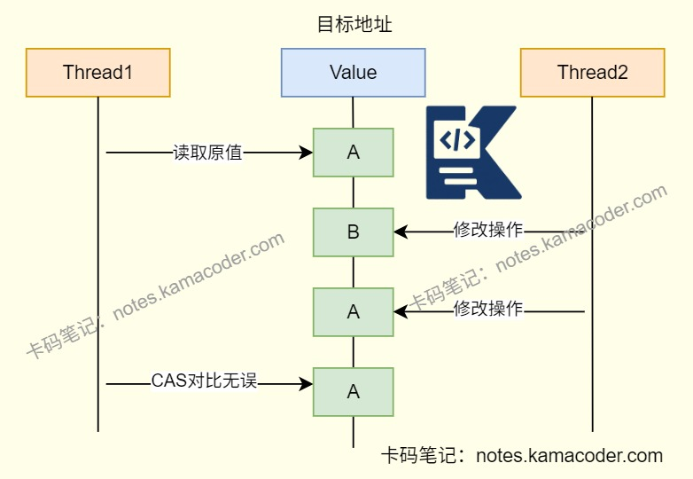
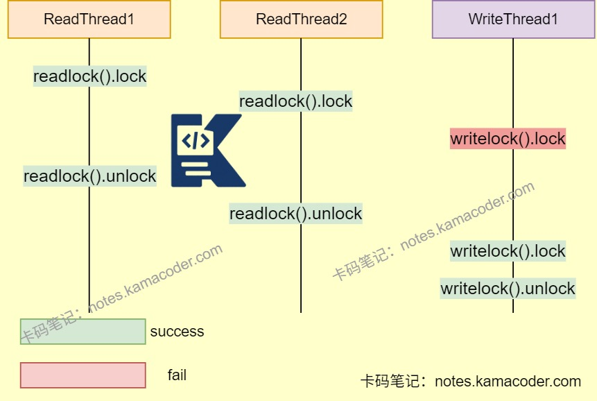

# 线程安全

> 来源: https://notes.kamacoder.com/java/thread-safety.html

# `# 线程安全 

## `# 简要回答 

实现Java线程安全，需要**控制多个线程对共享资源的并发访问**，避免出现**数据不一致**，**竞态条件**等问题 

可以分为三种方式： 
  - 阻塞同步（使用锁实现）   - 非阻塞同步（基于CAS操作）   - 无同步方案（避免共享资源） 

## `# 详细回答 
  - 阻塞同步：通过“**加锁-释放锁**”控制线程对资源的访问，未获取锁的线程会阻塞等待。 
  - synchronized关键字（隐式锁）

    - 通过**JVM隐式管理锁**，对对象或者类加锁，确保同一时间只有一个线程执行同步代码。 

```
//同步方法
public synchronized void setA(){
  // 执行代码逻辑
}

//同步代码块
public void setB(){
  synchronized (this){
  // 执行代码逻辑
  }
}

```

 
  - JUC显式锁（Lock接口）

    - 通过ReentrantLock**手动加锁和释放锁**，能够支持更复杂的同步场景，比如公平锁、超时释放、中断。     - 通过**读写锁**，允许多个读取者同时访问共享资源，但只允许一个写入者。 
  - 非阻塞同步 
  - 原子类（CAS操作）：通过**循环重试**保证变量的更新。   - 版本号机制：乐观锁，通过**版本号来判断数据是否被修改**，仅在提交时校验。   - 优缺点：

    - 避免线程阻塞，唤醒线程开销以及用户态内核态切换带来的**性能问题**。     - **过度自旋会浪费CPU资源**。     - 仅能**操作单个共享资源**，对于组合类型还是需要加锁处理，或者重新组合为一个共享资源。     - ABA问题 
  - 无同步方案：让共享资源尽可能的在同一个线程中执行。 
  - 线程本地存储：为线程**创建独立的资源副本**，无需同步   - 创建不可变对象 

## `# 使用场景 

| 实现方式  适用场景 
| 阻塞方式  共享资源操作复杂、资源竞争不激烈、需要严格保证资源独占性场景 
| 非阻塞操作  高频/简单操作、重试成本低、不允许线程阻塞场景 
| 无同步方案  数据仅线程私有、数据不可修改、业务逻辑不依赖状态 

## `# 知识图解 
  - 

ABA问题示意图

   - 

读写锁使用示意图

 

## `# 知识扩展 
  - 扩展： 
  - ABA问题：

    - 在CAS更新的过程中，**读取到的值是A**，准备赋值时是A，但是其实是因为A的值先变成B又被改成了A。     - ABA漏洞在大部分场景下不会影响最终结果，可以通过Java中的**AtomicStampedReference**来解决问题，该类会加入**预期标志**和**更新后标志**两个字段，更新时不光检查值，还要检查当前标志是否等于预期标志，相等则更新。 
  - 面试官可能追问: 
  - Q1：原子类的底层原理是什么？

    - 底层是**CAS指令**+**volatile**+**自旋重试**的组合。CAS保证操作的原子性，volatile保证变量的可见性，自旋重试解决并发冲突。   - Q2：线程安全体现在哪些方面？

    - **原子性**：提供互斥访问，同一时刻只有一个线程对数据进行操作。     - **可见性**：线程对主存修改可以及时被其他线程看到。     - **有序性**：线程中的指令执行有序。可以使用happens-before原则实现。
