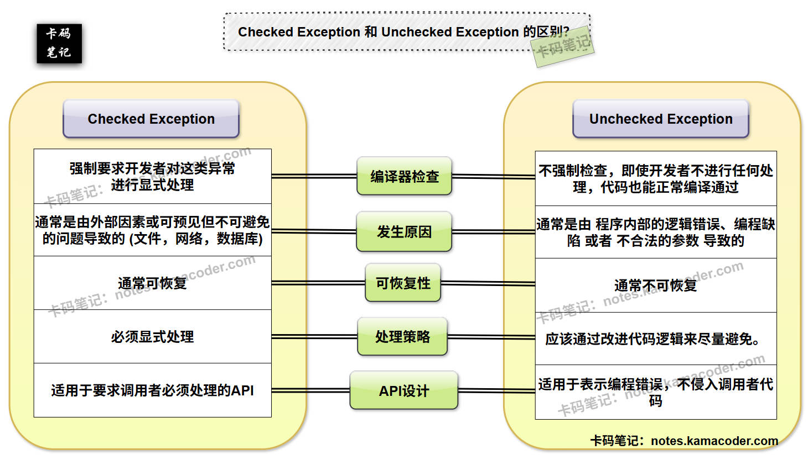
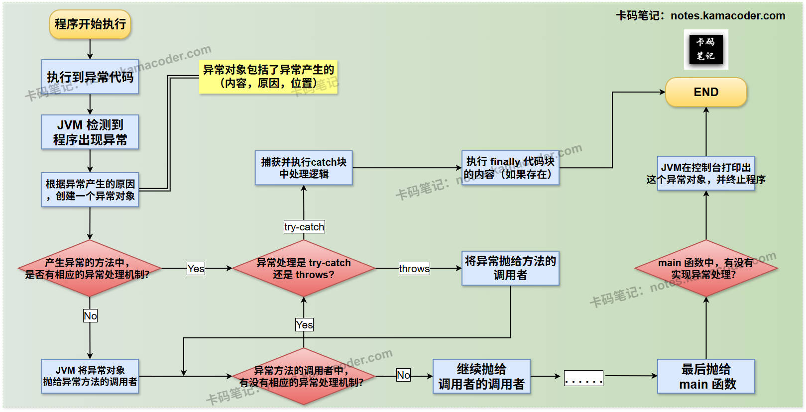

# Checked与Unchecked异常

> 来源: https://notes.kamacoder.com/java/checked-vs-unchecked-exception.html

# `# Checked与Unchecked异常 

## `# 简要回答 

### `# Checked Exception 和 Unchecked Exception 的概念 
  - **Checked Exception (编译期异常)** ：指所有直接或间接继承自 `java.lang.Exception`，但不是 `java.lang.RuntimeException` 及其子类的异常。编译器会强制检查这类异常。   - **Unchecked Exception (运行期异常)** ：指 `java.lang.RuntimeException` 类及其所有子类。编译器不强制检查这类异常。 

### `# Checked Exception 和 Unchecked Exception 的区别 
  - 

**如下表所示**： 

| 区分维度  CheckedException(编译期异常)  UncheckedException(运行期异常) 
| **编译器检查**  强制检查，必须 `try-catch` 或 `throws` 声明。  不强制检查，可选择性处理。 
| **发生原因**  通常是外部因素或可预见的问题，如I/O错误。  通常是程序逻辑错误或编程缺陷，如空指针。 
| **可恢复性**  通常可恢复，程序可继续执行。  通常不可恢复，表示程序状态可能已经损坏。 
| **处理策略**  必须显式处理，提高代码健壮性。  通过改进代码逻辑来尽量避免，不强制要求捕获。 
| **API 设计**  适用于要求调用者必须处理的API  适用于表示编程错误，不侵入调用者代码。  

## `# 详细回答 

### `# Checked Exception 和 Unchecked Exception 的概念 
  - **Checked Exception (受检查异常，也叫编译期异常)** ：是指所有**直接或间接**继承自 `java.lang.Exception`，但不是属于 `java.lang.RuntimeException` 及其子类的异常。编译器会强制检查这类异常。   - **Unchecked Exception (非受检查异常，也叫运行期异常)** ：是指属于 `java.lang.RuntimeException` 类及其所有子类。编译器不强制检查这类异常。 

### `# Checked Exception 和 Unchecked Exception 的区别 
  - **编译器检查 (Compiler Check)** ：

    - **Checked Exception**：  

Java**编译器会强制要求**开发者对这类异常进行**显式**处理，例如使用 **`try-catch` 块** 来捕获 或者 在方法签名中使用 **`throws` 关键字** 声明抛出。  

如果没有显式处理，代码将无法编译通过。这种强制性可以确保程序对**外部环境**可能出现的、可预见的错误具备**健壮性**。     - **Unchecked Exception**：  

编译器**不会强制要求**开发者处理或声明这类异常，即使代码可能抛出例如 `NullPointerException` 或者 `ArrayIndexOutOfBoundsException` 这类异常。  

因为即使开发者不进行任何处理，代码也能正常编译通过。这可以让开发者不必为所有潜在的**运行期异常**编写冗余的 `try-catch`块，而是更专注于业务逻辑。   - **发生原因 (Cause of Occurrence)** ：

    - **Checked Exception**：  

通常是由**外部因素**或**可预见但不可避免的问题**导致的。例如，文件不存在（`FileNotFoundException`）、网络连接中断（`IOException`）、数据库连接失败（`SQLException`）等。     - **Unchecked Exception**：  

通常是由 **程序内部的逻辑错误**、**编程缺陷** 或者 **不合法的参数** 导致的。这些错误本应该在开发阶段通过更严谨的编码、输入校验和测试来避免。例如，空指针引用（`NullPointerException`）、数组越界（`ArrayIndexOutOfBoundsException`）、类型转换错误（`ClassCastException`）、非法参数（`IllegalArgumentException`）等。   - **可恢复性 (Recoverability)** ：

    - **Checked Exception**：  

通常**可恢复**。这类异常发生后，程序可以通过捕获异常并执行备用逻辑 或者 向用户提供错误提示等方式，从错误中恢复并继续执行，而不会导致程序立即崩溃。     - **Unchecked Exception**：  

通常**不可恢复**。这类异常发生时，往往意味着程序内部状态已经损坏或逻辑存在根本性缺陷，继续执行可能会导致更严重的问题。因此，通常不建议尝试恢复，而是让程序终止，以便开发者发现并修复根本的编程错误。   - **处理策略 (Handling Strategy)** ：

    - **Checked Exception**：  
 **必须显式处理**，比如我们前面提到的 `try-catch`块 和 `throws`关键字。     - **Unchecked Exception**：  
 **应该通过改进代码逻辑来尽量避免**。   - **API 设计 (API Design)** ：

    - **Checked Exception**：  

适用于要求**调用者必须处理**的API。当一个方法可能因为外部环境问题而失败 并且调用者有能力处理这种失败时，应该声明抛出 Checked Exception。这是一种明确的**契约**，告诉API的使用者可能需要处理的风险。     - **Unchecked Exception**：  

适用于表示**编程错误**，不侵入调用者代码。当一个方法因为调用者传递了非法参数 或 违反了方法的前置条件而失败时，通常抛出 Unchecked Exception。这表明调用者应该在使用API前确保参数的合法性，而不是强制调用者捕获。  

## `# 知识拓展 
  - **Checked Exception 和 Unchecked Exception 的区别**，示意图如下：  
 
   - **Java异常的产生和处理机制**，示意图如下：  
 
   - **Checked Exception 和 Unchecked Exception 在Java异常体系中的示意图如下**：  
 
   - **面试官可能的追问1：在什么情况下，我可以将一个编译期异常包装成运行期异常抛出？这样做有什么优缺点？** 
    - **简答：**  

① **场景**：当底层API抛出编译期异常，但上层业务逻辑认为该异常是不可恢复的编程错误，或者不希望强制上层调用者处理时，可以考虑这样做。  

② **优点**： 简化API签名，避免在每个方法上都声明大量的 `throws` 语句，使代码更简洁。而且将底层细节隐藏，可以让上层调用者只关注业务逻辑，而不是底层异常。  

③ **缺点**：如果包装不当，可能导致重要的错误信息丢失，或将可恢复的错误误判为不可恢复。并且，原始异常的类型信息可能被隐藏，增加调试难度。  

④ **良好实践**：如果选择包装，可以将原始异常作为新异常的 `cause`（原因）链起来，例如 `throw new RuntimeException("Error occurred", FileNotFoundException);`。   - **面试官可能的追问2：为什么 Java 强制检查 Checked Exception，而 C++ 或 Python 等语言没有类似机制？这种设计哲学有何不同？** 
    - **简答：**  

① Java的强制检查主要是为了在提高程序的**健壮性**。它迫使开发者在编译时就考虑并处理所有**可预见的失败情况**，避免运行时出现未处理的异常导致程序崩溃。这是一种“**fail-fast**”的策略，在编译阶段就暴露问题。  

② **C++/Python (无强制检查)**：这些语言的异常处理更偏向于“**运行时发现问题**”。它们不会强制开发者在编译时处理异常，而是允许异常在运行时传播，直到被捕获或导致程序终止。这在一定程度上提供了更大的**灵活性和开发效率**，但也可能导致一些潜在的运行时错误直到部署后才被发现。
