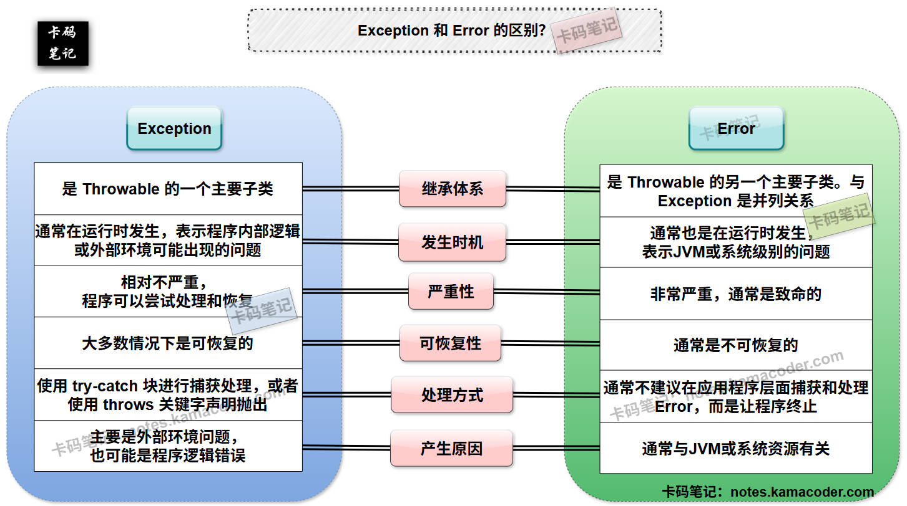
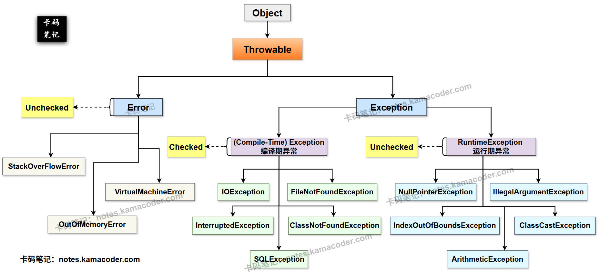

# Error与Exception

> 来源: https://notes.kamacoder.com/java/error-vs-exception.html

# `# Error与Exception 

## `# 简要回答 

### `# Exception 和 Error 的概念 
  - **Exception (异常)** ：表示程序在运行过程中**可能遇到的、可以被捕获和处理**的异常情况。这些异常通常是由于**外部因素或程序逻辑错误**导致的，是可恢复的。   - **Error (错误)** ：表示 **JVM 内部**或**系统级别**的严重问题，通常是致命的，应用程序无法预料和恢复。 

### `# Exception 和 Error 的区别 
  - 

如下表所示： 

| **维度**  **Exception**  **Error** 
| **继承体系**  继承自 `java.lang.Throwable`，是 `Throwable` 的一个主要子类。  继承自 `java.lang.Throwable`，是 `Throwable` 的另一个主要子类。 
| **发生时机**  通常在程序运行时发生，但有些在编译时强制检查。  通常在程序运行时发生，表示JVM或系统层面的问题。 
| **严重性**  相对不严重，通常是可预见和可恢复的。  严重，通常是致命的，表示系统资源或JVM的故障。 
| **可恢复性**  大多数情况下是可恢复的，可以通过 `try-catch` 捕获处理，使程序继续运行。  通常不可恢复，即使捕获也难以有效处理，程序往往会终止。 
| **处理方式**  编译器强制或建议处理（`try-catch` 或 `throws`）。  通常不建议捕获和处理，应由JVM或系统层面解决。 
| **产生原因**  外部环境问题（如I/O错误）、程序逻辑错误、非法参数等。  系统资源耗尽、JVM内部错误、硬件故障等。  

## `# 详细回答 

### `# Exception 和 Error 的概念 
  - **Exception (异常)** ：
`Exception` 类及其子类表示程序在运行过程中可能遇到的、**可以被捕获和处理**的异常情况。这些异常通常是由于**外部因素**（如文件不存在、网络中断）或**程序逻辑错误**导致的。   - **Error (错误)** ：
`Error` 类及其子类表示了在 **程序运行期间发生的**、**JVM** 或 **系统级别的** 严重问题，这些问题通常是应用程序**无法预料和恢复**的。例如，JVM 内存耗尽、JVM 错误、线程死锁等。 

### `# Exception 和 Error 的区别 
  - **继承体系** ：

    - **Exception**：`Exception` 类继承自 `java.lang.Throwable`，是 `Throwable` 的一个主要子类。它下面又派生出众多子类，形成一个庞大的异常体系，包括编译期异常（如 `IOException等`）和运行期异常（如 `RuntimeException及其子类`）。     - **Error**：`Error` 类也继承自 `java.lang.Throwable`，是 `Throwable` 的另一个主要子类。它与 `Exception` 在 `Throwable` 层面是并列关系，表示不同性质的问题。   - **发生时机**：

    - **Exception**：`Exception` 通常在程序运行时发生，但 **编译期异常** 在编译阶段就会被编译器强制检查。`Exception`是**程序逻辑或外部环境**在运行时可能出现的**可预见问题**。     - **Error**：`Error` 通常在程序运行时发生，但它们表示的是**JVM或系统层面**的问题，而非应用程序本身的逻辑问题。这些问题往往是**突发的、无法预料的**。   - **严重性**：

    - **Exception**：相对不严重。`Exception` 表示的是**程序可以尝试处理和恢复**的异常情况，例如文件未找到、网络连接中断等，这些问题通常不会导致整个应用程序崩溃。     - **Error**：严重。`Error` 表示的是**非常严重的、通常是致命的**问题，例如内存溢出（`OutOfMemoryError`）、栈溢出（`StackOverflowError`）。这些问题往往意味着JVM或底层系统已经处于崩溃边缘，程序无法继续正常运行。   - **可恢复性**：

    - **Exception**：大多数情况下是**可恢复**的。我们可以通过 `try-catch` 块捕获 `Exception`，并执行相应的异常处理逻辑（如重试、给出提示、记录日志等），从而使程序能够从异常中恢复并继续执行。     - **Error**：通常是**不可恢复**的。`Error` 表示的问题超出了应用程序的控制范围，即使捕获了 `Error`，也往往无法采取有效的措施来恢复程序的正常运行。所以，通常遇到 `Error` 意味着程序需要终止并进行系统级别的检查或重启。   - **处理方式**：

    - **Exception**：对于**编译期异常**，Java编译器会强制要求开发者进行处理，例如使用 `try-catch` 块进行捕获处理，或者 使用 `throws` 关键字声明抛出。对于**运行期异常**，编译器不强制处理，但开发者可以选择性地捕获和处理，以增强程序的健壮性。     - **Error**：通常不建议在应用程序层面捕获和处理 `Error`。因为它们代表的是系统级别的故障，捕获它们并试图恢复往往是徒劳的，甚至可能掩盖更深层次的问题。当 `Error` 发生时，通常最好的做法是**让程序终止**，并由运维人员或系统管理员介入解决。   - **产生原因**：

    - **Exception**：主要是**外部环境问题** （如文件不存在、网络连接超时、数据库连接失败等），也有可能是程序逻辑错误（如空指针引用、数组越界、类型转换失败、非法参数传递等）。     - **Error**：产生原因通常与**JVM或系统资源**有关，例如内存不足（`OutOfMemoryError`）、栈空间耗尽（`StackOverflowError`）等，也可能是JVM自身的bug或者出现了损坏，甚至还有可能是硬件的故障间接导致JVM无法正常运行。  

## `# 知识拓展 
  - 

**Exception 和 Error的对比 示意图如下**：  
 
   - 

**Exception 和 Error 构成的Java异常体系 示意图如下**：  
 
   - 

**面试官可能的追问1：既然 Error 通常不建议捕获，那为什么 Java 还要提供 Error 类，而不是直接让程序崩溃？** 
    - **简答：**  

Java 提供 `Error` 类是为了**统一异常处理的体系结构**，使得所有可抛出的问题都继承自 `Throwable`。这样做的好处是：即使程序崩溃，`Error` 对象也能提供关于崩溃原因的详细信息（堆栈跟踪），有助于排查问题。   - 

**面试官可能的追问2：在 `try-catch` 块中，我可以同时捕获 `Exception` 和 `Error` 吗？如果可以，有什么需要注意的？** 
    - **简答：**  

从语法上讲，可以同时捕获 `Exception` 和 `Error`，因为它们都继承自 `Throwable`，也就都可以使用 `catch (Throwable t)` 来捕获所有异常和错误。  

但是，虽然语法允许，但捕获 `Error` 往往是徒劳的，因为它们通常是致命且不可恢复的系统级问题。捕获`Error`往往会导致欲盖弥彰，适得其反。
