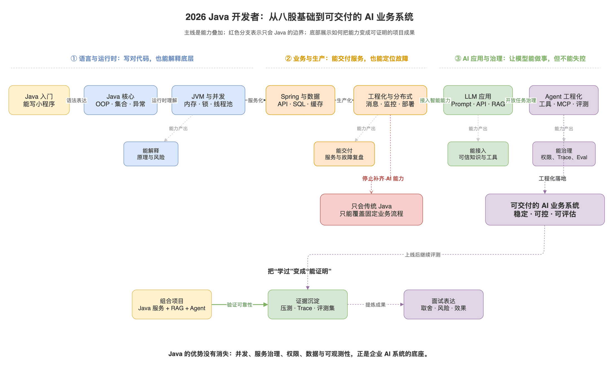

# 2026年Java最新学习路线：只会Java已经不够了

> 来源: https://notes.kamacoder.com/java/java-learning-roadmap.html

# `# 2026年Java最新学习路线：只会Java已经不够了 

录友们，先把结论放前面：**Java 没有过时，但只会 Java 不够了。** 

企业里的 AI 系统，照样需要 Java 擅长的东西：高并发接口、权限、订单和数据一致性、服务治理、可观测性。变化在于，2026 年的后端开发者除了要把这些底座做稳，还要能把大模型接进业务，知道 RAG、工具调用、MCP、Agent 和评测怎么落地。 

所以别走两个极端： 
  - 不要因为 AI 热，就跳过 Java、JVM、并发和 Spring。这些仍然是后端岗位的地基。   - 也不要只刷 HashMap 和八股。你至少要做过一个有知识库、有工具调用、有权限边界和评测的 AI 应用。 

这份路线把本站已有的 Java 八股、计算机基础和 LLM/Agent 内容串成一条线。目标不是背完目录，而是让你能交付一个可靠的 Java AI 业务系统。 

## `# 先看全局：不是换赛道，是叠加能力 

传统 Java 后端和 AI 应用开发不是两条互斥的路。 

前者解决数据、权限、并发、稳定性和业务流程；后者解决自然语言交互、非结构化知识和开放式任务决策。真正有竞争力的候选人，是能把两边接起来的人。 

下图展示的就是这条能力链：从 Java 基础一路往后叠加；工程化之后若停止补齐 AI 能力，能覆盖的主要还是固定流程；继续走到 LLM 与 Agent，才有能力把 AI 放进真实业务。 

 

## `# 学习原则：每一阶段都要有“能交付的东西” 

只看文章很容易出现一种错觉：名词都认识，手一写就卡住。 

每完成一个阶段，都拿一个可运行、可解释的产出来验收自己：代码、压测报告、故障复盘、接口文档或项目功能都可以。下面的“完成标志”比“看完多少篇”更重要。 

## `# 第一阶段：Java 核心，把语法练成基本功 

这一阶段的目标不是会写 `for` 循环，而是知道一段 Java 代码如何表达对象关系、如何在内存中存在、为什么会出现类型和异常问题。 

**先学这些：** 
  - 面向对象：封装、继承、多态，以及抽象类和接口、重载和重写的边界。   - 常用语言特性：泛型、final、equals 和 ==、自动装箱与拆箱。   - 基础工程能力：异常分层、日志、Maven 或 Gradle、Git、单元测试；有余力再补 IO 与反射。 

如果你连输入输出、数组、字符串、集合和面向对象都不熟，先把Java零基础入门课里的代码写出来，再开始刷八股。 

**完成标志：** 独立写一个命令行版图书/订单管理小程序：有实体对象、接口、异常处理、文件持久化和不少于 10 个单元测试。不要让 AI 一次性生成完；让它审代码、补测试、解释报错，你自己负责判断。 

## `# 第二阶段：集合、JVM、并发，建立“底层解释能力” 

这一段是 Java 面试和线上排障的分水岭。你不需要手写 JVM，但要能解释内存、对象、线程和锁怎样互相影响。 

### `# 1. 集合：别只背“数组 + 链表 + 红黑树” 
  - 从Java常见集合入门，重点吃透 ArrayList 扩容、HashMap 底层、put 流程和扩容。   - 接着理解HashMap 为什么线程不安全，再对照ConcurrentHashMap 如何保证线程安全。 

**完成标志：** 不看资料画出 HashMap 的插入与扩容过程，并能回答：为什么 `equals` 和 `hashCode` 要配套？并发下为什么不能直接用 HashMap？ 

### `# 2. JVM：把“内存结构”变成排障语言 
  - 依次看 JVM 组成、内存结构、类加载、双亲委派。   - 再补 垃圾回收机制、垃圾收集器和JVM 参数。 

**完成标志：** 给一个内存持续上涨或 Full GC 频繁的模拟服务，能说出先看什么指标、如何抓证据、哪些参数不能靠猜着改。 

### `# 3. 并发：会用线程池，更要会做容量与故障控制 
  - 重点是线程安全实现、synchronized、volatile、Lock 对比。   - 然后学线程池为什么必要、线程池参数、BIO/NIO/AIO以及死锁排查。 

**完成标志：** 做一个有界队列的异步任务服务，明确核心线程数、队列、拒绝策略和指标；再人为制造一次死锁或任务堆积并复盘。线程池参数没有“万能答案”，一定要结合任务类型和压测结果。 

## `# 第三阶段：Spring 与数据层，能做标准业务服务 

这一阶段要完成从“会写 Java”到“能做服务”的转换。 

**Java 栏目必学：** 
  - Spring 主线：Spring、Spring Boot、Spring MVC 与 Spring Cloud 的区别、IOC、AOP、Bean 生命周期、循环依赖。   - Spring Boot 主线：Starter、启动流程、常用注解、Spring MVC 执行流程。   - 设计能力：把单例、工厂、策略和代理模式放进真实代码，而不是只背定义。 

**计算机基础同步补：** 
  - 数据库：索引、事务、锁与 SQL 执行流程，入口见数据库面试题。   - 缓存：Redis 数据结构、过期、淘汰、缓存穿透/击穿/雪崩，入口见计算机基础。   - 网络：HTTP/HTTPS、TCP、DNS、长连接；尤其要理解接口超时与重试的连锁反应。 

**完成标志：** 写一个前后端分离的订单/预约服务，至少包含鉴权、参数校验、分页查询、事务、缓存、全局异常、日志和接口测试。能解释一次下单如何从 Controller 走到数据库，以及失败时怎样保证数据不乱。 

## `# 第四阶段：工程化与分布式，别把“能跑”当“能上线” 

Java 八股给你原理，工程化决定你的系统能不能长期跑。 

这一阶段建议按项目需要补齐： 
  - MySQL 慢查询定位、索引与事务边界；Redis 缓存一致性、热点和失效策略。   - 消息队列的异步化、重复消费、顺序、失败重试与幂等。   - API 设计、限流、熔断、配置管理、灰度发布、容器化与 CI/CD。   - 监控、日志、链路追踪、告警和故障复盘。能从指标定位问题，而不是靠重启服务祈祷。 

**完成标志：** 给第三阶段项目加上缓存、异步消息和监控：模拟一次库存扣减失败、缓存失效或下游超时，证明系统不会重复扣款，也能定位到错误链路。 

这一步也是 Java 开发者转 AI 应用最值钱的底座。大模型会生成文字，但不会天然解决权限、幂等、限流、审计、可观测性和成本控制；这些仍是后端工程的责任。 

## `# 第五阶段：大模型应用，先会“接入”，再谈 Agent 

别一开始就堆多 Agent 框架。先搞清楚模型到底能做什么、哪些地方不可靠，以及如何让一次模型调用变成可控的服务能力。 

### `# 先建立正确的大模型认知 
  - 从大模型关键词和大模型应用开发概览开始：Token、上下文、温度、幻觉、流式输出、结构化输出分别解决什么问题。   - 看模型如何接入真实应用、Prompt 工程、结构化输出和流式输出。   - 关注工程约束：Token 成本与延迟、压力测试。 

**完成标志：** 用 Java/Spring Boot 封装一个模型调用接口：支持流式输出、超时与重试、结构化 JSON 校验、请求日志与 Token 成本记录。模型输出必须经过校验，不能直接相信它生成的任何 JSON。 

### `# RAG：企业知识接入的第一站 

模型不知道你的内部制度、产品文档和刚发生的事情，不能靠 Prompt 硬塞。RAG 的本质是：检索可信资料，再让模型基于证据回答。 
  - 依次学习为什么需要 RAG、Embedding、向量数据库、如何切分文档。   - 再看RAG 优化、RAG 评估和RAG 常见问题。 

**完成标志：** 做一个“公司制度/产品文档问答”项目：完成文档清洗、切块、向量化、检索、引用来源和拒答；自己准备一组问题集，分别评估召回是否找对、答案是否有依据。只做出聊天框不算完成。 

## `# 第六阶段：Agent 与 MCP，把模型放进受控的业务流程 

**Agent 不是聊天机器人换了一个名字。** 它是让 LLM 在循环里根据上下文选择工具、读取结果、再决定下一步的执行系统。 

你至少要能把这些问题讲清楚： 
  - LLM 与 Agent 有什么区别？   - 任务什么时候应该使用Workflow，什么时候应该使用 Agent？固定规则流程不要硬套 Agent。   - Function Calling到底是什么？模型只负责选择工具和生成参数，真正执行工具的必须是受权限控制的后端。   - 工具怎么设计？看Agent 工具设计：描述、输入 schema、返回值、幂等和权限缺一不可。   - MCP 协议解决什么接入问题？它不是“让 Agent 获得一切权限”的通行证。   - 长任务怎么管理状态？看Agent 记忆、上下文工程与ReAct、Reflection、Planning。 

Java 开发者不必强行转 Python。Spring AI 与 LangChain4j 都可以把模型、向量库、工具调用、RAG 和 MCP 接入现有的 Java/Spring 应用；选一个框架完成项目即可，重点是原理、架构和测试，而不是框架名。 

**完成标志：** 在 RAG 项目中加两个只读工具，例如“查询订单状态”和“查询知识库版本”。工具必须有 JSON Schema 校验、用户身份透传、超时、审计日志和最大执行步数；敏感写操作必须走二次确认或人工审批。 

## `# 第七阶段：Agent 工程化，Demo 能跑不代表能上线 

很多项目到“模型能调工具”就停了，这是最危险的阶段。生产里的 Agent 会出现工具幻觉、参数错误、上下文污染、死循环、Prompt Injection、成本失控和错误动作。 

这一阶段要学习的，不是更多花哨的 Prompt，而是完整的运行护栏： 
  - Agent 的失败模式：给最大步数、超时、重试边界与降级路径。   - Agent 评估：同时评估任务完成、工具轨迹、步骤效率、成本和失败处理，不只看最终回答像不像。   - Agent 幻觉约束：Prompt、工具、证据、输出校验和兜底要分层做。   - Agent Harness 可观测性：记录目标、计划、上下文、工具、状态、成本和评估，才能回放失败。   - Agent 面试题汇总：用来检查自己是否真的懂 ReAct、Function Calling、MCP、RAG 与安全边界。 

**完成标志：** 为 Agent 增加 traceId、完整工具调用轨迹、Token/耗时指标、失败样本集和回归评测。准备 20 个测试任务，包含正常问题、无答案问题、越权请求、错误参数和工具超时；系统必须能拒答、停止或转人工，不能硬编。 

## `# 推荐的 24 周节奏 

如果你是零基础，先把前 12 周拉长；如果你已有 Java 工作经验，可以把前 12 周压缩，把更多时间投给工程化和 AI 项目。 

| 周期  主线  要拿到的产出 
| 第 1-4 周  Java 基础、面向对象、集合、异常、Git、测试  命令行小项目 + 单元测试 
| 第 5-8 周  JVM、并发、线程池、IO  并发任务服务 + 一次排障复盘 
| 第 9-12 周  Spring Boot、MySQL、Redis、HTTP  可用的业务后端服务 
| 第 13-16 周  缓存、消息、监控、部署、压测  有故障演练的工程化项目 
| 第 17-19 周  LLM API、Prompt、流式与结构化输出、RAG  有引用和评估的知识库问答 
| 第 20-22 周  Function Calling、MCP、Agent/Workflow  带权限边界的工具调用 Agent 
| 第 23-24 周  Trace、评测、简历与面试复盘  可演示、可回放的完整项目 

每周保持一个固定节奏：40% 写代码，30% 学原理，20% 复盘与补八股，10% 用 AI 做代码审查、测试设计和知识盲区检查。只用 AI 出答案、自己不验证，最后面试追问一定露馅。 

## `# 项目怎么选：做一个“传统后端 + AI”组合项目 

最推荐的不是再做一个纯 CRUD 商城，也不是做一个只会聊天的套壳机器人，而是把两者合在一起。 

可以做一个Java业务项目，例如 卡码网盘  (opens new window) 

在做一个Agent项目 KamaClaude  (opens new window) 

## `# 面试准备：八股、项目、AI 三条线同时说清楚 

2026 年的 Java 面试，基础题仍然会问。请继续按Java面试题专栏复习集合、JVM、并发、Spring 与设计模式，并结合真实 Java 面经查漏。 

但项目介绍要多走一步。不要只说“我接入了某某大模型 API”，可以按这个顺序讲： 
  - **业务问题**：用户为什么需要自然语言检索或自动处理？   - **架构取舍**：为什么固定流程用 Workflow，开放问题才用 Agent？   - **核心实现**：RAG 如何切块和召回？工具 schema、权限与确认如何设计？   - **可靠性**：怎么防幻觉、工具乱调、超时、循环和越权？   - **效果证据**：用什么测试集、指标和 trace 证明它确实更可靠？ 

能把这五点讲明白，就不是“会调 API”，而是在展示系统设计能力。 

## `# 最容易走偏的四件事 
  - **只刷八股，不写项目。** 知道 HashMap 原理和能定位线上问题不是一回事。   - **跳过基础直接学 Agent。** 工具调用、缓存、权限、并发和观测，最后都会回到后端基本功。   - **把 RAG、Function Calling、MCP 当同一种东西。** RAG 是补知识，Function Calling 是工具调用机制，MCP 是工具/资源接入协议；各自的边界要分清。   - **把“能跑通一次”当成完成。** Agent 必须有错误处理、权限、日志、评测和回归；没有这些就是 Demo。
