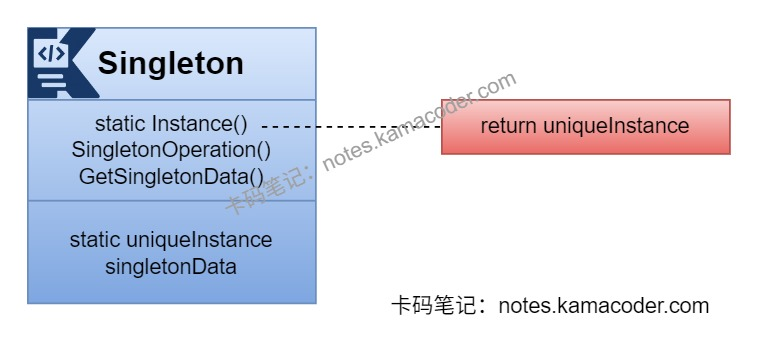
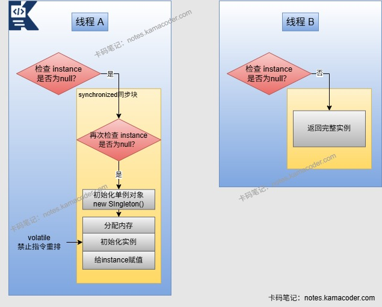

# 单例模式

> 来源: https://notes.kamacoder.com/java/singleton-pattern.html

# `# 单例模式 

## `# 简要回答 
  - 单例设计模式是一种确保一个类在运行期间只有一个实例，提供一个**全局访问点**来访问该实例的创建型模式。核心特点如下：

    - 私有化构造方法，防止外部通过new关键字直接实例化对象。     - 类内部自行创建一个私有的静态变量，保存该类的唯一实例。     - 提供公共静态方法，给使用者提供调用方法，返回唯一实例。   - 单例模式适用于资源独占、全局统一管理的场景，可以避免一个全局使用的类被频繁创建与销毁，耗费系统资源。 

## `# 详细回答 
  - 

实现单例模式有6种常用的方法： 
    - 

**懒汉式（线程不安全）**：等待该类第一次被调用时再创建实例。 
      - 优点是能够**延迟实例化**，只在需要时创建实例，避免资源浪费。       - 缺点是线程不安全，在多线程环境下，如果多个线程同时进入了懒汉式单例的创建方法，就可能会有多个线程执行uniqueInstance = new Singleton();导致实例化多个实例。 

```
public class Singleton {
    private static Singleton instance;
    private Singleton (){}

    public static Singleton getInstance() {
        if (instance == null) {
            instance = new Singleton();
        }
        return instance;
    }
}

```

      - 

**饿汉式（线程安全）**：在类加载时就创建实例，需要使用时可以直接调用方法使用。 
      - 优点是可以**提前实例化**好一个实例，避免了线程不安全的问题。       - 缺点是直接实例化，没有延迟加载的效果，可能系统没有使用该实例而使得操作系统的资源浪费。 

```
public class Singleton {
    private static Singleton instance;
    private Singleton (){}
    public static synchronized Singleton getInstance() {
        if (instance == null) {
            instance = new Singleton();
        }
        return instance;
    }
}

```

  

3.**懒汉类（线程安全）**：在懒汉类的基础上实现线程安全，本质上是给getInstance()方法加锁，只有拿到锁的线程能够进入该方法。 
    - 优点是能够延迟实例化、节约资源并且实现线程安全。     - 缺点是性能降低，因为实例在实例化后依然存在加锁操作，只有拿到锁的线程才能进入会导致线程阻塞。

```
public class Singleton {
    private static Singleton uniqueInstance;
    private static singleton() {}
    private static synchronized Sing leton getUinqueInstance() {
        if (uniqueInstance == null) {
            uniqueInstance = new Singleton();
        }
        return uniqueInstance;
    }
}

```

  
    - 

**双重检查锁（线程安全）**：使用双重检查锁实现单例模式能够在多线程环境下保证线程安全并具有高性能，通过**synchronized**保证多线程下的原子性，**volatile**解决指令重排问题。 
      - 优点是双重检查锁可以在延迟实例化的基础上实现线程安全，并且性能高于线程安全的懒汉模式。       - 缺点是创建实例的开销可能会高一些，因为使用了volatile关键字，并且需要进行两次检查。 

```
public class DCLSingleton {
    // volatile禁止指令重排，避免多线程下获取到"半初始化"实例
    private static volatile DCLSingleton instance;

    private DCLSingleton() {}

    public static DCLSingleton getInstance() {
        // 第一次检查：避免每次调用都加锁
        if (instance == null) {
            synchronized (DCLSingleton.class) {
                // 第二次检查：防止多线程同时进入第一个if，重复创建实例
                if (instance == null) {
                    instance = new DCLSingleton();
                }
            }
        }
        return instance;
    }
}

```

      - 

**静态内部类（线程安全）**：当外部类被加载时，静态内部类不会被加载，调用getInstance()方法时，静态内部类才会被加载，并创建单例实例。此时静态内部类才会被加载进内存，并且初始化INSTANCE实例，通过JVM保证只被实例化一次。 
      - 优点是能够延迟实例化的同时实现线程安全，并且节约资源，性能较高。 

```
public class Singleton {
    private Singleton() {}

    // 静态内部类持有实例
    private static class SingletonHolder {
        private static final Singleton INSTANCE = new Singleton();
    }

    // 公共静态方法，返回实例
    public static Singleton getInstance() {
        return SingletonHolder.INSTANCE;
    }
}

```

      - 

**枚举类实现（线程安全）**：枚举方式实现单例由JVM保证唯一，且枚举类的构造器默认是私有，能够防止反射创建实例，支持序列化机制，防止反序列化重新创建新对象。 

```
public enum Singleton {
    INSTANCE;

    // 可以添加其他方法和属性
    public void doSomething() {
        // 实现
    }
}

```

  

## `# 知识图解 
  - 单例模式结构图

   - 双重检查锁

 

## `# 使用场景 
  - 单例模式适用于类只能有一个实例且客户可以从一个众所周知的访问点访问它的场景，频繁创建与销毁的对象可以通过单例模式提高性能，经常使用且实例化复杂的对象可以通过单例模式避免重复创建，需要控制共享资源时可以使用单例模式方便通信。   - 常见的应用场景如下：

    - **资源密集型对象的创建**：创建数据库连接池、线程池时可以使用单例模式，避免重复创建浪费系统资源，单例模式可以保证全局仅有一个池实例，进行统一管理连接、线程。     - **系统的全局配置**：数据库地址、APIkey等配置资源可以通过单例模式封装，能够保证所有模块获取的配置资源一致，避免重复读取。     - **工具类**：例如日志管理工具类和缓存工具类，需要全局统一的入口操作资源，使用单例模式可以避免多实例导致的日志混乱、缓存不一致等问题。     - **硬件操作**：硬件资源唯一，单例模式可以保证同一时间只有一个实例操作硬件，避免冲突。 

## `# 知识扩展 
  - 面试官可能追问： 
  - Q1：怎么选择单例模式的实现方式？

    - 根据业务的实际需求选择，如果不需要实现懒加载，可以使用饿汉式简单实现，如果需要防止反射和序列化则使用枚举方式实现；     - 需要懒加载实现单例模式时，对懒汉式加锁可以以性能较低的方式实现，还可以使用静态内部类实现；如果需要传参初始化，可以使用双重检查锁(DCL)实现单例模式。   - Q2：为什么双重检查锁需要加 volatile？

    - instance=new DCLSingleton()并非原子操作，会被拆分为3步：①分配内存；②初始化实例；③给 instance赋值。JVM中可能发生指令重排（如先执行③再执行②），导致多线程下某个线程获取到 “半初始化” 的实例（instance 不为 null，但对象未初始化完成）。volatile关键字可禁止指令重排，保证实例创建的原子性。   - Q3：反射 / 序列化会破坏单例吗？如何解决？

    - 反射破坏：通过Constructor.setAccessible(true) 可强制调用私有构造方法，创建多个实例；使用饿汉式 / 静态内部类可在构造方法中加判断（若 instance 不为 null 则抛异常）；枚举天然防反射，如果反射创建枚举会抛 IllegalArgumentException异常。     - 序列化破坏：序列化单例对象后反序列化，会生成新实例；可以通过重写readResolve() 方法解决，返回已有的单例实例；枚举天然防序列化破坏。
