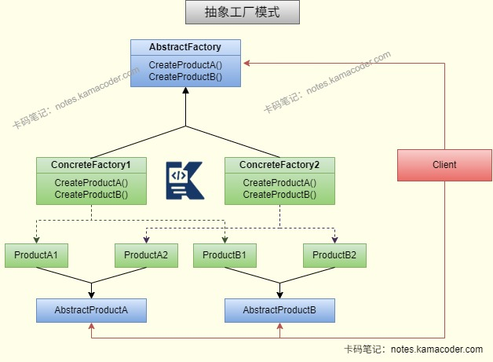

# 工厂模式

> 来源: https://notes.kamacoder.com/java/factory-pattern.html

# `# 工厂模式 

## `# 简要回答 
  - 工厂模式是常用的**创建型设计模式**，会定义创建对象的接口，但由子类决定实例化哪一个类，避免向客户端暴露对象的创建逻辑，实现封装和管理对象的创建过程。可以分为**简单工厂模式**、**工厂方法模式**和**抽象工厂模式**三种形式。   - 工厂模式的优点是**将对象的创建和使用进行分离**，客户端只需要知道接口而不需要了解具体实现细节；如果对象的创建过程比较复杂，工厂模式可以**提高代码的复用性**；工厂模式还可以方便地进行扩展，增加新的产品类而不需要修改已有代码，**符合开闭原则**；将对象的创建封装在工厂类中也是**符合单一职责原则**的。 

## `# 详细回答 
  - **简单工厂模式（静态工厂模式）**：工厂类通过静态方法，根据传入的参数判断并创建对应的具体产品对象，返回给调用者。

    - 简单工厂模式有三类角色，分别是工厂、抽象产品和具体产品。**工厂类**是工厂模式的核心，负责实现所有产品的内部逻辑，可以直接被外界调用；**抽象产品**是工厂类所创建的所有对象的父类，封装了产品对象的公共方法；**具体产品**则是简单工厂模式的创建目标，实现了抽象产品中声明的抽象方法。     - 缺点是使用简单工厂模式需要新增产品时，需要修改原工厂类，违反了开闭原则，且不够灵活。     - 在JDK中DateFormate、Calendar类都有使用简单工厂模式，通过不同参数返回需要的对象。   - **工厂方法模式**：将简单工厂中的工厂类变为抽象接口，工厂接口定义创建产品的方法，具体工厂类实现该方法，每个具体工厂对应一个具体产品。调用者通过实例化具体工厂获取产品，无需传入参数。

    - JDK的Collection接口中Iterator的实现使用了工厂方法模式，每个具体的集合类都有一个对应的迭代器类，迭代器类实现了Iterator接口，负责遍历集合中的元素。   - **抽象工厂模式**：提供一个创建一系列相关或相互依赖对象的接口，而无需指定它们的具体类。抽象工厂模式通常涉及多个抽象产品、多个具体产品和多个具体工厂。

    - 抽象工厂模式的优点是可以创建一组相关的产品，保证产品族的一致性；     - 对抽象工厂模式的业务进行扩展时需注意，对产品族扩展是符合开闭原则的，无需修改原有代码；如果需要对产品等级扩展，将会导致所有代码变动，所以需要新增产品等级的业务不能使用抽象工厂模式。 

## `# 知识图解 
  - 简单工厂模式和工厂方法模式结构图

   - 抽象工厂模式结构图

 

## `# 代码示例 
  - 

**简单工厂模式**：一个工厂类、一个产品接口、多个具体产品类 

```
// 产品接口
public interface Car {
    void drive();
}

// 具体产品1
public class CarA implements Car {
    @Override
    public void drive() {
        System.out.println("驾驶A车");
    }
}

// 具体产品2
public class CarB implements Car {
    @Override
    public void drive() {
        System.out.println("驾驶B车");
    }
}

// 简单工厂类
public class CarFactory {
    public static Car createCar(String type) {
        if ("CarA".equals(type)) {
            return new CarA();
        } else if ("CarB".equals(type)) {
            return new CarB();
        }
        return null;
    }
}

// 调用者
public class Client {
    public static void main(String[] args) {
        Car car = CarFactory.createCar("CarA");
        car.drive(); // 输出：驾驶A车
    }
}

```

    - 

工厂方法模式：一个工厂接口、多个具体工厂类、一个产品接口、多个具体产品类 

```
// 产品接口（同简单工厂）
public interface Car {
    void drive();
}

// 具体产品1（同简单工厂）
public class CarA implements Car {
    @Override
    public void drive() {
        System.out.println("驾驶A车");
    }
}

// 具体产品2（同简单工厂）
public class CarB implements Car {
    @Override
    public void drive() {
        System.out.println("驾驶B车");
    }
}

// 工厂接口
public interface CarFactory {
    Car createCar();
}

// 具体工厂1：创建A车
public class CarAFactory implements CarFactory {
    @Override
    public Car createCar() {
        return new CarA();
    }
}

// 具体工厂2：创建B车
public class CarBFactory implements CarFactory {
    @Override
    public Car createCar() {
        return new CarB();
    }
}

// 调用者
public class Client {
    public static void main(String[] args) {
        CarFactory factory = new CarBFactory();
        Car car = factory.createCar();
        car.drive(); // 输出：驾驶B车
    }
}

```

    - 

抽象工厂模式：一个工厂接口、多个具体工厂类、多个产品接口、多个具体产品族（每个具体工厂对应一个具体产品族，每个产品族包含多个产品） 

```
// 产品接口1：汽车
public interface Car {
    void drive();
}

// 产品接口2：发动机
public interface Engine {
    void run();
}

// 具体产品族1：A系列
public class CarA implements Car {
    @Override
    public void drive() {
        System.out.println("驾驶A车");
    }
}

public class AEngine implements Engine {
    @Override
    public void run() {
        System.out.println("A发动机运转");
    }
}

// 具体产品族2：B系列
public class CarB implements Car {
    @Override
    public void drive() {
        System.out.println("驾驶B车");
    }
}

public class BEngine implements Engine {
    @Override
    public void run() {
        System.out.println("B发动机运转");
    }
}

// 抽象工厂接口：创建汽车和发动机
public interface CarAbstractFactory {
    Car createCar();
    Engine createEngine();
}

// 具体工厂1：创建A产品族
public class AFactory implements CarAbstractFactory {
    @Override
    public Car createCar() {
        return new CarA();
    }

    @Override
    public Engine createEngine() {
        return new AEngine();
    }
}

// 具体工厂2：创建B产品族
public class BFactory implements CarAbstractFactory {
    @Override
    public Car createCar() {
        return new CarB();
    }

    @Override
    public Engine createEngine() {
        return new BEngine();
    }
}

// 调用者
public class Client {
    public static void main(String[] args) {
        CarAbstractFactory factory = new AFactory();
        Car car = factory.createCar();
        Engine engine = factory.createEngine();
        car.drive(); // 输出：驾驶A车
        engine.run(); // 输出：A发动机运转
    }
}

```

  

## `# 使用场景 
  - 工厂设计模式适合在以下场景中使用：

    - 当一个类不知道它所需要创建的对象的类时，即调用类只需知道产品的接口，而不需要知道具体的实现类。     - 当一个类希望通过其子类来指定它所创建的对象时，即工厂模式将类的实例化延迟到子类，父类只需要定义通用的业务逻辑，由子类实现对象的创建逻辑。   - 工厂模式的本质是根据不同的需要创建不同的对象，例如根据不同的数据库类型创建不同的数据库连接对象、根据配置文件选择不同的日志记录器、根据文件类型选择不同解析器等等。 

### `# 三种工厂模式对比： 
  - 简单工厂模式适合产品类型少且固定场景，调用者只需知道传入参数即可创建对象   - 工厂方法模式适合产品类型较多且需要新增产品的场景，希望将对象实例化延迟到子类实现   - 抽象工厂模式适合需要创建一组相关产品的场景，创建不同的产品族，系统与产品族交互。 

## `# 知识扩展 
  - 面试官可能追问： 
  - Q1：工厂模式和单例模式、原型模式有什么区别和联系？

    - 工厂、单例、原型均为创建型设计模式，都封装对象创建逻辑、优化对象创建方式、解耦创建与使用；     - 区别在于核心设计目标不同：**工厂模式**是按需创建不同类型的全新对象，核心做对象的统一生产，封装对象的创建细节；**单例模式**是确保一个类仅创建唯一实例，核心做对象的全局复用，避免重复创建消耗资源；**原型模式**是基于已有对象拷贝生成新对象，核心做对象的高效克隆。   - Q2：Spring框架中哪里使用到了工厂模式？

    - SpringIoC的根接口**BeanFactory**就是简单工厂模式和工厂方法模式的结合体，所有Spring容器都是它的实现类。统一封装了所有Bean对象的创建、实例化、初始化。依赖注入等操作，因此我们可以在不了解Bean的具体创建的情况下获取Bean对象。     - Spring框架的扩展接口**FactoryBean**也使用了工厂方法模式，FactoryBean接口是自定义Bean工厂，负责创建某一个特定的、创建逻辑复杂的Bean实例。在FactoryBean定义的getObject()方法中实现具体的Bean创建逻辑，Spring容器调用这个方法获取Bean实例。   - Q3：什么时候不适合使用工厂模式？

    - 当对象的创建逻辑极其简单（仅一行new关键字即可完成，无任何初始化、配置等复杂逻辑）、业务中产品类的数量极少且永远不会扩展、项目是简单的小工具/小型业务模块，或是为了极简化代码、降低系统冗余度时，就不适合使用工厂模式；     - 此时使用工厂模式，不仅发挥不出其优势，反而会凭空增加多余的工厂类、抽象接口，让代码结构变复杂、类的数量冗余、阅读和维护成本上升，违背了简单设计的原则。
