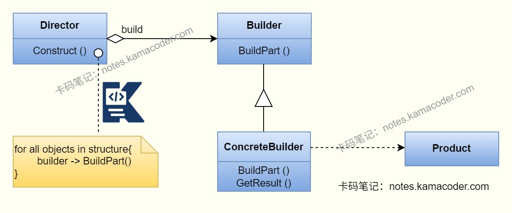

# 建造者模式

> 来源: https://notes.kamacoder.com/java/builder-pattern.html

# `# 建造者模式 

## `# 简要回答 
  - 建造者模式是**创建型设计模式**，将复杂对象的构建过程与它的表示分离，把构建步骤拆分为固定的模版，通过不同的建造者实现这些步骤，使得**相同的构建过程能够得出不同的表示**。   - 优点：解决了复杂对象多参数、多配置导致的构造器臃肿问题，让对象的创建过程更加灵活和可维护。   - 缺点：会增加类的数量，如果构建步骤频繁变化时需要修改抽象建造者。 

## `# 详细回答 
  - 建造者模式有四种角色：产品、抽象建造者、具体建造者和指挥者

    - **产品(Product)** ：是被构建的复杂对象，包含多个部件。     - **抽象建造者(Builder)** ：是定义构建产品的固定步骤模版，为产品对象的各个部件指定抽象接口，声明获取最终产品的方法。     - **具体建造者(ConcreteBuilder)** ：实现抽象建造者的步骤方法，负责创建产品的具体部件。     - **指挥者(Director)** ：是使用Builder接口的对象。能够控制构建流程，调用建造者的步骤方法完成对象构建，客户端只和指挥者交互，无需关注具体的构建细节。   - 建造者模式的工作流程如下：由**客户端**创建具体建造者和指挥者，并将建造者传入指挥者；**指挥者**调用建造者的固定步骤方法，**具体建造者**会在每个步骤中创建产品的对应部件；指挥者调用建造者的方法**获取最终构建好的复杂对象**，客户端直接使用该产品，无需参与任何构建步骤。 

## `# 知识图解 
  - 建造者模式结构图

 

## `# 示例代码 

```
// 1. Product（产品类）：被构建的复杂对象
class Product {
    // 产品的核心部件
    private String partA;
    private String partB;

    // 设置部件的方法（供建造者调用）
    public void setPartA(String partA) {
        this.partA = partA;
    }

    public void setPartB(String partB) {
        this.partB = partB;
    }

    // 重写toString，方便查看构建结果
    @Override
    public String toString() {
        return "Product{" +
                "partA='" + partA + '\'' +
                ", partB='" + partB + '\'' +
                '}';
    }
}

// 2. Builder（抽象建造者）：定义构建产品的固定步骤模板
abstract class Builder {
    // 持有产品对象（所有具体建造者共用）
    protected Product product = new Product();

    // 固定构建步骤1：构建部件A
    public abstract void buildPartA();

    // 固定构建步骤2：构建部件B
    public abstract void buildPartB();

    // 获取最终构建好的产品
    public Product getProduct() {
        return product;
    }
}

// 3. ConcreteBuilder（具体建造者1）：实现抽象步骤，构建「类型1」产品
class ConcreteBuilder1 extends Builder {
    @Override
    public void buildPartA() {
        product.setPartA("部件A-类型1"); // 具体部件实现
    }

    @Override
    public void buildPartB() {
        product.setPartB("部件B-类型1"); // 具体部件实现
    }
}

// 3. ConcreteBuilder（具体建造者2）：实现抽象步骤，构建「类型2」产品
class ConcreteBuilder2 extends Builder {
    @Override
    public void buildPartA() {
        product.setPartA("部件A-类型2"); // 不同的部件实现
    }

    @Override
    public void buildPartB() {
        product.setPartB("部件B-类型2"); // 不同的部件实现
    }
}

// 4. Director（指挥者）：控制构建流程，调用建造者的步骤方法
class Director {
    // 核心方法：传入建造者，按固定顺序执行构建步骤
    public Product construct(Builder builder) {
        // 固定构建流程：先构建A，再构建B（指挥者定义流程）
        builder.buildPartA();
        builder.buildPartB();
        return builder.getProduct(); // 返回最终产品
    }
}

// 客户端测试代码
public class Client {
    public static void main(String[] args) {
        // 1. 创建指挥者（控制流程）
        Director director = new Director();

        // 2. 构建「类型1」产品（传入具体建造者1）
        Builder builder1 = new ConcreteBuilder1();
        Product product1 = director.construct(builder1);
        System.out.println("构建的类型1产品：" + product1);

        // 3. 构建「类型2」产品（仅替换具体建造者，流程不变）
        Builder builder2 = new ConcreteBuilder2();
        Product product2 = director.construct(builder2);
        System.out.println("构建的类型2产品：" + product2);
    }
}

```

 

## `# 使用场景 
  - 建造者模式适合在产品包含多个部件，且产品的构建顺序固定时使用，允许客户指定部件的配置方法，并构建出完整的产品。 

## `# 知识扩展 

### `# 面试官可能追问： 
  - 建造者模式和工厂模式有什么区别？

    - 建造者模式和工厂模式都是创建型设计模式，用于创建对象。     - 工厂模式关注**快速创建对象**，客户端指定类型后工厂直接返回产品对象；而建造者模式关注**复杂对象的构建过程**，将有多个部件的对象分步构建，通过不同建造者实现不同部件，最终获取不同配置的产品。   - 在项目使用中，你使用过建造者模式吗？

    - 使用过。我在项目中构建复杂的HTTP请求对象时，使用建造者模式将设置URL、请求方法、请求头等步骤拆分，客户端只需要传入建造者即可生成不同配置的请求；这样避免了构造器参数过多的问题，同时也提高了代码的可读性和维护性。
