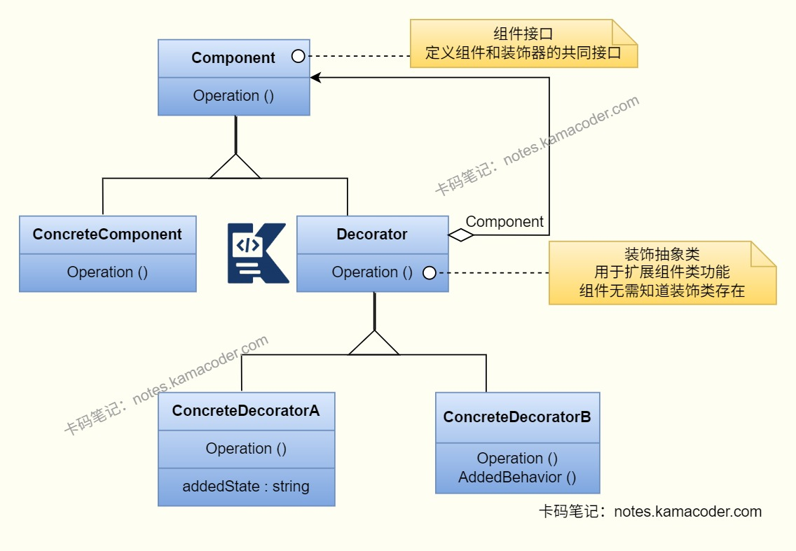

# 装饰器模式

> 来源: https://notes.kamacoder.com/java/decorator-pattern.html

# `# 装饰器模式 

## `# 简要回答 
  - 装饰器模式是**结构型设计模式**，不修改原始类接口的基础上，通过包装的方式给对象动态地添加功能或责任。通过创建一个装饰类包裹原始类的实例，保持原始类接口不变的情况下提供额外的功能，比生成子类更灵活。   - 优点：解决了继承导致的类膨胀问题，符合开闭原则和单一职责原则。   - 缺点：多层装饰器嵌套使用时调试难度增加，会出现少量代码冗余。 

## `# 详细回答 
  - 使用装饰器模式时，先由客户端创建具体组件，然后使用装饰器包装具体组件，生成增强对象。客户端调用最终装饰后的对象方法，会将所有装饰器的增强逻辑与基础逻辑叠加执行，最终返回组合结果。   - 装饰器模式的主要角色有：组件接口、具体组件、装饰器和具体装饰器：

    - **组件接口**定义了具体组件和装饰器共同的接口，确保它们可以互相替换，是所有组件的基础规范。     - **具体组件**实现了组件接口，是被装饰的具体对象，只包含核心基础功能。     - **装饰器**实现组件接口，同时持有组件对象的引用（指向具体组件或其他装饰器），为具体装饰器提供统一的父类，可以定义通用的装饰逻辑。     - **具体装饰器**继承自抽象装饰器，实现了具体的装饰逻辑，向组件添加职责，会调用父类的方法以保持接口一致。 

## `# 知识图解 
  - 装饰者模式结构图

 

## `# 示例代码 
  - 以咖啡订单为例，展示装饰器模式的实现： 

```
// 1. Component类：定义咖啡的核心接口
interface Coffee {
    // 获取咖啡描述
    String getDescription();
    // 获取价格
    double getPrice();
}

// 2. ConcreteComponent类：基础咖啡
class PlainCoffee implements Coffee {
    @Override
    public String getDescription() {
        return "原味咖啡";
    }

    @Override
    public double getPrice() {
        return 10.0; // 基础价格
    }
}

// 3. Decorator类：咖啡装饰器（持有咖啡引用，实现咖啡接口）
abstract class CoffeeDecorator implements Coffee {
    protected Coffee coffee; // 持有咖啡引用

    public CoffeeDecorator(Coffee coffee) {
        this.coffee = coffee;
    }
}

// 4. ConcreteDecorationA类：加牛奶（单一扩展功能）
class MilkDecorator extends CoffeeDecorator {
    public MilkDecorator(Coffee coffee) {
        super(coffee);
    }

    @Override
    public String getDescription() {
        // 叠加装饰描述
        return coffee.getDescription() + " + 牛奶";
    }

    @Override
    public double getPrice() {
        // 叠加装饰价格
        return coffee.getPrice() + 2.0;
    }
}

// 4. ConcreteDecorationB类：加糖（单一扩展功能）
class SugarDecorator extends CoffeeDecorator {
    public SugarDecorator(Coffee coffee) {
        super(coffee);
    }

    @Override
    public String getDescription() {
        return coffee.getDescription() + " + 糖";
    }

    @Override
    public double getPrice() {
        return coffee.getPrice() + 1.0;
    }
}

// 5. 客户端调用：自由组合装饰器
public class Client {
    public static void main(String[] args) {
        // 基础咖啡：原味
        Coffee coffee = new PlainCoffee();
        System.out.println(coffee.getDescription() + " → 价格：" + coffee.getPrice());

        // 装饰1：加牛奶
        coffee = new MilkDecorator(coffee);
        System.out.println(coffee.getDescription() + " → 价格：" + coffee.getPrice());

        // 装饰2：再加糖（嵌套装饰）
        coffee = new SugarDecorator(coffee);
        System.out.println(coffee.getDescription() + " → 价格：" + coffee.getPrice());
    }
}
/*
原味咖啡 → 价格：10.0
原味咖啡 + 牛奶 → 价格：12.0
原味咖啡 + 牛奶 + 糖 → 价格：13.0
*/

```

 

## `# 使用场景 
  - 

装饰器模式可以**避免继承爆炸**。 

当一个对象有多种可选的扩展功能，且功能可组合时，使用继承会产生2^n个子类（n为扩展功能的数量），装饰器模式使用组合替代继承，n个装饰器类就可以实现所有组合。同理，装饰器模式也可以将复杂的功能拆分成多个独立的小功能。   - 

需要在运行时为对象动态地添加功能时，且可随时移除该功能时，使用装饰器模式。   - 

在很多框架中也使用了装饰器模式，JavaIO的InputStream和OutputStream使用了装饰器模式，FileInputStream是基础组件，BufferedInputStream是缓冲装饰器，DataInputStream是数据处理装饰器；Spring框架中的BeanWrapper、DecoratingProxy等类是通过装饰器模式动态扩展Bean功能的。 

## `# 知识扩展 

### `# 面试官可能追问： 
  - 装饰器模式和代理模式的区别是什么？

    - 两者核心区别是设计的目的不同。装饰器模式主要作用是功能叠加，用于为对象新增核心业务功能，由客户端主动选择装饰器组合；而代理模式则是控制对象的访问，比如权限校验和日志记录等，客户端不需要知道代理的存在，目标是决定对象能不能做。   - JavaIO流为什么使用装饰器模式实现？

    - JavaIO流有多种基础流和多种扩展功能，使用装饰器模式可以将基础流和扩展功能进行组合，如果使用继承实现会产生大量子类无法维护，而装饰器模式可以在运行时动态组合不同的流功能，灵活且易于扩展。   - 你在项目中使用过装饰器模式吗？

    - 我在项目中的接口请求模块中使用了装饰器模式，基础组件是原生的HTTP请求，然后通过装饰器模式定义了超时重试的装饰器、数据加密装饰器和请求日志装饰器；客户可以根据实际场景进行组合使用，比如普通场景使用基础请求加超时重试和日志，敏感数据场景添加数据加密装饰器，无需修改原有请求代码，符合开闭原则且比继承更灵活。
